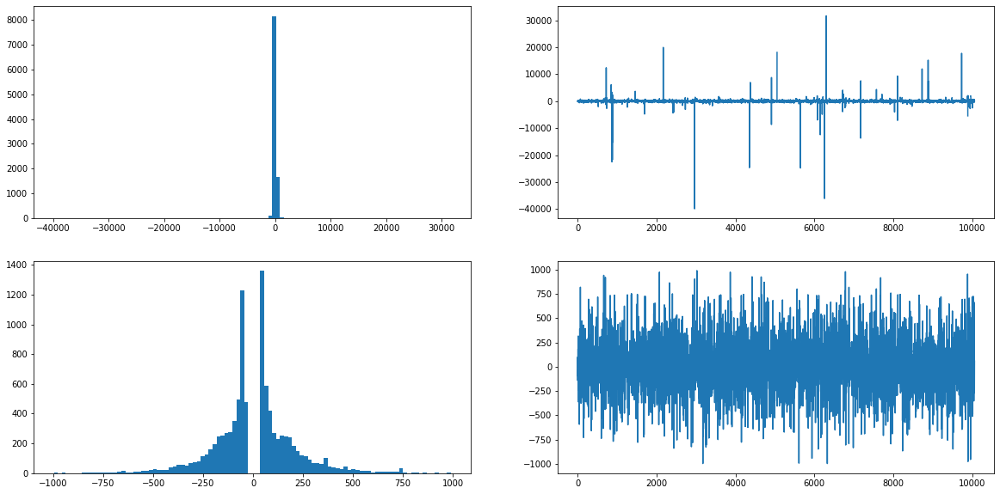
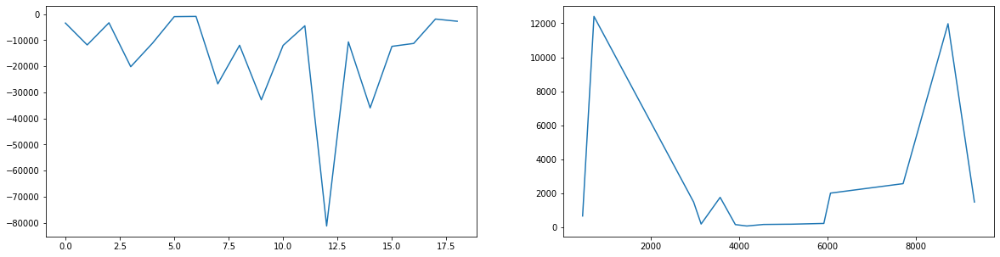
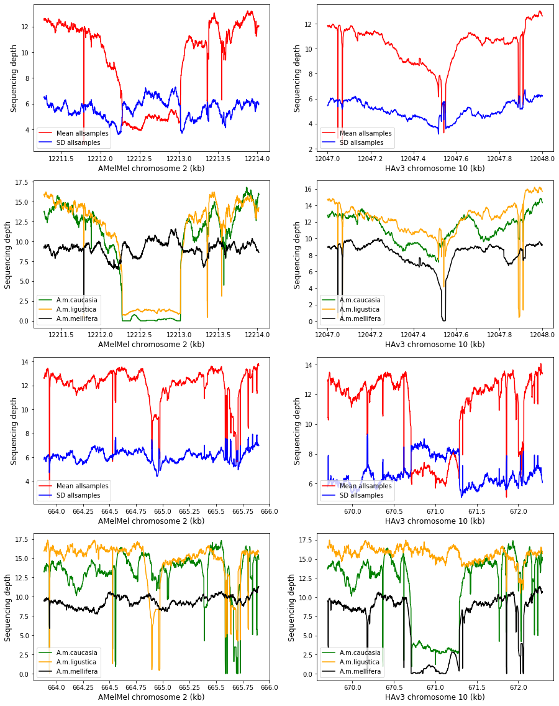
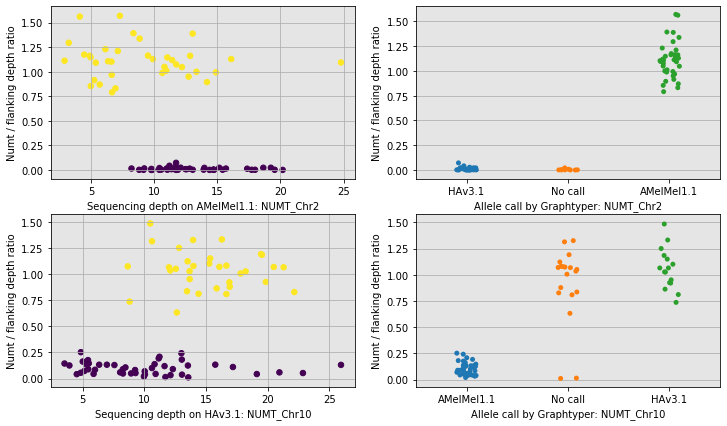
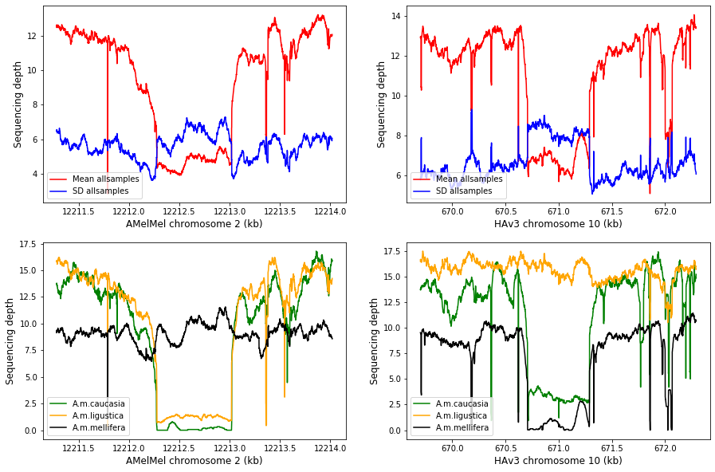
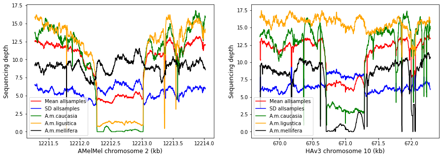

# Sequencing depth in samples at two indels
* One NUMT present in AMelMel and absent in HAv3
* One NUMT absent in AMelMel and present in HAv3
* variants.vcf : insertions, deletions, inversions detected by alignment of AMelMel and HAv3 with minimap and SVIM

## Extraction of relevant information from variants.vcf

----
```bash
#!/bin/bash

#selectDataFromVcf.bash

#Selects relevant columns from variants.vcf
#To analyse in Jupyter notebook DepthInsDelChrs2and10.ipynb

grep -v "#" variants.vcf | awk 'BEGIN{OFS="\t"}{print $1, $2, $3, $4, $5, $8}' | \
        awk 'BEGIN{FS="SVTYPE=" ; OFS=""}{print $1,$2}' | \
        awk 'BEGIN{FS=";END=" ; OFS="\t"}{print $1,$2}' | \
        awk 'BEGIN{FS=";SVLEN="; OFS="\t"}{print $1,$2}' > InsDelData.txt
```
-----


```python
import pandas as pd
import numpy as np
from matplotlib import pyplot as plt
import re
import csv
from collections import defaultdict
from IPython.display import display
```

## Import table of insertions and deletions


```python
df_DelIns = pd.read_csv("/Users/avignal/GenotoulWork/DepthChr3Inverstion/allInsDel/InsDelData.txt", sep="\t", header=None)
df_DelIns.columns = ['Chrom','Pos','Svim','Ref','Alt','Type','End','Length']
df_DelIns.Type.unique()

```


    array(['DEL', 'INS', 'DUP:TANDEM', 'INV', 'BND'], dtype=object)


## Plot length distribution of insertions and deletions
* Only a few very large insertions and deletions.
    * Largest insertion = 31640 bp
    * Largest deletion = 39880 bp
    * The minimum size of insertions and deletions detected is 40 bp
* The large ones seem to correspond to gaps between contigs in one or both assemblies


```python
df_DelIns.Length.max(),df_DelIns.Length.min(), \
df_DelIns[df_DelIns.Length > 0].Length.min(), \
df_DelIns[df_DelIns.Length < 0].Length.max()

```


    (31640.0, -39880.0, 40.0, -40.0)


```python
df_DelIns_short = df_DelIns[((df_DelIns.Type == "DEL") & (df_DelIns.Length > -1000)) | \
          ((df_DelIns.Type == "INS") & (df_DelIns.Length < 1000))]
fig, axs = plt.subplots(2,2,figsize=(20,10))
axs[0,0].hist(df_DelIns.Length, bins = 100)
axs[0,1].plot(df_DelIns.Length)
axs[1,0].hist(df_DelIns_short.Length, bins = 100)
axs[1,1].plot(df_DelIns_short.Length)

```


    [<matplotlib.lines.Line2D at 0x7fc42ac3f8d0>]





## Plot length distribution of inversions and tandem duplications
* Are they polymorphism or sequencing errors?


```python
df_DelIns_inv = df_DelIns[(df_DelIns.Type == "INV")].reset_index()
df_DelIns_inv["LengthInv"] = df_DelIns_inv.Pos - df_DelIns_inv.End
df_DelIns_tandem = df_DelIns[(df_DelIns.Type == "DUP:TANDEM")]
df_DelIns_inv
df_DelIns_tandem
fig, (ax1,ax2) = plt.subplots(1,2,figsize=(20,5))
ax1.plot(df_DelIns_inv.LengthInv)
ax2.plot(df_DelIns_tandem.Length)

```


    [<matplotlib.lines.Line2D at 0x7fc42b2ba590>]





## Test the status of one insertion and one deletion samples sequenced by Illumina
### Samples from the Wragg et al 2022 paper
* The A. m. mellifera sample used for the AMemMel assembly.
* 15 A. m. caucasia
* 30 A. m. ligustica
* 35 A. m. mellifera from Ouessant
### All aligned to AMelMel and HAv3.1

* allBAMsHAv3.list : paths to the HAv3 bam files
* allBAMsAMelMel.list : paths to the AMelMel bam files

```bash
head -3 allBAMsHAv3.list
/genphyse/cytogen/seqapipop/Data/Apis-mellifera/seqapipopOnHAV3_1/Haploid/Ab-PacBio_TCCGCGAA-CCTATCCT-BHCFFJDSXX_L004/bootstraping/Ab-PacBio_TCCGCGAA-CCTATCCT-BHCFFJDSXX_L004.bam
/genphyse/cytogen/seqapipop/Data/Apis-mellifera/seqapipopOnHAV3_1/Haploid/CAU10_ATCACG_L001/bootstraping/CAU10_ATCACG_L001.bam
/genphyse/cytogen/seqapipop/Data/Apis-mellifera/seqapipopOnHAV3_1/Haploid/CAU11_CGATGT_L001/bootstraping/CAU11_CGATGT_L001.bam

head -3 allBAMsAMelMel.list
/genphyse/cytogen/seqapipop/Data/Apis-mellifera/seqapipopOnAMelMel/Ab-PacBio_TCCGCGAA-CCTATCCT-BHCFFJDSXX_L004/bootstraping/Ab-PacBio_TCCGCGAA-CCTATCCT-BHCFFJDSXX_L004.bam
/genphyse/cytogen/seqapipop/Data/Apis-mellifera/seqapipopOnAMelMel/CAU10_ATCACG_L001/bootstraping/CAU10_ATCACG_L001.bam
/genphyse/cytogen/seqapipop/Data/Apis-mellifera/seqapipopOnAMelMel/CAU11_CGATGT_L001/bootstraping/CAU11_CGATGT_L001.bam
```
### Calculate sequencing depths of the alignments in two regions
* Longest AMel NUMT absent of HAv3, found by Quentin: on chromosome 2
* Longest HAv3 NUMT absent of AMel, found by Quentin: on chromosome 10
* Correspondence between the two regions from the output of the whole genome alignments done with the LAST software

```bash
samtools depth -r NC_037639.1:12047000-12048000 -f allBAMsHAv3.list > allDepthsHAv3_NUMT_Chr2.table
samtools depth -r CM010320.1:12211278-12.214019 -f allBAMsAMelMel.list > allDepthsAMelMel_NUMT_Chr2.table
samtools depth -r NC_037647.1:669701-672291 -f allBAMsHAv3.list > allDepthsHAv3_NUMT_Chr10.table
samtools depth -r CM010328.1:663884-665903 -f allBAMsAMelMel.list > allDepthsAMelMel_NUMT_Chr10.table
```
### Indices (columns) of the samples in the tables
* Ab-PacBio = indice 2
* The 15 caucasia = indices 3 to 17
* The 30 ligusticas = indices 18 to 47
* The 35 ligusticas = indices 48 to 82


### Longest AMel NUMT absent of HAv3, on LG2


```python
df_DelIns[(df_DelIns.Chrom == 'NC_037639.1') & (df_DelIns.Pos > 12047000) & (df_DelIns.Pos < 12048000)]

```


<div>
<style scoped>
    .dataframe tbody tr th:only-of-type {
        vertical-align: middle;
    }

    .dataframe tbody tr th {
        vertical-align: top;
    }

    .dataframe thead th {
        text-align: right;
    }
</style>
<table border="1" class="dataframe">
  <thead>
    <tr style="text-align: right;">
      <th></th>
      <th>Chrom</th>
      <th>Pos</th>
      <th>Svim</th>
      <th>Ref</th>
      <th>Alt</th>
      <th>Type</th>
      <th>End</th>
      <th>Length</th>
    </tr>
  </thead>
  <tbody>
    <tr>
      <td>1514</td>
      <td>NC_037639.1</td>
      <td>12047549</td>
      <td>svim_asm.INS.760</td>
      <td>A</td>
      <td>AAGGTATTCAATAATAAATTTTATTTAAAATATTAAATTTATTATT...</td>
      <td>INS</td>
      <td>12047549.0</td>
      <td>745.0</td>
    </tr>
  </tbody>
</table>
</div>


### Longest HAv3 NUMT absent of AMel, on LG10


```python
df_DelIns[(df_DelIns.Chrom == 'NC_037647.1') & (df_DelIns.Pos > 670500) & (df_DelIns.Pos < 671491)]

```


<div>
<style scoped>
    .dataframe tbody tr th:only-of-type {
        vertical-align: middle;
    }

    .dataframe tbody tr th {
        vertical-align: top;
    }

    .dataframe thead th {
        text-align: right;
    }
</style>
<table border="1" class="dataframe">
  <thead>
    <tr style="text-align: right;">
      <th></th>
      <th>Chrom</th>
      <th>Pos</th>
      <th>Svim</th>
      <th>Ref</th>
      <th>Alt</th>
      <th>Type</th>
      <th>End</th>
      <th>Length</th>
    </tr>
  </thead>
  <tbody>
    <tr>
      <td>6027</td>
      <td>NC_037647.1</td>
      <td>670675</td>
      <td>svim_asm.DEL.3005</td>
      <td>TTCTTTCAACATGGAATAATTTTTACAAAAAAAAGTTGTTGCTTAT...</td>
      <td>T</td>
      <td>DEL</td>
      <td>671251.0</td>
      <td>-576.0</td>
    </tr>
  </tbody>
</table>
</div>


### Plots mean sequencing depths
* for all samples and for the mean for each of the three subspecies separately
* On AMelMel and on HAv3


```python
# Import the tables of sequencing depths
df_AMelMel_NUMT_LG2 = pd.read_csv("/Users/avignal/GenotoulWork/DepthChr3Inverstion/allDepthsAMelMel_NUMT_Chr2.table", sep="\t", header=None)
df_HAv3_NUMT_LG2 = pd.read_csv("/Users/avignal/GenotoulWork/DepthChr3Inverstion/allDepthsHAv3_NUMT_Chr2.table", sep="\t", header=None)
df_AMelMel_NUMT_LG10 = pd.read_csv("/Users/avignal/GenotoulWork/DepthChr3Inverstion/allDepthsAMelMel_NUMT_Chr10.table", sep="\t", header=None)
df_HAv3_NUMT_LG10 = pd.read_csv("/Users/avignal/GenotoulWork/DepthChr3Inverstion/allDepthsHAv3_NUMT_Chr10.table", sep="\t", header=None)

```

## Plot figure for supplementary


```python
fig, axs = plt.subplots(4,2,figsize=(15,20))
axs[0,0].plot(df_AMelMel_NUMT_LG2.loc[:,1],df_AMelMel_NUMT_LG2.loc[:,3:82].mean(axis=1),label="Mean allsamples", c="red")
axs[0,0].plot(df_AMelMel_NUMT_LG2.loc[:,1],df_AMelMel_NUMT_LG2.loc[:,3:82].std(axis=1),label="SD allsamples", c="blue")
axs[0,0].legend(loc='lower left')
axs[1,0].plot(df_AMelMel_NUMT_LG2.loc[:,1],df_AMelMel_NUMT_LG2.loc[:,3:17].mean(axis=1),label="A.m.caucasia", c="green")
axs[1,0].plot(df_AMelMel_NUMT_LG2.loc[:,1],df_AMelMel_NUMT_LG2.loc[:,18:47].mean(axis=1),label="A.m.ligustica", c="orange")
axs[1,0].plot(df_AMelMel_NUMT_LG2.loc[:,1],df_AMelMel_NUMT_LG2.loc[:,48:82].mean(axis=1),label="A.m.mellifera",c="black")
axs[1,0].legend(loc='lower left')
axs[0,1].plot(df_HAv3_NUMT_LG2.loc[:,1],df_HAv3_NUMT_LG2.loc[:,3:82].mean(axis=1),label="Mean allsamples", c="red")
axs[0,1].plot(df_HAv3_NUMT_LG2.loc[:,1],df_HAv3_NUMT_LG2.loc[:,3:82].std(axis=1),label="SD allsamples", c="blue")
axs[0,1].legend(loc='lower left')
axs[1,1].plot(df_HAv3_NUMT_LG2.loc[:,1],df_HAv3_NUMT_LG2.loc[:,3:17].mean(axis=1),label="A.m.caucasia", c="green")
axs[1,1].plot(df_HAv3_NUMT_LG2.loc[:,1],df_HAv3_NUMT_LG2.loc[:,18:47].mean(axis=1),label="A.m.ligustica", c="orange")
axs[1,1].plot(df_HAv3_NUMT_LG2.loc[:,1],df_HAv3_NUMT_LG2.loc[:,48:82].mean(axis=1),label="A.m.mellifera",c="black")
axs[1,1].legend(loc='lower left')
axs[2,0].plot(df_AMelMel_NUMT_LG10.loc[:,1],df_AMelMel_NUMT_LG10.loc[:,3:82].mean(axis=1),label="Mean allsamples", c="red")
axs[2,0].plot(df_AMelMel_NUMT_LG10.loc[:,1],df_AMelMel_NUMT_LG10.loc[:,3:82].std(axis=1),label="SD allsamples", c="blue")
axs[2,0].legend(loc='lower left')
axs[3,0].plot(df_AMelMel_NUMT_LG10.loc[:,1],df_AMelMel_NUMT_LG10.loc[:,3:17].mean(axis=1),label="A.m.caucasia", c="green")
axs[3,0].plot(df_AMelMel_NUMT_LG10.loc[:,1],df_AMelMel_NUMT_LG10.loc[:,18:47].mean(axis=1),label="A.m.ligustica", c="orange")
axs[3,0].plot(df_AMelMel_NUMT_LG10.loc[:,1],df_AMelMel_NUMT_LG10.loc[:,48:82].mean(axis=1),label="A.m.mellifera",c="black")
axs[3,0].legend(loc='lower left')
axs[2,1].plot(df_HAv3_NUMT_LG10.loc[:,1],df_HAv3_NUMT_LG10.loc[:,3:82].mean(axis=1),label="Mean allsamples", c="red")
axs[2,1].plot(df_HAv3_NUMT_LG10.loc[:,1],df_HAv3_NUMT_LG10.loc[:,3:82].std(axis=1),label="SD allsamples", c="blue")
axs[2,1].legend(loc='lower left')
axs[3,1].plot(df_HAv3_NUMT_LG10.loc[:,1],df_HAv3_NUMT_LG10.loc[:,3:17].mean(axis=1),label="A.m.caucasia", c="green")
axs[3,1].plot(df_HAv3_NUMT_LG10.loc[:,1],df_HAv3_NUMT_LG10.loc[:,18:47].mean(axis=1),label="A.m.ligustica", c="orange")
axs[3,1].plot(df_HAv3_NUMT_LG10.loc[:,1],df_HAv3_NUMT_LG10.loc[:,48:82].mean(axis=1),label="A.m.mellifera",c="black")
axs[3,1].legend(loc='lower left')

#Tick labels converted to kb
AMelMel_LG2_ticks = axs[0,0].get_xticks()
AMelMel_LG2_ticks = AMelMel_LG2_ticks/1000
axs[0,0].set_xticklabels(AMelMel_LG2_ticks)
axs[1,0].set_xticklabels(AMelMel_LG2_ticks)
axs[0,0].set_xlabel("AMelMel chromosome 2 (kb)", fontsize = 12)
axs[1,0].set_xlabel("AMelMel chromosome 2 (kb)", fontsize = 12)
axs[0,0].set_ylabel("Sequencing depth", fontsize = 12)
axs[1,0].set_ylabel("Sequencing depth", fontsize = 12)

HAv3_LG2_ticks = axs[0,1].get_xticks()
HAv3_LG2_ticks = HAv3_LG2_ticks/1000
axs[0,1].set_xticklabels(HAv3_LG2_ticks)
axs[1,1].set_xticklabels(HAv3_LG2_ticks)
axs[0,1].set_xlabel("HAv3 chromosome 10 (kb)", fontsize = 12)
axs[1,1].set_xlabel("HAv3 chromosome 10 (kb)", fontsize = 12)
axs[0,1].set_ylabel("Sequencing depth", fontsize = 12)
axs[1,1].set_ylabel("Sequencing depth", fontsize = 12)

AMelMel_LG10_ticks = axs[2,0].get_xticks()
AMelMel_LG10_ticks = AMelMel_LG10_ticks/1000
axs[2,0].set_xticklabels(AMelMel_LG10_ticks)
axs[3,0].set_xticklabels(AMelMel_LG10_ticks)
axs[2,0].set_xlabel("AMelMel chromosome 2 (kb)", fontsize = 12)
axs[3,0].set_xlabel("AMelMel chromosome 2 (kb)", fontsize = 12)
axs[2,0].set_ylabel("Sequencing depth", fontsize = 12)
axs[3,0].set_ylabel("Sequencing depth", fontsize = 12)

HAv3_LG10_ticks = axs[2,1].get_xticks()
HAv3_LG10_ticks = HAv3_LG10_ticks/1000
axs[2,1].set_xticklabels(HAv3_LG10_ticks)
axs[3,1].set_xticklabels(HAv3_LG10_ticks)
axs[2,1].set_xlabel("HAv3 chromosome 10 (kb)", fontsize = 12)
axs[3,1].set_xlabel("HAv3 chromosome 10 (kb)", fontsize = 12)
axs[2,1].set_ylabel("Sequencing depth", fontsize = 12)
axs[3,1].set_ylabel("Sequencing depth", fontsize = 12)

fig.savefig("/Users/avignal/Documents/Stats/2016_PacificBee/2019AlignAMelMelHav3_1/WholeChromosomesV2c/Depth_LG2_LG10/Depth_LG2_10_All.pdf", bbox_inches='tight')

```





## Plot figure for main


```python
fig, (ax1,ax2) = plt.subplots(1,2,figsize=(15,5))
ax1.plot(df_AMelMel_NUMT_LG2.loc[:,1],df_AMelMel_NUMT_LG2.loc[:,3:17].mean(axis=1),label="A.m.caucasia", c="green")
ax1.plot(df_AMelMel_NUMT_LG2.loc[:,1],df_AMelMel_NUMT_LG2.loc[:,18:47].mean(axis=1),label="A.m.ligustica", c="orange")
ax1.plot(df_AMelMel_NUMT_LG2.loc[:,1],df_AMelMel_NUMT_LG2.loc[:,48:82].mean(axis=1),label="A.m.mellifera",c="black")
ax1.legend(loc='lower left')
ax2.plot(df_HAv3_NUMT_LG10.loc[:,1],df_HAv3_NUMT_LG10.loc[:,3:17].mean(axis=1),label="A.m.caucasia", c="green")
ax2.plot(df_HAv3_NUMT_LG10.loc[:,1],df_HAv3_NUMT_LG10.loc[:,18:47].mean(axis=1),label="A.m.ligustica", c="orange")
ax2.plot(df_HAv3_NUMT_LG10.loc[:,1],df_HAv3_NUMT_LG10.loc[:,48:82].mean(axis=1),label="A.m.mellifera",c="black")
ax2.legend(loc='lower left')

#Tick labels converted to kb
AMelMel_LG2_ticks = ax1.get_xticks()
AMelMel_LG2_ticks = AMelMel_LG2_ticks/1000
ax1.set_xticklabels(AMelMel_LG2_ticks)
ax1.set_xlabel("AMelMel chromosome 2 (kb)", fontsize = 12)
ax1.set_ylabel("Sequencing depth", fontsize = 12)

HAv3_LG10_ticks = ax2.get_xticks()
HAv3_LG10_ticks = HAv3_LG10_ticks/1000
ax2.set_xticklabels(HAv3_LG10_ticks)
ax2.set_xlabel("HAv3 chromosome 10 (kb)", fontsize = 12)
ax2.set_ylabel("Sequencing depth", fontsize = 12)

fig.savefig("/Users/avignal/Documents/Stats/2016_PacificBee/2019AlignAMelMelHav3_1/WholeChromosomesV2c/Depth_LG2_LG10/Depth_LG2_10_SubSpec_Only.pdf", bbox_inches='tight')

```





## Other possibility


```python
fig, axs = plt.subplots(2,2,figsize=(15,10))
axs[0,0].plot(df_AMelMel_NUMT_LG2.loc[:,1],df_AMelMel_NUMT_LG2.loc[:,3:82].mean(axis=1),label="Mean allsamples", c="red")
axs[0,0].plot(df_AMelMel_NUMT_LG2.loc[:,1],df_AMelMel_NUMT_LG2.loc[:,3:82].std(axis=1),label="SD allsamples", c="blue")
axs[0,0].legend(loc='lower left')
axs[1,0].plot(df_AMelMel_NUMT_LG2.loc[:,1],df_AMelMel_NUMT_LG2.loc[:,3:17].mean(axis=1),label="A.m.caucasia", c="green")
axs[1,0].plot(df_AMelMel_NUMT_LG2.loc[:,1],df_AMelMel_NUMT_LG2.loc[:,18:47].mean(axis=1),label="A.m.ligustica", c="orange")
axs[1,0].plot(df_AMelMel_NUMT_LG2.loc[:,1],df_AMelMel_NUMT_LG2.loc[:,48:82].mean(axis=1),label="A.m.mellifera",c="black")
axs[1,0].legend(loc='lower left')
axs[0,1].plot(df_HAv3_NUMT_LG10.loc[:,1],df_HAv3_NUMT_LG10.loc[:,3:82].mean(axis=1),label="Mean allsamples", c="red")
axs[0,1].plot(df_HAv3_NUMT_LG10.loc[:,1],df_HAv3_NUMT_LG10.loc[:,3:82].std(axis=1),label="SD allsamples", c="blue")
axs[0,1].legend(loc='lower left')
axs[1,1].plot(df_HAv3_NUMT_LG10.loc[:,1],df_HAv3_NUMT_LG10.loc[:,3:17].mean(axis=1),label="A.m.caucasia", c="green")
axs[1,1].plot(df_HAv3_NUMT_LG10.loc[:,1],df_HAv3_NUMT_LG10.loc[:,18:47].mean(axis=1),label="A.m.ligustica", c="orange")
axs[1,1].plot(df_HAv3_NUMT_LG10.loc[:,1],df_HAv3_NUMT_LG10.loc[:,48:82].mean(axis=1),label="A.m.mellifera",c="black")
axs[1,1].legend(loc='lower left')

#Tick labels converted to kb
AMelMel_LG2_ticks = axs[0,0].get_xticks()
AMelMel_LG2_ticks = AMelMel_LG2_ticks/1000
axs[0,0].set_xticklabels(AMelMel_LG2_ticks)
axs[1,0].set_xticklabels(AMelMel_LG2_ticks)
axs[0,0].set_xlabel("AMelMel chromosome 2 (kb)", fontsize = 12)
axs[1,0].set_xlabel("AMelMel chromosome 2 (kb)", fontsize = 12)
axs[0,0].set_ylabel("Sequencing depth", fontsize = 12)
axs[1,0].set_ylabel("Sequencing depth", fontsize = 12)

HAv3_LG10_ticks = axs[0,1].get_xticks()
HAv3_LG10_ticks = HAv3_LG10_ticks/1000
axs[0,1].set_xticklabels(HAv3_LG10_ticks)
axs[1,1].set_xticklabels(HAv3_LG10_ticks)
axs[0,1].set_xlabel("HAv3 chromosome 10 (kb)", fontsize = 12)
axs[1,1].set_xlabel("HAv3 chromosome 10 (kb)", fontsize = 12)
axs[0,1].set_ylabel("Sequencing depth", fontsize = 12)
axs[1,1].set_ylabel("Sequencing depth", fontsize = 12)

fig.savefig("/Users/avignal/Documents/Stats/2016_PacificBee/2019AlignAMelMelHav3_1/WholeChromosomesV2c/Depth_LG2_LG10/Depth_LG2_10_Missing_only.pdf", bbox_inches='tight')

```





## And another


```python
fig, (ax1,ax2) = plt.subplots(1,2,figsize=(15,5))
ax1.plot(df_AMelMel_NUMT_LG2.loc[:,1],df_AMelMel_NUMT_LG2.loc[:,3:82].mean(axis=1),label="Mean allsamples", c="red")
ax1.plot(df_AMelMel_NUMT_LG2.loc[:,1],df_AMelMel_NUMT_LG2.loc[:,3:82].std(axis=1),label="SD allsamples", c="blue")
ax1.plot(df_AMelMel_NUMT_LG2.loc[:,1],df_AMelMel_NUMT_LG2.loc[:,3:17].mean(axis=1),label="A.m.caucasia", c="green")
ax1.plot(df_AMelMel_NUMT_LG2.loc[:,1],df_AMelMel_NUMT_LG2.loc[:,18:47].mean(axis=1),label="A.m.ligustica", c="orange")
ax1.plot(df_AMelMel_NUMT_LG2.loc[:,1],df_AMelMel_NUMT_LG2.loc[:,48:82].mean(axis=1),label="A.m.mellifera",c="black")
ax1.legend(loc='lower left')
ax2.plot(df_HAv3_NUMT_LG10.loc[:,1],df_HAv3_NUMT_LG10.loc[:,3:82].mean(axis=1),label="Mean allsamples", c="red")
ax2.plot(df_HAv3_NUMT_LG10.loc[:,1],df_HAv3_NUMT_LG10.loc[:,3:82].std(axis=1),label="SD allsamples", c="blue")
ax2.plot(df_HAv3_NUMT_LG10.loc[:,1],df_HAv3_NUMT_LG10.loc[:,3:17].mean(axis=1),label="A.m.caucasia", c="green")
ax2.plot(df_HAv3_NUMT_LG10.loc[:,1],df_HAv3_NUMT_LG10.loc[:,18:47].mean(axis=1),label="A.m.ligustica", c="orange")
ax2.plot(df_HAv3_NUMT_LG10.loc[:,1],df_HAv3_NUMT_LG10.loc[:,48:82].mean(axis=1),label="A.m.mellifera",c="black")
ax2.legend(loc='lower left')

#Tick labels converted to kb
AMelMel_LG2_ticks = ax1.get_xticks()
AMelMel_LG2_ticks = AMelMel_LG2_ticks/1000
ax1.set_xticklabels(AMelMel_LG2_ticks)
ax1.set_xlabel("AMelMel chromosome 2 (kb)", fontsize = 12)
ax1.set_ylabel("Sequencing depth", fontsize = 12)

HAv3_LG10_ticks = ax2.get_xticks()
HAv3_LG10_ticks = HAv3_LG10_ticks/1000
ax2.set_xticklabels(HAv3_LG10_ticks)
ax2.set_xlabel("HAv3 chromosome 10 (kb)", fontsize = 12)
ax2.set_ylabel("Sequencing depth", fontsize = 12)

fig.savefig("/Users/avignal/Documents/Stats/2016_PacificBee/2019AlignAMelMelHav3_1/WholeChromosomesV2c/Depth_LG2_LG10/Depth_LG2_10_Bof.pdf", bbox_inches='tight')

```





```python

```
