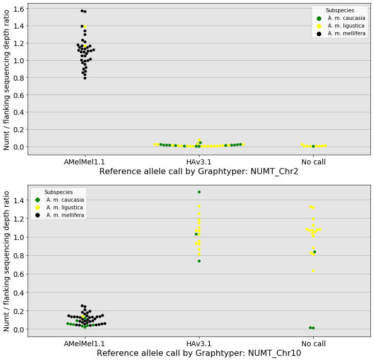

```python
import pandas as pd
import numpy as np
from matplotlib import pyplot as plt
import re
import csv
from sklearn.cluster import KMeans
import seaborn as sns
from collections import defaultdict
from IPython.display import display
```

# Sequencing depth in samples at two indels
## Two nuclear mitochondrial DNA (NUMT) were selected, from another study (unpublished)
* One NUMT present in AMelMel and absent in HAv3
* One NUMT absent in AMelMel and present in HAv3
* In both cases, the largest possible NUMT was selected (see below)

## Import table of insertions and deletions
* variants.vcf : ocontains insertions, deletions, inversions detected by alignment of AMelMel and HAv3 with minimap and structural variant detection with SVIM
* see minimap2, SVIM-asm, graphtyper2 in markdown file on GitHub: AMelMel_4_Structural_Variant_detection.md

## Extraction of relevant information from variants.vcf

----
```bash
#!/bin/bash

#selectDataFromVcf.bash

#Selects relevant columns from variants.vcf
#To analyse in Jupyter notebook DepthInsDelChrs2and10.ipynb

grep -v "#" variants.vcf | awk 'BEGIN{OFS="\t"}{print $1, $2, $3, $4, $5, $8}' | \
        awk 'BEGIN{FS="SVTYPE=" ; OFS=""}{print $1,$2}' | \
        awk 'BEGIN{FS=";END=" ; OFS="\t"}{print $1,$2}' | \
        awk 'BEGIN{FS=";SVLEN="; OFS="\t"}{print $1,$2}' > InsDelData.txt
```
-----


```python
# Import the genotyping data, as obtained by awk (see above) from the variants.vcf
df_DelIns = pd.read_csv("/Users/avignal/GenotoulWork/DepthChr3Inverstion/allInsDel/InsDelData.txt", 
                        sep="\t", header=None)
df_DelIns.columns = ['Chrom','Pos','Svim','Ref','Alt','Type','End','Length']
# Which types of structural variants are found in the file
df_DelIns.Type.unique()

```


    array(['DEL', 'INS', 'DUP:TANDEM', 'INV', 'BND'], dtype=object)


### Longest NUMT present in AMelMel and absent in HAv3 is on LG2: NUMT_Chr2


```python
df_DelIns[(df_DelIns.Chrom == 'NC_037639.1') & (df_DelIns.Pos > 12047000) & (df_DelIns.Pos < 12048000)]

```


<div>
<style scoped>
    .dataframe tbody tr th:only-of-type {
        vertical-align: middle;
    }

    .dataframe tbody tr th {
        vertical-align: top;
    }

    .dataframe thead th {
        text-align: right;
    }
</style>
<table border="1" class="dataframe">
  <thead>
    <tr style="text-align: right;">
      <th></th>
      <th>Chrom</th>
      <th>Pos</th>
      <th>Svim</th>
      <th>Ref</th>
      <th>Alt</th>
      <th>Type</th>
      <th>End</th>
      <th>Length</th>
    </tr>
  </thead>
  <tbody>
    <tr>
      <td>1514</td>
      <td>NC_037639.1</td>
      <td>12047549</td>
      <td>svim_asm.INS.760</td>
      <td>A</td>
      <td>AAGGTATTCAATAATAAATTTTATTTAAAATATTAAATTTATTATT...</td>
      <td>INS</td>
      <td>12047549.0</td>
      <td>745.0</td>
    </tr>
  </tbody>
</table>
</div>


### Longest NUMT present in HAv3 and absent in AMelMel is on LG10: NUMT_Chr10


```python
df_DelIns[(df_DelIns.Chrom == 'NC_037647.1') & (df_DelIns.Pos > 670500) & (df_DelIns.Pos < 671491)]

```


<div>
<style scoped>
    .dataframe tbody tr th:only-of-type {
        vertical-align: middle;
    }

    .dataframe tbody tr th {
        vertical-align: top;
    }

    .dataframe thead th {
        text-align: right;
    }
</style>
<table border="1" class="dataframe">
  <thead>
    <tr style="text-align: right;">
      <th></th>
      <th>Chrom</th>
      <th>Pos</th>
      <th>Svim</th>
      <th>Ref</th>
      <th>Alt</th>
      <th>Type</th>
      <th>End</th>
      <th>Length</th>
    </tr>
  </thead>
  <tbody>
    <tr>
      <td>6027</td>
      <td>NC_037647.1</td>
      <td>670675</td>
      <td>svim_asm.DEL.3005</td>
      <td>TTCTTTCAACATGGAATAATTTTTACAAAAAAAAGTTGTTGCTTAT...</td>
      <td>T</td>
      <td>DEL</td>
      <td>671251.0</td>
      <td>-576.0</td>
    </tr>
  </tbody>
</table>
</div>


## Test the status of : NUMT_Chr2 and : NUMT_Chr2 on samples sequenced by Illumina
### Samples from the Wragg et al 2022 paper: doi/10.1111/1755-0998.13665
* The A. m. mellifera sample used for the AMelMel assembly.
* 15 A. m. caucasia
* 30 A. m. ligustica
* 35 A. m. mellifera from Ouessant
### All aligned to AMelMel and to HAv3.1

* allBAMsHAv3.list : paths to the bam files of the alignments to HAv3
* allBAMsAMelMel.list : paths to the bam files of the alignments to AMelMel

```bash
head -3 allBAMsHAv3.list
/genphyse/cytogen/seqapipop/Data/Apis-mellifera/seqapipopOnHAV3_1/Haploid/Ab-PacBio_TCCGCGAA-CCTATCCT-BHCFFJDSXX_L004/bootstraping/Ab-PacBio_TCCGCGAA-CCTATCCT-BHCFFJDSXX_L004.bam
/genphyse/cytogen/seqapipop/Data/Apis-mellifera/seqapipopOnHAV3_1/Haploid/CAU10_ATCACG_L001/bootstraping/CAU10_ATCACG_L001.bam
/genphyse/cytogen/seqapipop/Data/Apis-mellifera/seqapipopOnHAV3_1/Haploid/CAU11_CGATGT_L001/bootstraping/CAU11_CGATGT_L001.bam

head -3 allBAMsAMelMel.list
/genphyse/cytogen/seqapipop/Data/Apis-mellifera/seqapipopOnAMelMel/Ab-PacBio_TCCGCGAA-CCTATCCT-BHCFFJDSXX_L004/bootstraping/Ab-PacBio_TCCGCGAA-CCTATCCT-BHCFFJDSXX_L004.bam
/genphyse/cytogen/seqapipop/Data/Apis-mellifera/seqapipopOnAMelMel/CAU10_ATCACG_L001/bootstraping/CAU10_ATCACG_L001.bam
/genphyse/cytogen/seqapipop/Data/Apis-mellifera/seqapipopOnAMelMel/CAU11_CGATGT_L001/bootstraping/CAU11_CGATGT_L001.bam
```
### Calculate sequencing depths of the alignments in two regions
* Longest AMel NUMT absent of HAv3, found: on chromosome 2
* Longest HAv3 NUMT absent of AMel, found: on chromosome 10
* Correspondence between the two regions from the output of the whole genome alignments done with the LAST software, to give the relevant regions for calculatins sequencing depth.

```bash
samtools depth -r NC_037639.1:12047000-12048000 -f allBAMsHAv3.list > allDepthsHAv3_NUMT_Chr2.table
samtools depth -r CM010320.1:12211278-12214019 -f allBAMsAMelMel.list > allDepthsAMelMel_NUMT_Chr2.table
samtools depth -r NC_037647.1:669701-672291 -f allBAMsHAv3.list > allDepthsHAv3_NUMT_Chr10.table
samtools depth -r CM010328.1:663884-665903 -f allBAMsAMelMel.list > allDepthsAMelMel_NUMT_Chr10.table
```
### Indices (columns) of the samples in the tables
* Ab-PacBio = indice 2
* The 15 caucasia = indices 3 to 17
* The 30 ligusticas = indices 18 to 47
* The 35 ligusticas = indices 48 to 82

## Plot figure : mean sequencing depths per populations
* Mean and standard deviation for all samples
* Mean for each of the three subspecies separately
* On AMelMel and on HAv3


```python
# Import the tables of sequencing depths
df_AMelMel_NUMT_LG2 = \
    pd.read_csv("/Users/avignal/GenotoulWork/DepthChr3Inverstion/allDepthsAMelMel_NUMT_Chr2.table",
                sep="\t", header=None)
df_HAv3_NUMT_LG2 = \
    pd.read_csv("/Users/avignal/GenotoulWork/DepthChr3Inverstion/allDepthsHAv3_NUMT_Chr2.table",
                sep="\t", header=None)
df_AMelMel_NUMT_LG10 = \
    pd.read_csv("/Users/avignal/GenotoulWork/DepthChr3Inverstion/allDepthsAMelMel_NUMT_Chr10.table",
                sep="\t", header=None)
df_HAv3_NUMT_LG10 = \
    pd.read_csv("/Users/avignal/GenotoulWork/DepthChr3Inverstion/allDepthsHAv3_NUMT_Chr10.table",
                sep="\t", header=None)

# Plot figures
fig, axs = plt.subplots(4,2,figsize=(15,20))

# Mean and standard deviation of sequencing depths for all samples: NUMT_Chr2 on AMelMel
axs[0,0].plot(df_AMelMel_NUMT_LG2.loc[:,1],df_AMelMel_NUMT_LG2.loc[:,3:82].mean(axis=1),
              label="Mean allsamples", c="red")
axs[0,0].plot(df_AMelMel_NUMT_LG2.loc[:,1],df_AMelMel_NUMT_LG2.loc[:,3:82].std(axis=1),
              label="SD allsamples", c="blue")
axs[0,0].legend(loc='lower left')

# Mean sequencing depths per subspecies: NUMT_Chr2 on AMelMel
axs[1,0].plot(df_AMelMel_NUMT_LG2.loc[:,1],df_AMelMel_NUMT_LG2.loc[:,3:17].mean(axis=1),
              label="A.m.caucasia", c="green")
axs[1,0].plot(df_AMelMel_NUMT_LG2.loc[:,1],df_AMelMel_NUMT_LG2.loc[:,18:47].mean(axis=1),
              label="A.m.ligustica", c="orange")
axs[1,0].plot(df_AMelMel_NUMT_LG2.loc[:,1],df_AMelMel_NUMT_LG2.loc[:,48:82].mean(axis=1),
              label="A.m.mellifera",c="black")
axs[1,0].legend(loc='lower left')

# Mean and standard deviation of sequencing depths for all samples: NUMT_Chr2 on HAv3
axs[0,1].plot(df_HAv3_NUMT_LG2.loc[:,1],df_HAv3_NUMT_LG2.loc[:,3:82].mean(axis=1),
              label="Mean allsamples", c="red")
axs[0,1].plot(df_HAv3_NUMT_LG2.loc[:,1],df_HAv3_NUMT_LG2.loc[:,3:82].std(axis=1),
              label="SD allsamples", c="blue")
axs[0,1].legend(loc='lower left')

# Mean sequencing depths per subspecies: NUMT_Chr2 on HAv3
axs[1,1].plot(df_HAv3_NUMT_LG2.loc[:,1],df_HAv3_NUMT_LG2.loc[:,3:17].mean(axis=1),
              label="A.m.caucasia", c="green")
axs[1,1].plot(df_HAv3_NUMT_LG2.loc[:,1],df_HAv3_NUMT_LG2.loc[:,18:47].mean(axis=1),
              label="A.m.ligustica", c="orange")
axs[1,1].plot(df_HAv3_NUMT_LG2.loc[:,1],df_HAv3_NUMT_LG2.loc[:,48:82].mean(axis=1),
              label="A.m.mellifera",c="black")
axs[1,1].legend(loc='lower left')

# Mean and standard deviation of sequencing depths for all samples: NUMT_Chr10 on AMelMel
axs[2,0].plot(df_AMelMel_NUMT_LG10.loc[:,1],df_AMelMel_NUMT_LG10.loc[:,3:82].mean(axis=1),
              label="Mean allsamples", c="red")
axs[2,0].plot(df_AMelMel_NUMT_LG10.loc[:,1],df_AMelMel_NUMT_LG10.loc[:,3:82].std(axis=1),
              label="SD allsamples", c="blue")
axs[2,0].legend(loc='lower left')

# Mean sequencing depths per subspecies: NUMT_Chr10 on AMelMel
axs[3,0].plot(df_AMelMel_NUMT_LG10.loc[:,1],df_AMelMel_NUMT_LG10.loc[:,3:17].mean(axis=1),
              label="A.m.caucasia", c="green")
axs[3,0].plot(df_AMelMel_NUMT_LG10.loc[:,1],df_AMelMel_NUMT_LG10.loc[:,18:47].mean(axis=1),
              label="A.m.ligustica", c="orange")
axs[3,0].plot(df_AMelMel_NUMT_LG10.loc[:,1],df_AMelMel_NUMT_LG10.loc[:,48:82].mean(axis=1),
              label="A.m.mellifera",c="black")
axs[3,0].legend(loc='lower left')

# Mean and standard deviation of sequencing depths for all samples: NUMT_Chr10 on HAv3
axs[2,1].plot(df_HAv3_NUMT_LG10.loc[:,1],df_HAv3_NUMT_LG10.loc[:,3:82].mean(axis=1),
              label="Mean allsamples", c="red")
axs[2,1].plot(df_HAv3_NUMT_LG10.loc[:,1],df_HAv3_NUMT_LG10.loc[:,3:82].std(axis=1),
              label="SD allsamples", c="blue")
axs[2,1].legend(loc='lower left')

# Mean sequencing depths per subspecies: NUMT_Chr10 on HAv3
axs[3,1].plot(df_HAv3_NUMT_LG10.loc[:,1],df_HAv3_NUMT_LG10.loc[:,3:17].mean(axis=1),
              label="A.m.caucasia", c="green")
axs[3,1].plot(df_HAv3_NUMT_LG10.loc[:,1],df_HAv3_NUMT_LG10.loc[:,18:47].mean(axis=1),
              label="A.m.ligustica", c="orange")
axs[3,1].plot(df_HAv3_NUMT_LG10.loc[:,1],df_HAv3_NUMT_LG10.loc[:,48:82].mean(axis=1),
              label="A.m.mellifera",c="black")
axs[3,1].legend(loc='lower left')

#Tick labels converted to kb
AMelMel_LG2_ticks = axs[0,0].get_xticks()
AMelMel_LG2_ticks = AMelMel_LG2_ticks/1000
axs[0,0].set_xticklabels(AMelMel_LG2_ticks)
axs[1,0].set_xticklabels(AMelMel_LG2_ticks)
axs[0,0].set_xlabel("AMelMel chromosome 2 (kb)", fontsize = 12)
axs[1,0].set_xlabel("AMelMel chromosome 2 (kb)", fontsize = 12)
axs[0,0].set_ylabel("Sequencing depth", fontsize = 12)
axs[1,0].set_ylabel("Sequencing depth", fontsize = 12)

HAv3_LG2_ticks = axs[0,1].get_xticks()
HAv3_LG2_ticks = HAv3_LG2_ticks/1000
axs[0,1].set_xticklabels(HAv3_LG2_ticks)
axs[1,1].set_xticklabels(HAv3_LG2_ticks)
axs[0,1].set_xlabel("HAv3 chromosome 2 (kb)", fontsize = 12)
axs[1,1].set_xlabel("HAv3 chromosome 2 (kb)", fontsize = 12)
axs[0,1].set_ylabel("Sequencing depth", fontsize = 12)
axs[1,1].set_ylabel("Sequencing depth", fontsize = 12)

AMelMel_LG10_ticks = axs[2,0].get_xticks()
AMelMel_LG10_ticks = AMelMel_LG10_ticks/1000
axs[2,0].set_xticklabels(AMelMel_LG10_ticks)
axs[3,0].set_xticklabels(AMelMel_LG10_ticks)
axs[2,0].set_xlabel("AMelMel chromosome 10 (kb)", fontsize = 12)
axs[3,0].set_xlabel("AMelMel chromosome 10 (kb)", fontsize = 12)
axs[2,0].set_ylabel("Sequencing depth", fontsize = 12)
axs[3,0].set_ylabel("Sequencing depth", fontsize = 12)

HAv3_LG10_ticks = axs[2,1].get_xticks()
HAv3_LG10_ticks = HAv3_LG10_ticks/1000
axs[2,1].set_xticklabels(HAv3_LG10_ticks)
axs[3,1].set_xticklabels(HAv3_LG10_ticks)
axs[2,1].set_xlabel("HAv3 chromosome 10 (kb)", fontsize = 12)
axs[3,1].set_xlabel("HAv3 chromosome 10 (kb)", fontsize = 12)
axs[2,1].set_ylabel("Sequencing depth", fontsize = 12)
axs[3,1].set_ylabel("Sequencing depth", fontsize = 12)

#fig.savefig("/Users/avignal/Documents/Articles/2019_PacificBee/Depth_LG2_10_All.pdf", bbox_inches='tight')

```


    Text(0, 0.5, 'Sequencing depth')


## Make tables with graphtyper2 results
### See AMelMel_4_Structural_Variant_detection.md for the production of the genotypes.txt files
#### Briefly : Graphtyper 2 was run for both NUMT_Chr and NUMT_Chr10 on the two variants.vcf.gz files produced by minimap and svim-asm: one with HAv3 as reference and AMelMel as query and one with the reverse
* 2 NUMTs X 2 minimap-svim_asm files = 4 output files named genotypes.txt by graphtyper, each in a separate directory
* NUMT_Chr10 could not be genotyped when using HAv3.1 as reference: the genotypes.txt was empty
* Three files left


```python


```


```python
# NUMT_Chr2: HAv3.1 as reference for minimap
chr2_HAv3 = \
    pd.read_csv('/Users/avignal/GenotoulWork/DepthChr3Inverstion/allInsDel/sv_results/NC_037639.1/genotypes.txt',
                sep="\t", header=None)
chr2_HAv3.columns = ['Chr','Pos','Ref','Alt','Sample','Genotype']
chr2_HAv3.Alt.value_counts()
AGGREGATED = chr2_HAv3.loc[chr2_HAv3.Alt == "<INS:SVSIZE=745:AGGREGATED>",['Sample','Genotype']]
AGGREGATED = AGGREGATED.set_index('Sample')
chr2_HAv3
BREAKPOINT2 = chr2_HAv3.loc[chr2_HAv3.Alt == "<INS:SVSIZE=745:BREAKPOINT2>",['Sample','Genotype']]
BREAKPOINT2 = BREAKPOINT2.set_index('Sample')
chr2_HAv3 = AGGREGATED.join(BREAKPOINT2,lsuffix='Agg', rsuffix='Bk2')
#chr2_HAv3

# NUMT_Chr2: AMelMel1.1 as reference
chr2_AMel = \
    pd.read_csv('/Users/avignal/GenotoulWork/DepthChr3Inverstion/allInsDel/HAv3_on_AMel/sv_results/CM010320.1/genotypes.txt',
                sep="\t", header=None)
chr2_AMel.columns = ['Chr','Pos','Ref','Alt','Sample','Genotype']
chr2_AMel.Alt.value_counts()
AGGREGATED = chr2_AMel.loc[chr2_AMel.Alt == "<DEL:SVSIZE=745:AGGREGATED>",['Sample','Genotype']]
AGGREGATED = AGGREGATED.set_index('Sample')
chr2_HAv3
BREAKPOINT2 = chr2_AMel.loc[chr2_AMel.Alt == "<DEL:SVSIZE=745:BREAKPOINT>",['Sample','Genotype']]
BREAKPOINT2 = BREAKPOINT2.set_index('Sample')
chr2_AMel = AGGREGATED.join(BREAKPOINT2,lsuffix='Agg', rsuffix='Bk')
#chr2_AMel

# Compare results for NUMT_Chr2 between both references
chr2_Numt = chr2_HAv3.join(chr2_AMel, lsuffix='Hav', rsuffix='Amel')
chr2_Numt = chr2_Numt.reset_index()
chr2_Numt['Chr2HAv'] = "./."
chr2_Numt.loc[chr2_Numt.GenotypeAggHav == chr2_Numt.GenotypeBk2,'Chr2HAv'] = chr2_Numt.GenotypeAggHav
chr2_Numt['Chr2AMel'] = "./."
chr2_Numt.loc[chr2_Numt.GenotypeAggAmel == chr2_Numt.GenotypeBk,'Chr2AMel'] = chr2_Numt.GenotypeAggAmel
chr2_Numt = chr2_Numt[['Sample','Chr2HAv','Chr2AMel']]
chr2_Numt['NUMT'] = "./."
chr2_Numt['Calls'] = 0
chr2_Numt.loc[(chr2_Numt.Chr2HAv == "1/1") & (chr2_Numt.Chr2AMel == "0/0"),'NUMT'] = "0/0"
chr2_Numt.loc[(chr2_Numt.Chr2HAv == "1/1") & (chr2_Numt.Chr2AMel == "0/0"),'Calls'] = 2
chr2_Numt.loc[(chr2_Numt.Chr2HAv == "0/0") & (chr2_Numt.Chr2AMel == "1/1"),'NUMT'] = "1/1"
chr2_Numt.loc[(chr2_Numt.Chr2HAv == "0/0") & (chr2_Numt.Chr2AMel == "1/1"),'Calls'] = 2
chr2_Numt.loc[(chr2_Numt.Chr2HAv == "1/1") & (chr2_Numt.Chr2AMel == "./."),'NUMT'] = "0/0"
chr2_Numt.loc[(chr2_Numt.Chr2HAv == "1/1") & (chr2_Numt.Chr2AMel == "./."),'Calls'] = 1
chr2_Numt.loc[(chr2_Numt.Chr2HAv == "0/0") & (chr2_Numt.Chr2AMel == "./."),'NUMT'] = "1/1"
chr2_Numt.loc[(chr2_Numt.Chr2HAv == "0/0") & (chr2_Numt.Chr2AMel == "./."),'Calls'] = 1
chr2_Numt.loc[(chr2_Numt.Chr2HAv == "./.") & (chr2_Numt.Chr2AMel == "0/0"),'NUMT'] = "0/0"
chr2_Numt.loc[(chr2_Numt.Chr2HAv == "./.") & (chr2_Numt.Chr2AMel == "0/0"),'Calls'] = 1
chr2_Numt.loc[(chr2_Numt.Chr2HAv == "./.") & (chr2_Numt.Chr2AMel == "1/1"),'NUMT'] = "1/1"
chr2_Numt.loc[(chr2_Numt.Chr2HAv == "./.") & (chr2_Numt.Chr2AMel == "1/1"),'Calls'] = 1
chr2_Numt.Calls.value_counts().to_frame()
chr2_Numt = chr2_Numt[chr2_Numt.Sample != "Ab-PacBio"]
#chr2_Numt

# Chromosome 10: AMelMel1.1 as reference
chr10_AMel = \
    pd.read_csv('/Users/avignal/GenotoulWork/DepthChr3Inverstion/allInsDel/HAv3_on_AMel/sv_results/CM010328.1/genotypes.txt',
                sep="\t", header=None)
chr10_AMel.columns = ['Chr','Pos','Ref','Alt','Sample','Genotype']
chr10_AMel.Alt.value_counts()
AGGREGATED = chr10_AMel.loc[chr10_AMel.Alt == "<INS:SVSIZE=576:AGGREGATED>",['Sample','Genotype']]
AGGREGATED = AGGREGATED.set_index('Sample')
chr2_HAv3
BREAKPOINT2 = chr10_AMel.loc[chr10_AMel.Alt == "<INS:SVSIZE=576:BREAKPOINT1>",['Sample','Genotype']]
BREAKPOINT2 = BREAKPOINT2.set_index('Sample')
chr10_AMel = AGGREGATED.join(BREAKPOINT2,lsuffix='Agg', rsuffix='Bk1')
chr10_AMel = chr10_AMel.reset_index()
chr10_AMel = chr10_AMel[chr10_AMel.Sample != "Ab-PacBio"]
#chr10_AMel


# Aggregate all 3 genotyping sets
All_NUMTs = chr2_Numt.set_index('Sample').join(chr10_AMel.set_index('Sample'))
All_NUMTs = All_NUMTs.reset_index()
All_NUMTs = All_NUMTs[['Sample','Chr2HAv','Chr2AMel','GenotypeAgg']]
All_NUMTs.columns = ['Sample','NUMT_Chr2_HAv3.1','NUMT_Chr2_AMelMel1.1','NUMT_Chr10_AMelMel1.1']
All_NUMTs.head()

```


<div>
<style scoped>
    .dataframe tbody tr th:only-of-type {
        vertical-align: middle;
    }

    .dataframe tbody tr th {
        vertical-align: top;
    }

    .dataframe thead th {
        text-align: right;
    }
</style>
<table border="1" class="dataframe">
  <thead>
    <tr style="text-align: right;">
      <th></th>
      <th>Sample</th>
      <th>NUMT_Chr2_HAv3.1</th>
      <th>NUMT_Chr2_AMelMel1.1</th>
      <th>NUMT_Chr10_AMelMel1.1</th>
    </tr>
  </thead>
  <tbody>
    <tr>
      <td>0</td>
      <td>CAU10</td>
      <td>0/0</td>
      <td>1/1</td>
      <td>0/0</td>
    </tr>
    <tr>
      <td>1</td>
      <td>CAU11</td>
      <td>0/0</td>
      <td>1/1</td>
      <td>./.</td>
    </tr>
    <tr>
      <td>2</td>
      <td>CAU12</td>
      <td>0/0</td>
      <td>1/1</td>
      <td>0/0</td>
    </tr>
    <tr>
      <td>3</td>
      <td>CAU14</td>
      <td>0/0</td>
      <td>1/1</td>
      <td>0/0</td>
    </tr>
    <tr>
      <td>4</td>
      <td>CAU15A</td>
      <td>0/0</td>
      <td>./.</td>
      <td>0/0</td>
    </tr>
  </tbody>
</table>
</div>


### Count missing and heterozygote calls


```python
# Count missing and heterozygote calls
counts_HAv3_Chr2 = chr2_Numt.Chr2HAv.value_counts().to_frame()#.reset_index()
counts_AMel_Chr2 = chr2_Numt.Chr2AMel.value_counts().to_frame()
counts_all = counts_AMel_Chr2.join(counts_HAv3_Chr2)
counts_AMel_Chr10 = chr10_AMel.GenotypeAgg.value_counts().to_frame()
counts_all = counts_all.join(counts_AMel_Chr10)
counts_all = counts_all.rename(columns={'GenotypeAgg':'Chr10AMel'})
counts_all = counts_all.fillna(0)
counts_all = counts_all.astype(int)
counts_all

```


<div>
<style scoped>
    .dataframe tbody tr th:only-of-type {
        vertical-align: middle;
    }

    .dataframe tbody tr th {
        vertical-align: top;
    }

    .dataframe thead th {
        text-align: right;
    }
</style>
<table border="1" class="dataframe">
  <thead>
    <tr style="text-align: right;">
      <th></th>
      <th>Chr2AMel</th>
      <th>Chr2HAv</th>
      <th>Chr10AMel</th>
    </tr>
  </thead>
  <tbody>
    <tr>
      <td>0/0</td>
      <td>35</td>
      <td>27</td>
      <td>45</td>
    </tr>
    <tr>
      <td>1/1</td>
      <td>33</td>
      <td>36</td>
      <td>16</td>
    </tr>
    <tr>
      <td>./.</td>
      <td>10</td>
      <td>17</td>
      <td>19</td>
    </tr>
    <tr>
      <td>0/1</td>
      <td>2</td>
      <td>0</td>
      <td>0</td>
    </tr>
  </tbody>
</table>
</div>


### Estimate success rate


```python
# Estimate success rate
Chr2AMel_success = (counts_all.loc['0/0','Chr2AMel'] + counts_all.loc['1/1','Chr2AMel']) / 80
Chr2HAv_success = (counts_all.loc['0/0','Chr2HAv'] + counts_all.loc['1/1','Chr2HAv']) / 80
Chr10AMel_success = (counts_all.loc['0/0','Chr10AMel'] + counts_all.loc['1/1','Chr10AMel']) / 80
print("Success rate:\nNUMT_Chr2 on HAv3.1: " + str(Chr2HAv_success) + \
      "\nNUMT_Chr10 on HAv3.1: 0.0\nNUMT_Chr2 on AMelMel1.1: " + str(Chr2AMel_success) + \
      "\nNUMT_Chr10 on AMelMel1.1: " + str(Chr10AMel_success))

```

    Success rate:
    NUMT_Chr2 on HAv3.1: 0.7875
    NUMT_Chr10 on HAv3.1: 0.0
    NUMT_Chr2 on AMelMel1.1: 0.85
    NUMT_Chr10 on AMelMel1.1: 0.7625


### Genotypes per population


```python
#Chromosome 2
chr2_CAU = chr2_Numt[chr2_Numt.Sample.str.contains('^CAU')].NUMT.value_counts().to_frame()
chr2_ITA = chr2_Numt[chr2_Numt.Sample.str.contains('^ITA')].NUMT.value_counts().to_frame()
chr2_OUE = chr2_Numt[chr2_Numt.Sample.str.contains('^OUE')].NUMT.value_counts().to_frame()
Chr2_per_population = chr2_OUE.join(chr2_ITA, lsuffix = "_OUE", rsuffix = "_ITA", how='outer').join(chr2_CAU, how='outer')
Chr2_per_population = Chr2_per_population.fillna(0)
Chr2_per_population.columns = ['Mellifera','Ligustica','Caucasia']
Chr2_per_population.stack().to_frame()
Chr2_per_population = Chr2_per_population.stack().to_frame()
Chr2_per_population['Chromosome'] = 2
Chr2_per_population = Chr2_per_population.reset_index()
Chr2_per_population


#Chromosome 10
chr10_CAU = chr10_AMel[chr10_AMel.Sample.str.contains('^CAU')].GenotypeAgg.value_counts().to_frame()
chr10_ITA = chr10_AMel[chr10_AMel.Sample.str.contains('^ITA')].GenotypeAgg.value_counts().to_frame()
chr10_OUE = chr10_AMel[chr10_AMel.Sample.str.contains('^OUE')].GenotypeAgg.value_counts().to_frame()
Chr10_per_population = chr10_OUE.join(chr10_ITA, lsuffix = "_OUE", rsuffix = "_ITA", how='outer').join(chr10_CAU, how='outer')
Chr10_per_population = Chr10_per_population.fillna(0)
Chr10_per_population.columns = ['Mellifera','Ligustica','Caucasia']
Chr10_per_population = Chr10_per_population.stack().to_frame()
Chr10_per_population['Chromosome'] = 10
Chr10_per_population = Chr10_per_population.reset_index()
Chr10_per_population


# Concatenate
genotype_counts = pd.concat([Chr2_per_population,Chr10_per_population],axis = 0)
genotype_counts.columns = ['Genotype','Population','Count','Chromosome']
genotype_counts.reset_index()
genotype_counts = genotype_counts[['Genotype','Population','Count','Chromosome']]
genotype_counts['Count'] = genotype_counts['Count'].astype(int)

genotype_counts.loc[genotype_counts.Genotype == "1/1","Genotype"] = "HAv3.1"
genotype_counts.loc[genotype_counts.Genotype == "0/0","Genotype"] = "AMelMel1.1"
genotype_counts.loc[genotype_counts.Genotype == "./.","Genotype"] = "No call"

genotype_counts = genotype_counts.set_index(['Chromosome','Population','Genotype'])
genotype_counts = genotype_counts.unstack(['Chromosome','Population'])
genotype_counts.to_csv("/Users/avignal/Documents/Articles/2019_PacificBee/table_genotypes.txt",sep="\t")
genotype_counts

```


<div>
<style scoped>
    .dataframe tbody tr th:only-of-type {
        vertical-align: middle;
    }

    .dataframe tbody tr th {
        vertical-align: top;
    }

    .dataframe thead tr th {
        text-align: left;
    }

    .dataframe thead tr:last-of-type th {
        text-align: right;
    }
</style>
<table border="1" class="dataframe">
  <thead>
    <tr>
      <th></th>
      <th colspan="6" halign="left">Count</th>
    </tr>
    <tr>
      <th>Chromosome</th>
      <th colspan="3" halign="left">2</th>
      <th colspan="3" halign="left">10</th>
    </tr>
    <tr>
      <th>Population</th>
      <th>Mellifera</th>
      <th>Ligustica</th>
      <th>Caucasia</th>
      <th>Mellifera</th>
      <th>Ligustica</th>
      <th>Caucasia</th>
    </tr>
    <tr>
      <th>Genotype</th>
      <th></th>
      <th></th>
      <th></th>
      <th></th>
      <th></th>
      <th></th>
    </tr>
  </thead>
  <tbody>
    <tr>
      <td>AMelMel1.1</td>
      <td>35</td>
      <td>2</td>
      <td>0</td>
      <td>35</td>
      <td>1</td>
      <td>9</td>
    </tr>
    <tr>
      <td>HAv3.1</td>
      <td>0</td>
      <td>20</td>
      <td>14</td>
      <td>0</td>
      <td>13</td>
      <td>3</td>
    </tr>
    <tr>
      <td>No call</td>
      <td>0</td>
      <td>8</td>
      <td>1</td>
      <td>0</td>
      <td>16</td>
      <td>3</td>
    </tr>
  </tbody>
</table>
</div>


## Individual genotyping of NUMT_Chr2 and NUMT_Chr10: by using sequencing depth
* Obtain list of samples
```
awk 'BEGIN{FS="/"}{print $8}' allBAMsAMelMel.list | awk 'BEGIN{FS="_"}{print $1}' > Samples.list
```
* Extract individual sequencing depths for samples aligned to the reference genome containing the NUMT
    * Alignments to AMelMel1.1 for NUMT_Chr2
    * Alignments to HAv3.1 for NUMT_Chr10
* Calculate for each individual the ratio between sequencing depth at the NUMT and in the flanking regions
* Assign ratios to two groups by K-means clustering
* In dataframes ratios_chr2_df and ratios_chr10_df
* Merge to Graphtyper results: ind ataframes ratios_chr2_df_graphtyper and ratios_chr10_df_graphtyper
* Plot


```python
"""Plot the sequencing depth ratios with the Graphtyper 2 results"""

# Make list of samples, to use as column headers (insert headers 'Chrom' and 'Pos')
samples_list = pd.read_csv('/Users/avignal/GenotoulWork/DepthChr3Inverstion/Samples.list', sep = "\n", header = None)
samples_list = list(samples_list.loc[:,0])
samples_to_genotype = samples_list[1:len(samples_list)] # The first sample Ab-PacBio removed, as it is the sample used for AMelMel
samples_list.insert(0, 'Pos')
samples_list.insert(0, 'Chrom')


# Make figure space for plotting
fig = plt.figure(figsize=(12,12))
ax = fig.add_subplot(111)
ax.spines['top'].set_color('none')
ax.spines['bottom'].set_color('none')
ax.spines['left'].set_color('none')
ax.spines['right'].set_color('none')
ax.tick_params(top=False, bottom=False, left=False, right=False,labelbottom=False, labeltop=False, labelleft=False, labelright=False)
ax.tick_params(labelcolor='w', top=False, bottom=False, left=False, right=False)
ax.axis('off')

##### PLOT 1

df_AMelMel_NUMT_LG2_new = df_AMelMel_NUMT_LG2.copy()
df_AMelMel_NUMT_LG2_new.columns = samples_list
ratios_chr2 = []
for i in samples_to_genotype:
    flanking = df_AMelMel_NUMT_LG2_new[(df_AMelMel_NUMT_LG2_new.Pos < 12212275) | (df_AMelMel_NUMT_LG2_new.Pos > 12213020)][i]#.mean()
    insert = df_AMelMel_NUMT_LG2_new[(df_AMelMel_NUMT_LG2_new.Pos >= 12212275) & (df_AMelMel_NUMT_LG2_new.Pos <= 12213020)][i]
    flanking_mean = flanking.mean()
    insert_mean = insert.mean()
    ratio = insert_mean / flanking_mean
    ratios_chr2.append([i,flanking_mean, insert_mean, ratio])
ratios_chr2_df = pd.DataFrame(ratios_chr2, columns=['Sample', 'Flanking', 'Insert','Ratio'])
ratios_chr2_df['Chromosome'] = 2
ratios_chr2_df['Color'] = ''
ratios_chr2_df['Subspecies'] = ''

ratios_chr2_df.at[ratios_chr2_df.Sample.str.contains('^CAU'),'Color'] = 'green'
ratios_chr2_df.at[ratios_chr2_df.Sample.str.contains('^CAU'),'Subspecies'] = 'A. m. caucasia'
ratios_chr2_df.at[ratios_chr2_df.Sample.str.contains('^OUE'),'Color'] = 'black'
ratios_chr2_df.at[ratios_chr2_df.Sample.str.contains('^OUE'),'Subspecies'] = 'A. m. mellifera'
ratios_chr2_df.at[ratios_chr2_df.Sample.str.contains('^ITA'),'Color'] = 'yellow'
ratios_chr2_df.at[ratios_chr2_df.Sample.str.contains('^ITA'),'Subspecies'] = 'A. m. ligustica'
ratios_chr2_df

kmeans = KMeans(n_clusters=2).fit(np.array(ratios_chr2_df['Ratio']).reshape(-1, 1))
centroids = kmeans.cluster_centers_
ratios_chr2_df['Genotype'] = kmeans.labels_.tolist()

ax2 = fig.add_subplot(211)

ax2.patch.set_facecolor('#ababab')
ax2.patch.set_alpha(0.3)
ax2.grid()

chr2_Numt_new = chr2_Numt.copy()
chr2_Numt_new['Graphtyper'] = 'No call'
chr2_Numt_new.loc[chr2_Numt_new.NUMT == "1/1",'Graphtyper'] = 'HAv3.1'
chr2_Numt_new.loc[chr2_Numt_new.NUMT == "0/0",'Graphtyper'] = 'AMelMel1.1'

chr2_Numt_new = chr2_Numt_new[['Sample','Graphtyper']].set_index('Sample')
ratios_chr2_df_idx = ratios_chr2_df.set_index('Sample')
ratios_chr2_df_graphtyper = ratios_chr2_df_idx.join(chr2_Numt_new)
ratios_chr2_df_graphtyper

ratios_chr2_df_graphtyper['Genome'] = 'Unknown'
ratios_chr2_df_graphtyper.loc[ratios_chr2_df_graphtyper.Genotype == 1,'Genome'] = 'HAv3.1'
ratios_chr2_df_graphtyper.loc[ratios_chr2_df_graphtyper.Genotype == 0,'Genome'] = 'AMelMel1.1'
ratios_chr2_df_graphtyper

sns.swarmplot(x="Graphtyper", y="Ratio", data=ratios_chr2_df_graphtyper, order=['AMelMel1.1','HAv3.1','No call'],
             hue="Subspecies", palette = ['green','yellow','black'], size=5.5)
plt.xlabel("Reference allele call by Graphtyper: NUMT_Chr2", fontsize=16)
plt.ylabel("Numt / flanking sequencing depth ratio", fontsize=14)
plt.tick_params(axis='both', which='major', labelsize=14)

##### PLOT 2

df_HAv3_NUMT_LG10_new = df_HAv3_NUMT_LG10.copy()
df_HAv3_NUMT_LG10_new.columns = samples_list
ratios_chr10 = []
for i in samples_to_genotype:
    flanking = df_HAv3_NUMT_LG10_new[(df_HAv3_NUMT_LG10_new.Pos < 670675) | (df_HAv3_NUMT_LG10_new.Pos > 671251)][i]#.mean()
    insert = df_HAv3_NUMT_LG10_new[(df_HAv3_NUMT_LG10_new.Pos >= 670675) & (df_HAv3_NUMT_LG10_new.Pos <= 671251)][i]
    flanking_mean = flanking.mean() # / len(flanking)
    insert_mean = insert.mean() # / len(insert)
    ratio = insert_mean / flanking_mean
    ratios_chr10.append([i,flanking_mean, insert_mean, ratio])
ratios_chr10_df = pd.DataFrame(ratios_chr10, columns=['Sample', 'Flanking', 'Insert','Ratio'])
ratios_chr10_df['Chromosome'] = 10
ratios_chr10_df['Color'] = ''
ratios_chr10_df['Subspecies'] = ''
ratios_chr10_df.at[ratios_chr10_df.Sample.str.contains('^CAU'),'Color'] = 'green'
ratios_chr10_df.at[ratios_chr10_df.Sample.str.contains('^CAU'),'Subspecies'] = 'A. m. caucasia'
ratios_chr10_df.at[ratios_chr10_df.Sample.str.contains('^OUE'),'Color'] = 'black'
ratios_chr10_df.at[ratios_chr10_df.Sample.str.contains('^OUE'),'Subspecies'] = 'A. m. mellifera'
ratios_chr10_df.at[ratios_chr10_df.Sample.str.contains('^ITA'),'Color'] = 'yellow'
ratios_chr10_df.at[ratios_chr10_df.Sample.str.contains('^ITA'),'Subspecies'] = 'A. m. ligustica'
ratios_chr10_df

kmeans = KMeans(n_clusters=2).fit(np.array(ratios_chr10_df['Ratio']).reshape(-1, 1))
centroids = kmeans.cluster_centers_
ratios_chr10_df['Genotype'] = kmeans.labels_.tolist()

ax4 = fig.add_subplot(212)

ax4.patch.set_facecolor('#ababab')
ax4.patch.set_alpha(0.3)
ax4.grid()

chr10_Numt_new = chr10_AMel.copy()
chr10_Numt_new['Graphtyper'] = 'No call'
chr10_Numt_new.loc[chr10_Numt_new.GenotypeBk1 == "1/1",'Graphtyper'] = 'HAv3.1'
chr10_Numt_new.loc[chr10_Numt_new.GenotypeBk1 == "0/0",'Graphtyper'] = 'AMelMel1.1'

chr10_Numt_new = chr10_Numt_new[['Sample','Graphtyper']].set_index('Sample')
ratios_chr10_df_idx = ratios_chr10_df.set_index('Sample')
ratios_chr10_df_graphtyper = ratios_chr10_df_idx.join(chr10_Numt_new)

ratios_chr10_df_graphtyper['Genome'] = 'Unknown'
ratios_chr10_df_graphtyper.loc[ratios_chr10_df_graphtyper.Genotype == 0,'Genome'] = 'HAv3.1'
ratios_chr10_df_graphtyper.loc[ratios_chr10_df_graphtyper.Genotype == 1,'Genome'] = 'AMelMel1.1'
ratios_chr10_df_graphtyper

import seaborn as sns
sns.swarmplot(x="Graphtyper", y="Ratio", data=ratios_chr10_df_graphtyper, order=['AMelMel1.1','HAv3.1','No call'],
             hue="Subspecies", palette = ['green','yellow','black'], size=5.5)

plt.xlabel("Reference allele call by Graphtyper: NUMT_Chr10", fontsize=16)
plt.ylabel("Numt / flanking sequencing depth ratio", fontsize=14)
plt.tick_params(axis='both', which='major', labelsize=14)

fig.savefig("/Users/avignal/Documents/Articles/2019_PacificBee/Calling_NUMTs_Subspecies.pdf")

```





```python
"""Plot the effect of sequencing depth on call rate"""

#ratios_chr2_df_colors = ratios_chr2_df.copy()
#ratios_chr2_df['Color'] = ''
#ratios_chr2_df.at[ratios_chr2_df.Sample.str.contains('^CAU'),'Color'] = 'green'
#ratios_chr2_df.at[ratios_chr2_df.Sample.str.contains('^OUE'),'Color'] = 'black'
#ratios_chr2_df.at[ratios_chr2_df.Sample.str.contains('^ITA'),'Color'] = 'yellow'
#ratios_chr2_df


# Make list of samples, to use as column headers (insert headers 'Chrom' and 'Pos')
samples_list = pd.read_csv('/Users/avignal/GenotoulWork/DepthChr3Inverstion/Samples.list', sep = "\n", header = None)
samples_list = list(samples_list.loc[:,0])
samples_to_genotype = samples_list[1:len(samples_list)] # The first sample Ab-PacBio removed, as it is the sample used for AMelMel
samples_list.insert(0, 'Pos')
samples_list.insert(0, 'Chrom')


# Make figure space for plotting
fig = plt.figure(figsize=(12,12))
ax = fig.add_subplot(111)
ax.spines['top'].set_color('none')
ax.spines['bottom'].set_color('none')
ax.spines['left'].set_color('none')
ax.spines['right'].set_color('none')
ax.tick_params(top=False, bottom=False, left=False, right=False,labelbottom=False, labeltop=False, labelleft=False, labelright=False)
ax.tick_params(labelcolor='w', top=False, bottom=False, left=False, right=False)
ax.axis('off')

##### PLOT 1

df_AMelMel_NUMT_LG2_new = df_AMelMel_NUMT_LG2.copy()
df_AMelMel_NUMT_LG2_new.columns = samples_list
ratios_chr2 = []
for i in samples_to_genotype:
    flanking = df_AMelMel_NUMT_LG2_new[(df_AMelMel_NUMT_LG2_new.Pos < 12212275) | (df_AMelMel_NUMT_LG2_new.Pos > 12213020)][i]#.mean()
    insert = df_AMelMel_NUMT_LG2_new[(df_AMelMel_NUMT_LG2_new.Pos >= 12212275) & (df_AMelMel_NUMT_LG2_new.Pos <= 12213020)][i]
    flanking_mean = flanking.mean()
    insert_mean = insert.mean()
    ratio = insert_mean / flanking_mean
    ratios_chr2.append([i,flanking_mean, insert_mean, ratio])
ratios_chr2_df = pd.DataFrame(ratios_chr2, columns=['Sample', 'Flanking', 'Insert','Ratio'])
ratios_chr2_df['Chromosome'] = 2
ratios_chr2_df['Color'] = ''
ratios_chr2_df['Subspecies'] = ''

ratios_chr2_df.at[ratios_chr2_df.Sample.str.contains('^CAU'),'Color'] = 'green'
ratios_chr2_df.at[ratios_chr2_df.Sample.str.contains('^CAU'),'Subspecies'] = 'A. m. caucasia'
ratios_chr2_df.at[ratios_chr2_df.Sample.str.contains('^OUE'),'Color'] = 'black'
ratios_chr2_df.at[ratios_chr2_df.Sample.str.contains('^OUE'),'Subspecies'] = 'A. m. mellifera'
ratios_chr2_df.at[ratios_chr2_df.Sample.str.contains('^ITA'),'Color'] = 'yellow'
ratios_chr2_df.at[ratios_chr2_df.Sample.str.contains('^ITA'),'Subspecies'] = 'A. m. ligustica'
ratios_chr2_df

kmeans = KMeans(n_clusters=2).fit(np.array(ratios_chr2_df['Ratio']).reshape(-1, 1))
centroids = kmeans.cluster_centers_
ratios_chr2_df['Genotype'] = kmeans.labels_.tolist()

ax2 = fig.add_subplot(211)

ax2.patch.set_facecolor('#ababab')
ax2.patch.set_alpha(0.3)
ax2.grid()

chr2_Numt_new = chr2_Numt.copy()
chr2_Numt_new['Graphtyper'] = 'No call'
chr2_Numt_new.loc[chr2_Numt_new.NUMT == "1/1",'Graphtyper'] = 'HAv3.1'
chr2_Numt_new.loc[chr2_Numt_new.NUMT == "0/0",'Graphtyper'] = 'AMelMel1.1'

chr2_Numt_new = chr2_Numt_new[['Sample','Graphtyper']].set_index('Sample')
ratios_chr2_df_idx = ratios_chr2_df.set_index('Sample')
ratios_chr2_df_graphtyper = ratios_chr2_df_idx.join(chr2_Numt_new)
ratios_chr2_df_graphtyper

ratios_chr2_df_graphtyper['Genome'] = 'Unknown'
ratios_chr2_df_graphtyper.loc[ratios_chr2_df_graphtyper.Genotype == 1,'Genome'] = 'HAv3.1'
ratios_chr2_df_graphtyper.loc[ratios_chr2_df_graphtyper.Genotype == 0,'Genome'] = 'AMelMel1.1'
ratios_chr2_df_graphtyper

sns.swarmplot(x="Graphtyper", y="Flanking", data=ratios_chr2_df_graphtyper, order=['AMelMel1.1','HAv3.1','No call'],
             hue="Subspecies", palette = ['green','yellow','black'], size=5.5)
plt.xlabel("Reference allele call by Graphtyper: NUMT_Chr2", fontsize=16)
plt.ylabel("Sequencing depth in flanking", fontsize=14)
plt.tick_params(axis='both', which='major', labelsize=14)

##### PLOT 2

df_HAv3_NUMT_LG10_new = df_HAv3_NUMT_LG10.copy()
df_HAv3_NUMT_LG10_new.columns = samples_list
ratios_chr10 = []
for i in samples_to_genotype:
    flanking = df_HAv3_NUMT_LG10_new[(df_HAv3_NUMT_LG10_new.Pos < 670675) | (df_HAv3_NUMT_LG10_new.Pos > 671251)][i]#.mean()
    insert = df_HAv3_NUMT_LG10_new[(df_HAv3_NUMT_LG10_new.Pos >= 670675) & (df_HAv3_NUMT_LG10_new.Pos <= 671251)][i]
    flanking_mean = flanking.mean() # / len(flanking)
    insert_mean = insert.mean() # / len(insert)
    ratio = insert_mean / flanking_mean
    ratios_chr10.append([i,flanking_mean, insert_mean, ratio])
ratios_chr10_df = pd.DataFrame(ratios_chr10, columns=['Sample', 'Flanking', 'Insert','Ratio'])
ratios_chr10_df['Chromosome'] = 10
ratios_chr10_df['Color'] = ''
ratios_chr10_df['Subspecies'] = ''
ratios_chr10_df.at[ratios_chr10_df.Sample.str.contains('^CAU'),'Color'] = 'green'
ratios_chr10_df.at[ratios_chr10_df.Sample.str.contains('^CAU'),'Subspecies'] = 'A. m. caucasia'
ratios_chr10_df.at[ratios_chr10_df.Sample.str.contains('^OUE'),'Color'] = 'black'
ratios_chr10_df.at[ratios_chr10_df.Sample.str.contains('^OUE'),'Subspecies'] = 'A. m. mellifera'
ratios_chr10_df.at[ratios_chr10_df.Sample.str.contains('^ITA'),'Color'] = 'yellow'
ratios_chr10_df.at[ratios_chr10_df.Sample.str.contains('^ITA'),'Subspecies'] = 'A. m. ligustica'
ratios_chr10_df

kmeans = KMeans(n_clusters=2).fit(np.array(ratios_chr10_df['Ratio']).reshape(-1, 1))
centroids = kmeans.cluster_centers_
ratios_chr10_df['Genotype'] = kmeans.labels_.tolist()

ax4 = fig.add_subplot(212)

ax4.patch.set_facecolor('#ababab')
ax4.patch.set_alpha(0.3)
ax4.grid()

chr10_Numt_new = chr10_AMel.copy()
chr10_Numt_new['Graphtyper'] = 'No call'
chr10_Numt_new.loc[chr10_Numt_new.GenotypeBk1 == "1/1",'Graphtyper'] = 'HAv3.1'
chr10_Numt_new.loc[chr10_Numt_new.GenotypeBk1 == "0/0",'Graphtyper'] = 'AMelMel1.1'

chr10_Numt_new = chr10_Numt_new[['Sample','Graphtyper']].set_index('Sample')
ratios_chr10_df_idx = ratios_chr10_df.set_index('Sample')
ratios_chr10_df_graphtyper = ratios_chr10_df_idx.join(chr10_Numt_new)

ratios_chr10_df_graphtyper['Genome'] = 'Unknown'
ratios_chr10_df_graphtyper.loc[ratios_chr10_df_graphtyper.Genotype == 0,'Genome'] = 'HAv3.1'
ratios_chr10_df_graphtyper.loc[ratios_chr10_df_graphtyper.Genotype == 1,'Genome'] = 'AMelMel1.1'
ratios_chr10_df_graphtyper

import seaborn as sns
sns.swarmplot(x="Graphtyper", y="Flanking", data=ratios_chr10_df_graphtyper, order=['AMelMel1.1','HAv3.1','No call'],
             hue="Subspecies", palette = ['green','yellow','black'], size=5.5)

plt.xlabel("Reference allele call by Graphtyper: NUMT_Chr10", fontsize=16)
plt.ylabel("Sequencing depth in flanking", fontsize=14)
plt.tick_params(axis='both', which='major', labelsize=14)

fig.savefig("/Users/avignal/Documents/Articles/2019_PacificBee/Calling_NUMTs_Subspecies_Depth.pdf")

```


```python
"""Sample with the lowest sequencing depth"""
ratios_chr2_df_graphtyper.Flanking.min()

```


    2.8952905811623246


```python
"""Plot the sequencing depth ratio as a function of sequencing depth
and colour as function of assignment to the two groups of sequencing depth ratios""" 

# Make list of samples, to use as column headers (insert headers 'Chrom' and 'Pos')
samples_list = pd.read_csv('/Users/avignal/GenotoulWork/DepthChr3Inverstion/Samples.list', sep = "\n", header = None)
samples_list = list(samples_list.loc[:,0])
samples_to_genotype = samples_list[1:len(samples_list)] # The first sample Ab-PacBio removed, as it is the sample used for AMelMel
samples_list.insert(0, 'Pos')
samples_list.insert(0, 'Chrom')


# Make figure space for plotting
fig = plt.figure(figsize=(6,7))
ax = fig.add_subplot(111)
ax.spines['top'].set_color('none')
ax.spines['bottom'].set_color('none')
ax.spines['left'].set_color('none')
ax.spines['right'].set_color('none')
ax.tick_params(top=False, bottom=False, left=False, right=False,labelbottom=False, labeltop=False, labelleft=False, labelright=False)
ax.tick_params(labelcolor='w', top=False, bottom=False, left=False, right=False)
ax.axis('off')

##### PLOT 1

ax1 = fig.add_subplot(211)

ax1.patch.set_facecolor('#ababab')
ax1.patch.set_alpha(0.3)
ax1.grid()

df_AMelMel_NUMT_LG2_new = df_AMelMel_NUMT_LG2.copy()
df_AMelMel_NUMT_LG2_new.columns = samples_list
ratios_chr2 = []
for i in samples_to_genotype:
    flanking = df_AMelMel_NUMT_LG2_new[(df_AMelMel_NUMT_LG2_new.Pos < 12212275) | (df_AMelMel_NUMT_LG2_new.Pos > 12213020)][i]#.mean()
    insert = df_AMelMel_NUMT_LG2_new[(df_AMelMel_NUMT_LG2_new.Pos >= 12212275) & (df_AMelMel_NUMT_LG2_new.Pos <= 12213020)][i]
    flanking_mean = flanking.mean()
    insert_mean = insert.mean()
    ratio = insert_mean / flanking_mean
    ratios_chr2.append([i,flanking_mean, insert_mean, ratio])
ratios_chr2_df = pd.DataFrame(ratios_chr2, columns=['Sample', 'Flanking', 'Insert','Ratio'])
ratios_chr2_df['Chromosome'] = 2
ratios_chr2_df

kmeans = KMeans(n_clusters=2).fit(np.array(ratios_chr2_df['Ratio']).reshape(-1, 1))
centroids = kmeans.cluster_centers_

ax1.scatter(ratios_chr2_df.Flanking, ratios_chr2_df.Ratio, c= kmeans.labels_.astype(float), s=30, alpha=1.0)
ax1.set(xlabel="Sequencing depth on AMelMel1.1: NUMT_Chr2", ylabel="Numt / flanking depth ratio")

ratios_chr2_df['Genotype'] = kmeans.labels_.tolist()

##### PLOT 3

ax3 = fig.add_subplot(212)

ax3.patch.set_facecolor('#ababab')
ax3.patch.set_alpha(0.3)
ax3.grid()

df_HAv3_NUMT_LG10_new = df_HAv3_NUMT_LG10.copy()
df_HAv3_NUMT_LG10_new.columns = samples_list
ratios_chr10 = []
for i in samples_to_genotype:
    flanking = df_HAv3_NUMT_LG10_new[(df_HAv3_NUMT_LG10_new.Pos < 670675) | (df_HAv3_NUMT_LG10_new.Pos > 671251)][i]#.mean()
    insert = df_HAv3_NUMT_LG10_new[(df_HAv3_NUMT_LG10_new.Pos >= 670675) & (df_HAv3_NUMT_LG10_new.Pos <= 671251)][i]
    flanking_mean = flanking.mean() # / len(flanking)
    insert_mean = insert.mean() # / len(insert)
    ratio = insert_mean / flanking_mean
    ratios_chr10.append([i,flanking_mean, insert_mean, ratio])
ratios_chr10_df = pd.DataFrame(ratios_chr10, columns=['Sample', 'Flanking', 'Insert','Ratio'])
ratios_chr10_df['Chromosome'] = 10
ratios_chr10_df

kmeans = KMeans(n_clusters=2).fit(np.array(ratios_chr10_df['Ratio']).reshape(-1, 1))
centroids = kmeans.cluster_centers_

ax3.scatter(ratios_chr10_df.Flanking, ratios_chr10_df.Ratio, c= kmeans.labels_.astype(float), s=30, alpha=1.0)
ax3.set(xlabel="Sequencing depth on HAv3.1: NUMT_Chr10", ylabel="Numt / flanking depth ratio")

ratios_chr10_df['Genotype'] = kmeans.labels_.tolist()

fig.savefig("/Users/avignal/Documents/Articles/2019_PacificBee/Calling_NUMTs-Kmeans.pdf")
```


### Concatenate and make genotypes per population counts table


```python
ratios_chr2_df_graphtyper_merge = ratios_chr2_df_graphtyper.reset_index()
ratios_chr10_df_graphtyper_merge = ratios_chr10_df_graphtyper.reset_index()
ratios_all = pd.concat([ratios_chr2_df_graphtyper_merge,ratios_chr10_df_graphtyper_merge],axis = 0)
ratios_all['Population'] = ''
ratios_all.loc[ratios_all.Sample.str.contains('^CAU'),'Population'] = "A. m. caucasia"
ratios_all.loc[ratios_all.Sample.str.contains('^ITA'),'Population'] = "A. m. ligustica"
ratios_all.loc[ratios_all.Sample.str.contains('^OUE'),'Population'] = "A. m. mellifera"
# ratios_all.head()
counts = ratios_all.groupby(['Chromosome','Population','Genome'])['Genome'].aggregate('count')
counts = counts.unstack()
counts = counts.fillna(0)
counts = counts.astype(int)
counts.to_csv("/Users/avignal/Documents/Articles/2019_PacificBee/table_genotypes_by_depth.txt",sep="\t")
counts

```


<div>
<style scoped>
    .dataframe tbody tr th:only-of-type {
        vertical-align: middle;
    }

    .dataframe tbody tr th {
        vertical-align: top;
    }

    .dataframe thead th {
        text-align: right;
    }
</style>
<table border="1" class="dataframe">
  <thead>
    <tr style="text-align: right;">
      <th></th>
      <th>Genome</th>
      <th>AMelMel1.1</th>
      <th>HAv3.1</th>
    </tr>
    <tr>
      <th>Chromosome</th>
      <th>Population</th>
      <th></th>
      <th></th>
    </tr>
  </thead>
  <tbody>
    <tr>
      <td rowspan="3" valign="top">2</td>
      <td>A. m. caucasia</td>
      <td>15</td>
      <td>0</td>
    </tr>
    <tr>
      <td>A. m. ligustica</td>
      <td>28</td>
      <td>2</td>
    </tr>
    <tr>
      <td>A. m. mellifera</td>
      <td>0</td>
      <td>35</td>
    </tr>
    <tr>
      <td rowspan="3" valign="top">10</td>
      <td>A. m. caucasia</td>
      <td>4</td>
      <td>11</td>
    </tr>
    <tr>
      <td>A. m. ligustica</td>
      <td>29</td>
      <td>1</td>
    </tr>
    <tr>
      <td>A. m. mellifera</td>
      <td>0</td>
      <td>35</td>
    </tr>
  </tbody>
</table>
</div>


### Individual genotypes table for supplementary data


```python
df = ratios_all[['Sample','Chromosome','Genome','Population']]#df.set_index('Chromosome','Sample').unstack('Chromosome')
df = df.set_index(['Chromosome','Sample'])
df = df.unstack('Chromosome').reset_index()
df.columns = ['Sample','NUMT_Chr2','NUMT_Chr10','Population','Population_1']
df = df[['Sample','NUMT_Chr2','NUMT_Chr10','Population']]

Supplementary_table = All_NUMTs.set_index('Sample').join(df.set_index('Sample')).reset_index()
Supplementary_table = Supplementary_table[['Sample', \
                                           'Population', \
                                           'NUMT_Chr2_HAv3.1', \
                                           'NUMT_Chr2_AMelMel1.1', \
                                           'NUMT_Chr10_AMelMel1.1', \
                                           'NUMT_Chr2', \
                                           'NUMT_Chr10']]
Supplementary_table.columns = ['Sample','Population', \
                               'NUMT_Chr2_HAv3.1','NUMT_Chr2_AMelMel1.1','NUMT_Chr10_AMelMel1.1', \
                               'NUMT_Chr2_depth','NUMT_Chr10_depth']
Supplementary_table.to_csv('/Users/avignal/Documents/Articles/2019_PacificBee/table_genotypes_Graph_Depth.txt', sep= "\t", \
                           index = False, quoting=csv.QUOTE_NONNUMERIC, quotechar = "'")

Supplementary_table.head()

```


<div>
<style scoped>
    .dataframe tbody tr th:only-of-type {
        vertical-align: middle;
    }

    .dataframe tbody tr th {
        vertical-align: top;
    }

    .dataframe thead th {
        text-align: right;
    }
</style>
<table border="1" class="dataframe">
  <thead>
    <tr style="text-align: right;">
      <th></th>
      <th>Sample</th>
      <th>Population</th>
      <th>NUMT_Chr2_HAv3.1</th>
      <th>NUMT_Chr2_AMelMel1.1</th>
      <th>NUMT_Chr10_AMelMel1.1</th>
      <th>NUMT_Chr2_depth</th>
      <th>NUMT_Chr10_depth</th>
    </tr>
  </thead>
  <tbody>
    <tr>
      <td>0</td>
      <td>CAU10</td>
      <td>A. m. caucasia</td>
      <td>0/0</td>
      <td>1/1</td>
      <td>0/0</td>
      <td>AMelMel1.1</td>
      <td>HAv3.1</td>
    </tr>
    <tr>
      <td>1</td>
      <td>CAU11</td>
      <td>A. m. caucasia</td>
      <td>0/0</td>
      <td>1/1</td>
      <td>./.</td>
      <td>AMelMel1.1</td>
      <td>HAv3.1</td>
    </tr>
    <tr>
      <td>2</td>
      <td>CAU12</td>
      <td>A. m. caucasia</td>
      <td>0/0</td>
      <td>1/1</td>
      <td>0/0</td>
      <td>AMelMel1.1</td>
      <td>HAv3.1</td>
    </tr>
    <tr>
      <td>3</td>
      <td>CAU14</td>
      <td>A. m. caucasia</td>
      <td>0/0</td>
      <td>1/1</td>
      <td>0/0</td>
      <td>AMelMel1.1</td>
      <td>HAv3.1</td>
    </tr>
    <tr>
      <td>4</td>
      <td>CAU15A</td>
      <td>A. m. caucasia</td>
      <td>0/0</td>
      <td>./.</td>
      <td>0/0</td>
      <td>AMelMel1.1</td>
      <td>HAv3.1</td>
    </tr>
  </tbody>
</table>
</div>


```python

```
