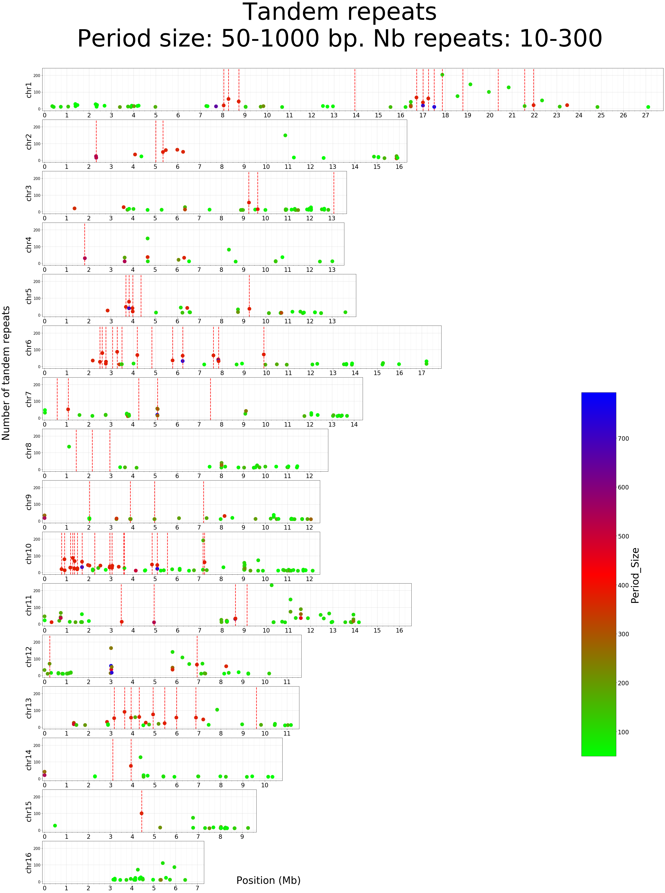

# Plot tandem repeats along chromosomes
## Tandem repeats

    in : /work/genphyse/cytogen/Alain/PacificBee/TRF/AMelMel1_1
    The tandem repeat finder command:

trf /home/gencel/vignal/save/Genomes/Abeille/PacificBee/assemblingV2c/allChrs.fa 2 7 7 80 10 50 1000 -d

    Output file : allChrs.fa.2.7.7.80.10.50.1000.dat


```python
import pandas as pd
import numpy as np
from matplotlib import pyplot as plt
import matplotlib.patches as mpatches
from matplotlib import colors
from matplotlib import cm
#from matplotlib.legend_handler import HandlerPatch
import re
import csv
import rpy2
from collections import defaultdict
from IPython.display import display
from IPython.display import set_matplotlib_formats
set_matplotlib_formats('png', 'pdf')
```


```python
dataDict = defaultdict(list)
with open('/Users/avignal/GenotoulBigWork/PacificBee/TRF/AMelMel1_1/allChrs.fa.2.7.7.80.10.50.1000.dat') as csvFile:
	data=csv.reader(csvFile, delimiter = " ")
	for row in data:
		if row:
			if re.search('Sequence',row[0]):
				chromosome = row[1]
			elif re.search('\d',row[0]): # and re.match('CM', chromosome) :
				dataDict["GenbankName"].append(chromosome)
				dataDict["RepStart"].append(int(row[0]))
				dataDict["RepEnd"].append(int(row[1]))
				dataDict["Period_Size"].append(int(row[2]))
				dataDict["Copy_Number"].append(float(row[3]))
				dataDict["Percent_Matches"].append(int(row[5]))
				dataDict["Percent_Indels"].append(int(row[6]))
				dataDict["Repseq"].append(row[13])
				dataDict["StartMb"].append(int(row[0])/1000000)
				dataDict["EndMb"].append(int(row[1])/1000000)
				dataDict["MeanPosMb"].append((int(row[0])+int(row[1]))/2000000)
trfTable = pd.DataFrame.from_dict(dataDict, )
trfTable = trfTable.set_index('GenbankName')
conversionTable = pd.read_csv('/Users/avignal/Documents/Stats/2016_PacificBee/AgpAndConversionFiles/Ours/ChrAndContigLenthsAMel1_1.txt',delimiter="\t")
conversionTable = conversionTable.set_index('GenbankName')
trfTable = trfTable.join(conversionTable, how="left")
trfTable = trfTable.reset_index()
trfTable['RepLength'] = trfTable['RepEnd'] - trfTable['RepStart'] + 1
trfTable['DistToStart'] = trfTable['RepStart'] - 1
trfTable['DistToEnd'] = trfTable['SequenceLength'] - trfTable['RepEnd']
trfTable = trfTable.loc[:,['GenbankName','LinkageGroupUN','OurNames','SequenceLength',
                           'RepStart','RepEnd','StartMb','EndMb','MeanPosMb','Period_Size','Copy_Number','Percent_Matches','Percent_Indels',
                           'RepLength','DistToStart','DistToEnd','Repseq']]
trfTable.head()
```


<div>
<style scoped>
    .dataframe tbody tr th:only-of-type {
        vertical-align: middle;
    }

    .dataframe tbody tr th {
        vertical-align: top;
    }

    .dataframe thead th {
        text-align: right;
    }
</style>
<table border="1" class="dataframe">
  <thead>
    <tr style="text-align: right;">
      <th></th>
      <th>GenbankName</th>
      <th>LinkageGroupUN</th>
      <th>OurNames</th>
      <th>SequenceLength</th>
      <th>RepStart</th>
      <th>RepEnd</th>
      <th>StartMb</th>
      <th>EndMb</th>
      <th>MeanPosMb</th>
      <th>Period_Size</th>
      <th>Copy_Number</th>
      <th>Percent_Matches</th>
      <th>Percent_Indels</th>
      <th>RepLength</th>
      <th>DistToStart</th>
      <th>DistToEnd</th>
      <th>Repseq</th>
    </tr>
  </thead>
  <tbody>
    <tr>
      <td>0</td>
      <td>LG1</td>
      <td>LG1</td>
      <td>chr1</td>
      <td>27693668.0</td>
      <td>1</td>
      <td>6180</td>
      <td>0.000001</td>
      <td>0.006180</td>
      <td>0.003090</td>
      <td>5</td>
      <td>1222.8</td>
      <td>87</td>
      <td>5</td>
      <td>6180</td>
      <td>0</td>
      <td>27687488.0</td>
      <td>AACCT</td>
    </tr>
    <tr>
      <td>1</td>
      <td>LG1</td>
      <td>LG1</td>
      <td>chr1</td>
      <td>27693668.0</td>
      <td>1886</td>
      <td>1910</td>
      <td>0.001886</td>
      <td>0.001910</td>
      <td>0.001898</td>
      <td>1</td>
      <td>25.0</td>
      <td>100</td>
      <td>0</td>
      <td>25</td>
      <td>1885</td>
      <td>27691758.0</td>
      <td>A</td>
    </tr>
    <tr>
      <td>2</td>
      <td>LG1</td>
      <td>LG1</td>
      <td>chr1</td>
      <td>27693668.0</td>
      <td>6303</td>
      <td>6333</td>
      <td>0.006303</td>
      <td>0.006333</td>
      <td>0.006318</td>
      <td>15</td>
      <td>2.1</td>
      <td>93</td>
      <td>0</td>
      <td>31</td>
      <td>6302</td>
      <td>27687335.0</td>
      <td>TAATAATAATGATAA</td>
    </tr>
    <tr>
      <td>3</td>
      <td>LG1</td>
      <td>LG1</td>
      <td>chr1</td>
      <td>27693668.0</td>
      <td>6366</td>
      <td>6450</td>
      <td>0.006366</td>
      <td>0.006450</td>
      <td>0.006408</td>
      <td>18</td>
      <td>4.7</td>
      <td>73</td>
      <td>11</td>
      <td>85</td>
      <td>6365</td>
      <td>27687218.0</td>
      <td>TAATGGTAATAGTGATAG</td>
    </tr>
    <tr>
      <td>4</td>
      <td>LG1</td>
      <td>LG1</td>
      <td>chr1</td>
      <td>27693668.0</td>
      <td>6386</td>
      <td>6829</td>
      <td>0.006386</td>
      <td>0.006829</td>
      <td>0.006607</td>
      <td>24</td>
      <td>18.5</td>
      <td>73</td>
      <td>12</td>
      <td>444</td>
      <td>6385</td>
      <td>27686839.0</td>
      <td>ATGGTAATAGGAATGAGAATGATA</td>
    </tr>
  </tbody>
</table>
</div>


## Select only chromosomes and chromosomes list


```python
chrList = ['chr16','chr15','chr14','chr13','chr12','chr11','chr10','chr9','chr8','chr7','chr6','chr5','chr4','chr3','chr2','chr1']
trfTableChrs = trfTable[trfTable.OurNames.isin(chrList)]

```

## Select specific repeat types and define title and filename


```python
smallest_repeat = 50
largest_repeat = 1000
min_copy_nb = 10
max_copy_nb = 300
trfTableChrsSelRep = trfTableChrs[(trfTableChrs.Period_Size >= smallest_repeat) 
                                  & (trfTableChrs.Period_Size <= largest_repeat) 
                                  & (trfTableChrs.Copy_Number >= min_copy_nb) 
                                  & (trfTableChrs.Copy_Number <= max_copy_nb)]
repeatCategory = "Rep" + str(smallest_repeat) + "_" + str(largest_repeat) + "_Copy" + str(min_copy_nb) + "_" + str(max_copy_nb)
outFileName = '/Users/avignal/Documents/Stats/2016_PacificBee/TandemRepeatFinder/FigurePaper' + repeatCategory + '.pdf'
figTitle = "Tandem repeats\nPeriod size: " + str(smallest_repeat) + "-" + str(largest_repeat) + " bp. Nb repeats: " + str(min_copy_nb) + "-" + str(max_copy_nb)
comments = ""
        
```

## Plot chromosomes


```python
#Figure settings
ybins = len(chrList)
space = (1 / (ybins + 1)) * 1 / 6
figHeight = (ybins + 1) * 3
figWidth = (trfTableChrs['EndMb'].max()) * 1.4 # + space * 4
fig = plt.figure(figsize=(figWidth, figHeight))
fig.suptitle(figTitle, fontsize=96)
fig.text(.5,.2,comments, wrap=True, fontsize=24)
fig.text(.35,.01, "Position (Mb)", fontsize=40)
fig.text(.01,.5, "Number of tandem repeats", fontsize=40, rotation='vertical',)

bottom = space

#Plot chromosomes
images=[]
for chr_i in chrList:
    chrAll = trfTableChrs[(trfTableChrs.OurNames == chr_i)]
    chrData = trfTableChrsSelRep[(trfTableChrsSelRep.OurNames == chr_i)]
    #Define size and draw box
    left = space * 7
    width = (chrAll['EndMb'].max()) * 1.4 /figWidth * 0.90
    height = (1/ybins) * 4.5/6
    ax = plt.axes([left, bottom, width, height])
    bottom = bottom + height + space
    #Plot
    images.append(ax.scatter(x='MeanPosMb', y='Copy_Number', s=200, c='Period_Size', cmap = 'brg_r', data=chrData))
    ax.set_xlim(-0.1, chrAll['StartMb'].max()+0.1)
    maxYvalue = trfTableChrsSelRep['Copy_Number'].max()
    margin = maxYvalue * 0.05
    ax.set_ylim(0 - margin, trfTableChrsSelRep['Copy_Number'].max() + margin)
    #Contig limits
    with open("/Users/avignal/Documents/Stats/2016_PacificBee/AgpAndConversionFiles/Ours/meanBkptsAMelMelV2c_Chr", "r") as csvFile:
        data=csv.reader(csvFile, delimiter = "\t")
        for row in data:
            if row[0] == chr_i:
                plt.axvline(x=float(row[1])/1000000,color='r',alpha=0.9, linewidth=2.5, linestyle='--')
    #ax.set_yticklabels(, fontsize=24)
    minor_ticks = np.arange(0,chrAll['EndMb'].max(),0.250000)
    ax.set_xticks(minor_ticks, minor=True)
    ax.grid(which='minor', alpha=0.2)
    #Labels, ticks, grids
    ax.tick_params(axis='y', labelsize=15)
    ax.set_ylabel(chr_i, fontsize=30)
    major_ticks = np.arange(0,chrAll['EndMb'].max(),1,dtype='int16')
    ax.set_xticks(major_ticks)
    ax.set_xticklabels(major_ticks, fontsize=24)
    ax.grid(which='major', alpha=0.5)
#Find the min and max of all colors for use in setting the color scale.
vmin = trfTableChrsSelRep.Period_Size.min()
vmax = trfTableChrsSelRep.Period_Size.max()
norm = colors.Normalize(vmin=vmin, vmax=vmax)
for im in images:
    im.set_norm(norm)
cbar = fig.colorbar(images[0],cax=fig.add_axes([0.85, 0.15, 0.05, 0.4]))#.set_label("Period_Size", fontsize=40)
cbar.set_label("Period_Size", fontsize=40)
cbar.ax.tick_params(labelsize=24)    
    
fig.savefig(outFileName)#, bbox_inches='tight')
```





```python

```


```python
            
```


```python

```
