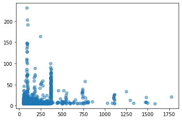
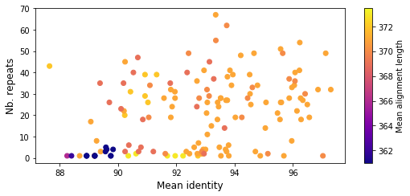
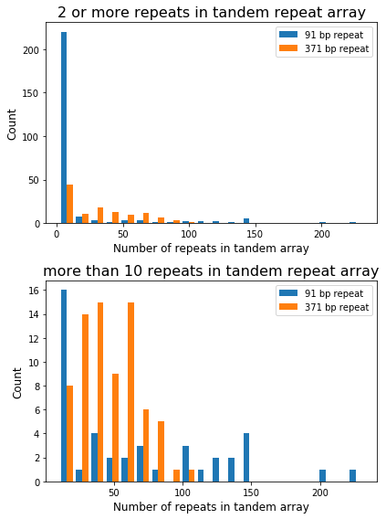
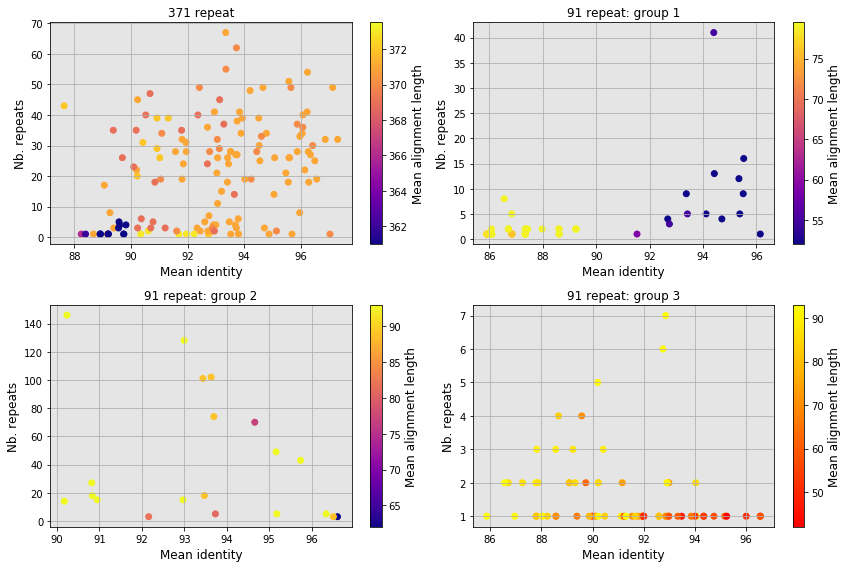
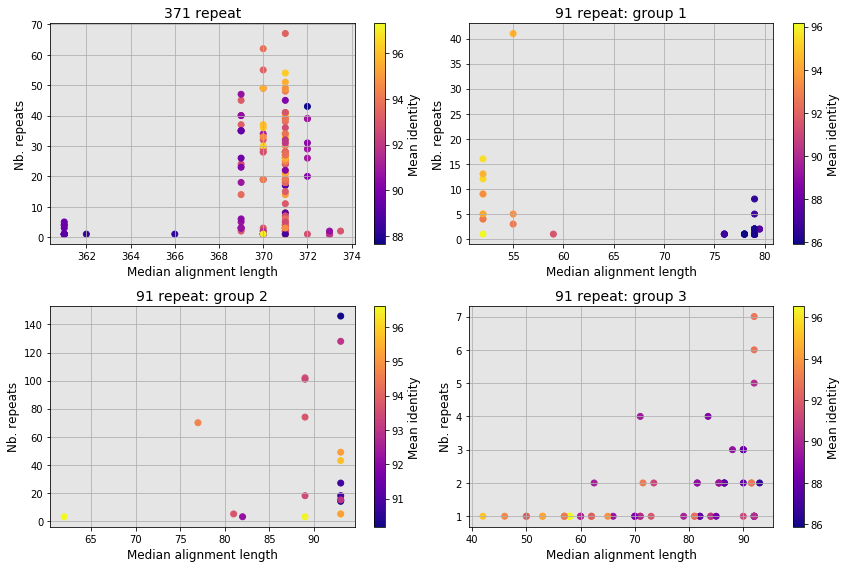
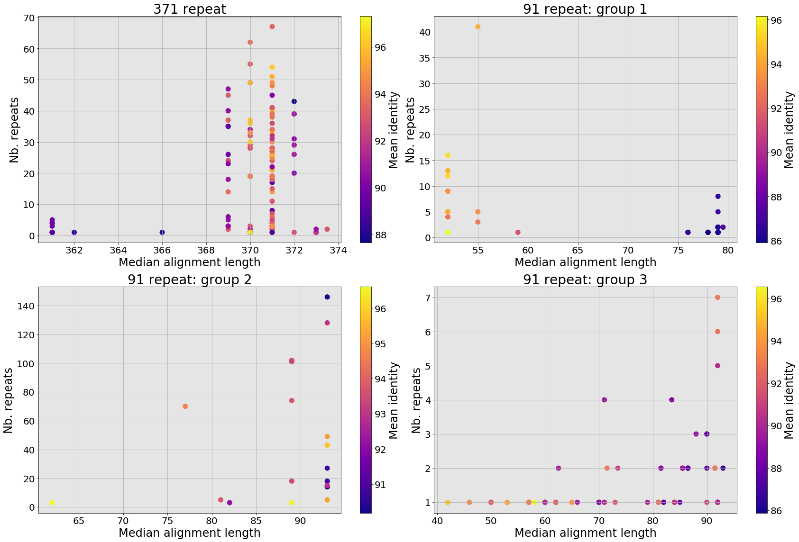

## Tandem repeats

    in : ~/Documents/Stats/2016_PacificBee/TandemRepeatFinder
    The tandem repeat finder command:


/Applications/TandemRepeatFinder/trf409.macosx ../NCBI_GenomeBlackBee/GCA_003314205.1_INRA_AMelMel_1.0_genomic.fna  2 7 7 80 10 50 1000 -d -h


```python
import pandas as pd
import numpy as np
from matplotlib import pyplot as plt
import re
import csv
import rpy2
from collections import defaultdict
from IPython.display import display
```


```python
pd.options.display.max_rows = 4000

```


```python
dataDict = defaultdict(list)
with open('/Users/avignal/GenotoulBigWork/PacificBee/TRF/AMelMel1_1/allChrs.fa.2.7.7.80.10.50.2000.dat') as csvFile:
	data=csv.reader(csvFile, delimiter = " ")
	for row in data:
		if row:
			if re.search('Sequence',row[0]):
				chromosome = row[1]
			elif re.search('\d',row[0]): # and re.match('CM', chromosome) :
				dataDict["GenbankName"].append(chromosome)
				dataDict["RepStart"].append(int(row[0]))
				dataDict["RepEnd"].append(int(row[1]))
				dataDict["Period_Size"].append(int(row[2]))
				dataDict["Copy_Number"].append(float(row[3]))
				dataDict["Percent_Matches"].append(int(row[5]))
				dataDict["Percent_Indels"].append(int(row[6]))
				dataDict["Repseq"].append(row[13])
				dataDict["StartMb"].append(int(row[0])/1000000)
				dataDict["EndMb"].append(int(row[1])/1000000)
				dataDict["MeanPosMb"].append((int(row[0])+int(row[1]))/2000000)
trfTable = pd.DataFrame.from_dict(dataDict, )
trfTable = trfTable.set_index('GenbankName')
conversionTable = pd.read_csv('/Users/avignal/Documents/Stats/2016_PacificBee/AgpAndConversionFiles/Ours/ChrAndContigLenthsAMel1_1.txt',delimiter="\t")
conversionTable = conversionTable.set_index('GenbankName')
trfTable = trfTable.join(conversionTable, how="left")
trfTable = trfTable.reset_index()
trfTable['RepLength'] = trfTable['RepEnd'] - trfTable['RepStart'] + 1
trfTable['DistToStart'] = trfTable['RepStart'] - 1
trfTable['DistToEnd'] = trfTable['SequenceLength'] - trfTable['RepEnd']
trfTable = trfTable.loc[:,['GenbankName','LinkageGroupUN','OurNames','SequenceLength',
                           'RepStart','RepEnd','StartMb','EndMb','MeanPosMb','Period_Size','Copy_Number','Percent_Matches','Percent_Indels',
                           'RepLength','DistToStart','DistToEnd','Repseq']]

# Add sequences in fasta format, for making multi fasta files
trfTable.loc[:,'fasta'] = ">" + trfTable.GenbankName +"_" + trfTable.RepStart.map(str) + "_" + trfTable.RepEnd.map(str) + "\n" + trfTable.Repseq

trfTable.head() 


```


<div>
<style scoped>
    .dataframe tbody tr th:only-of-type {
        vertical-align: middle;
    }

    .dataframe tbody tr th {
        vertical-align: top;
    }

    .dataframe thead th {
        text-align: right;
    }
</style>
<table border="1" class="dataframe">
  <thead>
    <tr style="text-align: right;">
      <th></th>
      <th>GenbankName</th>
      <th>LinkageGroupUN</th>
      <th>OurNames</th>
      <th>SequenceLength</th>
      <th>RepStart</th>
      <th>RepEnd</th>
      <th>StartMb</th>
      <th>EndMb</th>
      <th>MeanPosMb</th>
      <th>Period_Size</th>
      <th>Copy_Number</th>
      <th>Percent_Matches</th>
      <th>Percent_Indels</th>
      <th>RepLength</th>
      <th>DistToStart</th>
      <th>DistToEnd</th>
      <th>Repseq</th>
      <th>fasta</th>
    </tr>
  </thead>
  <tbody>
    <tr>
      <td>0</td>
      <td>LG1</td>
      <td>LG1</td>
      <td>chr1</td>
      <td>27693668.0</td>
      <td>1</td>
      <td>6180</td>
      <td>0.000001</td>
      <td>0.006180</td>
      <td>0.003090</td>
      <td>5</td>
      <td>1222.8</td>
      <td>87</td>
      <td>5</td>
      <td>6180</td>
      <td>0</td>
      <td>27687488.0</td>
      <td>AACCT</td>
      <td>&gt;LG1_1_6180\nAACCT</td>
    </tr>
    <tr>
      <td>1</td>
      <td>LG1</td>
      <td>LG1</td>
      <td>chr1</td>
      <td>27693668.0</td>
      <td>1886</td>
      <td>1910</td>
      <td>0.001886</td>
      <td>0.001910</td>
      <td>0.001898</td>
      <td>1</td>
      <td>25.0</td>
      <td>100</td>
      <td>0</td>
      <td>25</td>
      <td>1885</td>
      <td>27691758.0</td>
      <td>A</td>
      <td>&gt;LG1_1886_1910\nA</td>
    </tr>
    <tr>
      <td>2</td>
      <td>LG1</td>
      <td>LG1</td>
      <td>chr1</td>
      <td>27693668.0</td>
      <td>6303</td>
      <td>6333</td>
      <td>0.006303</td>
      <td>0.006333</td>
      <td>0.006318</td>
      <td>15</td>
      <td>2.1</td>
      <td>93</td>
      <td>0</td>
      <td>31</td>
      <td>6302</td>
      <td>27687335.0</td>
      <td>TAATAATAATGATAA</td>
      <td>&gt;LG1_6303_6333\nTAATAATAATGATAA</td>
    </tr>
    <tr>
      <td>3</td>
      <td>LG1</td>
      <td>LG1</td>
      <td>chr1</td>
      <td>27693668.0</td>
      <td>6366</td>
      <td>6450</td>
      <td>0.006366</td>
      <td>0.006450</td>
      <td>0.006408</td>
      <td>18</td>
      <td>4.7</td>
      <td>73</td>
      <td>11</td>
      <td>85</td>
      <td>6365</td>
      <td>27687218.0</td>
      <td>TAATGGTAATAGTGATAG</td>
      <td>&gt;LG1_6366_6450\nTAATGGTAATAGTGATAG</td>
    </tr>
    <tr>
      <td>4</td>
      <td>LG1</td>
      <td>LG1</td>
      <td>chr1</td>
      <td>27693668.0</td>
      <td>6386</td>
      <td>6829</td>
      <td>0.006386</td>
      <td>0.006829</td>
      <td>0.006607</td>
      <td>24</td>
      <td>18.5</td>
      <td>73</td>
      <td>12</td>
      <td>444</td>
      <td>6385</td>
      <td>27686839.0</td>
      <td>ATGGTAATAGGAATGAGAATGATA</td>
      <td>&gt;LG1_6386_6829\nATGGTAATAGGAATGAGAATGATA</td>
    </tr>
  </tbody>
</table>
</div>


```python
for_plot = trfTable[(trfTable.Period_Size > 50) & \
                        (trfTable.Period_Size < 2000) & \
                        (trfTable.Copy_Number > 5) &\
                        (trfTable.Copy_Number < 300)]
plt.scatter(for_plot.Period_Size,for_plot.Copy_Number, alpha=0.5)
#ax1.set_xlabel("Period size (bp)", fontsize = 20)
#ax1.set_ylabel("Copy number", fontsize = 20)
#ax1.set_title("All period sizes", fontsize = 25)

```


    <matplotlib.collections.PathCollection at 0x7fc8c2a15610>





## Select the peak around 370 bp (74 sequences) and generate multi fasta file


```python
fasta370 = trfTable[(trfTable.Period_Size > 366) & (trfTable.Period_Size < 372) & (trfTable.Copy_Number > 10)]['fasta']
fasta370.to_csv('/Users/avignal/GenotoulBigWork/PacificBee/TRF/AMelMel1_1/Repeat370/fasta370TEST.fa', index=False, quoting = csv.QUOTE_NONE, escapechar = ' ', header = False)
number = len(fasta370)
highest = trfTable[(trfTable.Period_Size > 366) & (trfTable.Period_Size < 372) & (trfTable.Copy_Number > 10)]['Copy_Number'].max()
mean_10 = trfTable[(trfTable.Period_Size > 366) & (trfTable.Period_Size < 372) & (trfTable.Copy_Number > 10)]['Copy_Number'].mean()
mean = trfTable[(trfTable.Period_Size > 366) & (trfTable.Period_Size < 372)]['Copy_Number'].mean()
median = trfTable[(trfTable.Period_Size > 366) & (trfTable.Period_Size < 372)]['Copy_Number'].median()
number, highest, mean_10, mean, median

```


    (74, 100.0, 46.740540540540536, 27.659541984732826, 22.7)


## Multiple alignment with MAFFT

### In multifasta format:
```
#!/bin/bash
module load bioinfo/mafft-7.313
mafft --adjustdirectionaccurately --auto --reorder fasta370.fa > fasta370_R1.fa
```
### in clustal format:
```
#!/bin/bash
module load bioinfo/mafft-7.313
mafft --adjustdirectionaccurately --auto --clustalout --reorder fasta370_R3.mfa > fasta370_R3.clustsorted
```

### Used the script realignMultiFastaAlignment.py, to have sequences starting at equivalent positions in the multifasta files:
```
* and script /home/gencel/vignal/save/bin/Python/realignMultiFastaAlignment.py -i fasta370.mfa -s 291 -o fasta370_R1.fa
```
* Comments:
    * -s 291 : position of the alignment that will be the new starting point. Trial-and-error.
    * Re-run mafft after
    * 2 sequences that were more divergent (a "largish" Indel). Were removed, after inspection with Jalview

### Make a consensus sequence out of the 72 remaining sequences blasted against AMelMel:
```
/home/gencel/vignal/save/bin/Python/consensus_sequence.py fasta370_R3.fasta 0.4
```
### Blast on AMelMel
```
blastall -p blastn -i consensus370.fa -d /home/gencel/vignal/save/Genomes/Abeille/PacificBee/assemblingV2c/allChrs.fa -m 8 -e 0.0000000001 > blast370_consensus.out
```


## Function for analysing BLAST outputs:


```python
def Analyse_blast_outputs (blast_output, alignment_length, repeat_interval):

# Import data from blast ouitput
    data = pd.read_csv(blast_output, sep="\t", header=None)
    data.columns = data.columns = ['Query',
     'Subject',
     'Identity',
     'AlignLength',
     'Mismatches',
     'Gaps',
     'qStart',
     'qEnd',
     'sStart',
     'sEnd',
     'eValue',
     'BitScore']
    data['sPos'] = (data['sEnd'] + data['sStart']) /2
    data['sStrand'] = (data['sEnd'] - data['sStart'])
    
# Add column with distance with previous hit (just for visual inspection)
    data = data.sort_values(by=['Subject','sPos'])
    data['Shift'] = data['sPos'].shift(1, fill_value=0)
    data['Interval'] = data['sPos'] - data['Shift']
    data.loc[(data.Interval > repeat_interval),'Interval'] = 0

# Only keep alignments larger than a defined length
    data = data[data.AlignLength > alignment_length].sort_values(by=['Subject','sPos'])
    
# Assign blast hits to groups
    data['Group'] = 0
    group = 0
    data = data.set_index(keys = ['Subject','sPos']).sort_index(ascending=[True,True])
    chrom = ""
    for idx in data.index:
        chrom_new = idx[0]
        if chrom_new != chrom:
            chrom = chrom_new
            group = group + 1
            data.loc[idx,'Group'] = group
            position = idx[1]
        elif chrom_new == chrom:
            if abs(idx[1] - position) < repeat_interval:
                data.loc[idx,'Group'] = group
                position = idx[1]
            else:
                group = group + 1
                data.loc[idx,'Group'] = group
                position = idx[1]
                
# Aggregate data by group                
    aggregate_groups = data.reset_index().groupby(['Group']).aggregate({'Subject':['first','count'],
                                                                      'sStart':'min','sEnd':'max',
                                                                     'Identity':'mean',
                                                                    'AlignLength':['median','min','max'],
                                                                       'Interval':'median',
                                                                       'BitScore':'median'})
    aggregate_groups = aggregate_groups.reset_index()
    aggregate_groups.columns = ['Group','Chrom','Nb_repeats','Start','End','mean_identity','median_length','min_length','max_length','period','median_score']
    aggregate_groups['Shift'] = aggregate_groups['End'].shift(-1, fill_value=0)
    aggregate_groups['DistToNext'] =  aggregate_groups['Start'] - aggregate_groups['Shift']
    return(data, aggregate_groups) #The data table and the hits grouped by local tandem repeats


```

## The 72 sequences 370 bp long


```python
blast_output = "/Users/avignal/GenotoulBigWork/PacificBee/TRF/AMelMel1_1/Repeat370/blast370_consensus.out"
alignment_length = 360
repeat_interval = 380
df370, groups370 = Analyse_blast_outputs(blast_output, alignment_length, repeat_interval)

```


```python
plt.rcParams["figure.figsize"] = [7.50, 3.50]
plt.rcParams["figure.autolayout"] = True

fig, ax = plt.subplots()
points = ax.scatter(groups370.mean_identity, groups370.Nb_repeats, c=groups370.median_length, cmap="plasma")
cbar = fig.colorbar(points)
ax.set_xlabel("Mean identity", fontsize = 12)
ax.set_ylabel("Nb. repeats", fontsize = 12)

cbar.set_label('Mean alignment length')#, rotation=270)

```





## The two 370 bp sequences that were different from the others

LG12_5803634_5816532 and LG4_4658924_4672512

* MAFFT, made a consensus and blast
* No significant hits


```python
blast_output = "/Users/avignal/GenotoulBigWork/PacificBee/TRF/AMelMel1_1/Repeat370/blast370_consensus_2_Extra_sequences.out"
alignment_length = 70
repeat_interval = 380
df370_2, groups370_2 = Analyse_blast_outputs(blast_output, alignment_length, repeat_interval)

```

## Results with the consensus of the two "370" sequences of the second group are weird. Should be both blasted separately ?


## Same with peak at 91 bp
## Select the peak around 91 bp (43 sequences) and generate multi fasta file


```python
fasta91 = trfTable[(trfTable.Period_Size > 90) & (trfTable.Period_Size < 94) & (trfTable.Copy_Number > 10)]['fasta']
fasta91.to_csv('/Users/avignal/GenotoulBigWork/PacificBee/TRF/AMelMel1_1/Repeat91/fasta91.fa', index=False, quoting = csv.QUOTE_NONE, escapechar = ' ', header=False)
len(trfTable[(trfTable.Period_Size > 90) & (trfTable.Period_Size < 94) & (trfTable.Copy_Number > 10)])

```


    43


```python
number = len(fasta91)
highest = trfTable[(trfTable.Period_Size > 90) & (trfTable.Period_Size < 94) & (trfTable.Copy_Number > 10)]['Copy_Number'].max()
mean_10 = trfTable[(trfTable.Period_Size > 90) & (trfTable.Period_Size < 94) & (trfTable.Copy_Number > 10)]['Copy_Number'].mean()
mean = trfTable[(trfTable.Period_Size > 90) & (trfTable.Period_Size < 94)]['Copy_Number'].mean()
median = trfTable[(trfTable.Period_Size > 90) & (trfTable.Period_Size < 94)]['Copy_Number'].median()
number, highest, mean_10, mean, median

```


    (43, 231.6, 67.24883720930234, 11.345217391304349, 3.0)


## Compare distributions of both repeat types


```python
repeat_91 = trfTable[(trfTable.Period_Size > 90) & (trfTable.Period_Size < 94)]['Copy_Number'].describe().to_frame()
repeat_371 = trfTable[(trfTable.Period_Size > 366) & (trfTable.Period_Size < 372)]['Copy_Number'].describe().to_frame()
repeats_all = repeat_91.join(repeat_371, lsuffix="_91", rsuffix="_371")

repeat_91_10 = trfTable[(trfTable.Period_Size > 90) & (trfTable.Period_Size < 94) & (trfTable.Copy_Number > 10)]['Copy_Number'].describe().to_frame()
repeat_371_10 = trfTable[(trfTable.Period_Size > 366) & (trfTable.Period_Size < 372) & (trfTable.Copy_Number > 10)]['Copy_Number'].describe().to_frame()
repeats_10 = repeat_91_10.join(repeat_371_10, lsuffix="_over_10_91", rsuffix="_over_10_371")

summary_all = repeats_all.join(repeats_10)
summary_all.to_csv("/Users/avignal/Documents/Articles/2019_PacificBee/table_summary_91_371.xls", sep = "\t")
summary_all

```


<div>
<style scoped>
    .dataframe tbody tr th:only-of-type {
        vertical-align: middle;
    }

    .dataframe tbody tr th {
        vertical-align: top;
    }

    .dataframe thead th {
        text-align: right;
    }
</style>
<table border="1" class="dataframe">
  <thead>
    <tr style="text-align: right;">
      <th></th>
      <th>Copy_Number_91</th>
      <th>Copy_Number_371</th>
      <th>Copy_Number_over_10_91</th>
      <th>Copy_Number_over_10_371</th>
    </tr>
  </thead>
  <tbody>
    <tr>
      <td>count</td>
      <td>345.000000</td>
      <td>131.000000</td>
      <td>43.000000</td>
      <td>74.000000</td>
    </tr>
    <tr>
      <td>mean</td>
      <td>11.345217</td>
      <td>27.659542</td>
      <td>67.248837</td>
      <td>46.740541</td>
    </tr>
    <tr>
      <td>std</td>
      <td>29.604098</td>
      <td>26.666968</td>
      <td>59.151474</td>
      <td>20.427854</td>
    </tr>
    <tr>
      <td>min</td>
      <td>1.800000</td>
      <td>1.900000</td>
      <td>10.400000</td>
      <td>15.200000</td>
    </tr>
    <tr>
      <td>25%</td>
      <td>2.000000</td>
      <td>2.750000</td>
      <td>15.350000</td>
      <td>29.625000</td>
    </tr>
    <tr>
      <td>50%</td>
      <td>3.000000</td>
      <td>22.700000</td>
      <td>49.500000</td>
      <td>43.750000</td>
    </tr>
    <tr>
      <td>75%</td>
      <td>5.700000</td>
      <td>47.250000</td>
      <td>109.150000</td>
      <td>61.325000</td>
    </tr>
    <tr>
      <td>max</td>
      <td>231.600000</td>
      <td>100.000000</td>
      <td>231.600000</td>
      <td>100.000000</td>
    </tr>
  </tbody>
</table>
</div>


## Histogram of number of repeats for the 370 and 91 class of repeats


```python
fig, ax = plt.subplots(2,1,figsize=(6,8))
copies_91 = trfTable[(trfTable.Period_Size > 90) & (trfTable.Period_Size < 94) & (trfTable.Copy_Number > 2)]['Copy_Number']
copies_371 = trfTable[(trfTable.Period_Size > 366) & (trfTable.Period_Size < 372) & (trfTable.Copy_Number > 2)]['Copy_Number']
ax[0].hist([copies_91, copies_371], bins = 20, label=['91 bp repeat', '371 bp repeat'])
ax[0].set_ylabel("Count", fontsize = 12)
ax[0].set_xlabel("Number of repeats in tandem array", fontsize = 12)
ax[0].legend(loc='upper right')
ax[0].set_title('2 or more repeats in tandem repeat array', fontsize = 16)

copies_91 = trfTable[(trfTable.Period_Size > 90) & (trfTable.Period_Size < 94) & (trfTable.Copy_Number > 10)]['Copy_Number']
copies_371 = trfTable[(trfTable.Period_Size > 366) & (trfTable.Period_Size < 372) & (trfTable.Copy_Number > 10)]['Copy_Number']
ax[1].hist([copies_91, copies_371], bins = 20, label=['91 bp repeat', '371 bp repeat'])
ax[1].set_ylabel("Count", fontsize = 12)
ax[1].set_xlabel("Number of repeats in tandem array", fontsize = 12)
ax[1].legend(loc='upper right')
ax[1].set_title('more than 10 repeats in tandem repeat array', fontsize = 16)

fig.savefig("/Users/avignal/Documents/Articles/2019_PacificBee/copy_distribution.pdf")

```





## Analysis of 3 groups of the 91 bp repeat:"
### 3 groups of sequences were identified in the tree built with Jalview
#### Made 3 consensus sequences
* /home/gencel/vignal/save/bin/Python/consensus_sequence.py Group1.fa 0.4
* /home/gencel/vignal/save/bin/Python/consensus_sequence.py Group2.fa 0.4
* /home/gencel/vignal/save/bin/Python/consensus_sequence.py Group3.fa 0.4
#### Blast on AMelMel
```
blastall -p blastn -i Group1_Consensus.fa -d /home/gencel/vignal/save/Genomes/Abeille/PacificBee/assemblingV2c/allChrs.fa -m 8 -e 0.0000000001 > blast91_consensus1.out
blastall -p blastn -i Group2_Consensus.fa -d /home/gencel/vignal/save/Genomes/Abeille/PacificBee/assemblingV2c/allChrs.fa -m 8 -e 0.0000000001 > blast91_consensus2.out
blastall -p blastn -i Group3_Consensus.fa -d /home/gencel/vignal/save/Genomes/Abeille/PacificBee/assemblingV2c/allChrs.fa -m 8 -e 0.0000000001 > blast91_consensus3.out
```


```python
blast_output = "/Users/avignal/GenotoulBigWork/PacificBee/TRF/AMelMel1_1/Repeat91/blast91_consensus1.out"
alignment_length = 30
repeat_interval = 100
df91_1, groups91_1 = Analyse_blast_outputs(blast_output, alignment_length, repeat_interval)

blast_output = "/Users/avignal/GenotoulBigWork/PacificBee/TRF/AMelMel1_1/Repeat91/blast91_consensus2.out"
alignment_length = 30
repeat_interval = 100
df91_2, groups91_2 = Analyse_blast_outputs(blast_output, alignment_length, repeat_interval)

blast_output = "/Users/avignal/GenotoulBigWork/PacificBee/TRF/AMelMel1_1/Repeat91/blast91_consensus3.out"
alignment_length = 30
repeat_interval = 100
df91_3, groups91_3 = Analyse_blast_outputs(blast_output, alignment_length, repeat_interval)

```

## Plot data from the BLAST outputs of the main 371 repeat group and the three 91 bp groups


```python
fig, axs = plt.subplots(2,2,figsize=(12,8))
plt.rcParams["figure.autolayout"] = True

points = axs[0,0].scatter(groups370.mean_identity, groups370.Nb_repeats, c=groups370.median_length, cmap="plasma")
cbar = fig.colorbar(points, ax=axs[0,0])
axs[0,0].set_xlabel("Mean identity", fontsize = 12)
axs[0,0].set_ylabel("Nb. repeats", fontsize = 12)
cbar.set_label('Mean alignment length', fontsize = 12)#, rotation=270)
axs[0,0].title.set_text('371 repeat')

axs[0,0].patch.set_facecolor('#ababab')
axs[0,0].patch.set_alpha(0.3)
axs[0,0].grid()

points = axs[0,1].scatter(groups91_1.mean_identity, groups91_1.Nb_repeats, c=groups91_1.median_length, cmap="plasma")
cbar = fig.colorbar(points, ax=axs[0,1])
axs[0,1].set_xlabel("Mean identity", fontsize = 12)
axs[0,1].set_ylabel("Nb. repeats", fontsize = 12)
cbar.set_label('Mean alignment length', fontsize = 12)#, rotation=270)
axs[0,1].title.set_text('91 repeat: group 1')

axs[0,1].patch.set_facecolor('#ababab')
axs[0,1].patch.set_alpha(0.3)
axs[0,1].grid()

points = axs[1,0].scatter(groups91_2.mean_identity, groups91_2.Nb_repeats, c=groups91_2.median_length, cmap="plasma")
cbar = fig.colorbar(points, ax=axs[1,0])
axs[1,0].set_xlabel("Mean identity", fontsize = 12)
axs[1,0].set_ylabel("Nb. repeats", fontsize = 12)
cbar.set_label('Mean alignment length', fontsize = 12)#, rotation=270)
axs[1,0].title.set_text('91 repeat: group 2')

axs[1,0].patch.set_facecolor('#ababab')
axs[1,0].patch.set_alpha(0.3)
axs[1,0].grid()

points = axs[1,1].scatter(groups91_3.mean_identity, groups91_3.Nb_repeats, c=groups91_3.median_length, cmap="plasma")
cbar = fig.colorbar(points, ax=axs[1,1])
axs[1,1].set_xlabel("Mean identity", fontsize = 12)
axs[1,1].set_ylabel("Nb. repeats", fontsize = 12)
cbar.set_label('Mean alignment length', fontsize = 12)#, rotation=270)
axs[1,1].title.set_text('91 repeat: group 3')

axs[1,1].patch.set_facecolor('#ababab')
axs[1,1].patch.set_alpha(0.3)
axs[1,1].grid()

```





```python
fig, axs = plt.subplots(2,2,figsize=(12,8))
plt.rcParams["figure.autolayout"] = True

points = axs[0,0].scatter(groups370.median_length, groups370.Nb_repeats, c=groups370.mean_identity, cmap="plasma")
cbar = fig.colorbar(points, ax=axs[0,0])
axs[0,0].set_xlabel("Median alignment length", fontsize = 12)
axs[0,0].set_ylabel("Nb. repeats", fontsize = 12)
cbar.set_label('Mean identity', fontsize = 12)#, rotation=270)
axs[0,0].set_title('371 repeat', fontsize = 14)

axs[0,0].patch.set_facecolor('#ababab')
axs[0,0].patch.set_alpha(0.3)
axs[0,0].grid()

points = axs[0,1].scatter(groups91_1.median_length, groups91_1.Nb_repeats, c=groups91_1.mean_identity, cmap="plasma")
cbar = fig.colorbar(points, ax=axs[0,1])
axs[0,1].set_xlabel("Median alignment length", fontsize = 12)
axs[0,1].set_ylabel("Nb. repeats", fontsize = 12)
cbar.set_label('Mean identity', fontsize = 12)#, rotation=270)
axs[0,1].set_title('91 repeat: group 1', fontsize = 14)

axs[0,1].patch.set_facecolor('#ababab')
axs[0,1].patch.set_alpha(0.3)
axs[0,1].grid()

points = axs[1,0].scatter(groups91_2.median_length, groups91_2.Nb_repeats, c=groups91_2.mean_identity, cmap="plasma")
cbar = fig.colorbar(points, ax=axs[1,0])
axs[1,0].set_xlabel("Median alignment length", fontsize = 12)
axs[1,0].set_ylabel("Nb. repeats", fontsize = 12)
cbar.set_label('Mean identity', fontsize = 12)#, rotation=270)
axs[1,0].set_title('91 repeat: group 2', fontsize = 14)

axs[1,0].patch.set_facecolor('#ababab')
axs[1,0].patch.set_alpha(0.3)
axs[1,0].grid()

points = axs[1,1].scatter(groups91_3.median_length, groups91_3.Nb_repeats, c=groups91_3.mean_identity, cmap="plasma")
cbar = fig.colorbar(points, ax=axs[1,1])
axs[1,1].set_xlabel("Median alignment length", fontsize = 12)
axs[1,1].set_ylabel("Nb. repeats", fontsize = 12)
cbar.set_label('Mean identity', fontsize = 12)#, rotation=270)
axs[1,1].set_title('91 repeat: group 3', fontsize = 14)

axs[1,1].patch.set_facecolor('#ababab')
axs[1,1].patch.set_alpha(0.3)
axs[1,1].grid()

fig.savefig("/Users/avignal/Documents/Articles/2019_PacificBee/Repeats_Blast.pdf")

```





```python
fig, axs = plt.subplots(2,2,figsize=(24,16))
plt.rcParams["figure.autolayout"] = True

points = axs[0,0].scatter(groups370.median_length, groups370.Nb_repeats, c=groups370.mean_identity, cmap="plasma", s=100)
cbar = fig.colorbar(points, ax=axs[0,0])
axs[0,0].set_xlabel("Median alignment length", fontsize = 24)
axs[0,0].set_ylabel("Nb. repeats", fontsize = 24)
cbar.set_label('Mean identity', fontsize = 24)#, rotation=270)
cbar.ax.tick_params(labelsize=20)
axs[0,0].set_title('371 repeat', fontsize = 28)
axs[0,0].tick_params(axis='x', labelsize=20)
axs[0,0].tick_params(axis='y', labelsize=20)

axs[0,0].patch.set_facecolor('#ababab')
axs[0,0].patch.set_alpha(0.3)
axs[0,0].grid()

points = axs[0,1].scatter(groups91_1.median_length, groups91_1.Nb_repeats, c=groups91_1.mean_identity, cmap="plasma", s=100)
cbar = fig.colorbar(points, ax=axs[0,1])
cbar.ax.tick_params(labelsize=20)
axs[0,1].set_xlabel("Median alignment length", fontsize = 24)
axs[0,1].set_ylabel("Nb. repeats", fontsize = 24)
cbar.set_label('Mean identity', fontsize = 24)#, rotation=270)
axs[0,1].set_title('91 repeat: group 1', fontsize = 28)
axs[0,1].tick_params(axis='x', labelsize=20)
axs[0,1].tick_params(axis='y', labelsize=20)

axs[0,1].patch.set_facecolor('#ababab')
axs[0,1].patch.set_alpha(0.3)
axs[0,1].grid()

points = axs[1,0].scatter(groups91_2.median_length, groups91_2.Nb_repeats, c=groups91_2.mean_identity, cmap="plasma", s=100)
cbar = fig.colorbar(points, ax=axs[1,0])
cbar.ax.tick_params(labelsize=20)
axs[1,0].set_xlabel("Median alignment length", fontsize = 24)
axs[1,0].set_ylabel("Nb. repeats", fontsize = 24)
cbar.set_label('Mean identity', fontsize = 24)#, rotation=270)
axs[1,0].set_title('91 repeat: group 2', fontsize = 28)
axs[1,0].tick_params(axis='x', labelsize=20)
axs[1,0].tick_params(axis='y', labelsize=20)

axs[1,0].patch.set_facecolor('#ababab')
axs[1,0].patch.set_alpha(0.3)
axs[1,0].grid()

points = axs[1,1].scatter(groups91_3.median_length, groups91_3.Nb_repeats, c=groups91_3.mean_identity, cmap="plasma", s=100)
cbar = fig.colorbar(points, ax=axs[1,1])
cbar.ax.tick_params(labelsize=20)
axs[1,1].set_xlabel("Median alignment length", fontsize = 24)
axs[1,1].set_ylabel("Nb. repeats", fontsize = 24)
cbar.set_label('Mean identity', fontsize = 24)#, rotation=270)
axs[1,1].set_title('91 repeat: group 3', fontsize = 28)
axs[1,1].tick_params(axis='x', labelsize=20)
axs[1,1].tick_params(axis='y', labelsize=20)

axs[1,1].patch.set_facecolor('#ababab')
axs[1,1].patch.set_alpha(0.3)
axs[1,1].grid()

fig.savefig("/Users/avignal/Documents/Articles/2019_PacificBee/Repeats_Blast_big.pdf")
```





```python

```
