```python

```


```python
import pandas as pd
import numpy as np
from matplotlib import pyplot as plt
import re
import csv
from collections import defaultdict
from IPython.display import display
```


```python
df_AMelMel = pd.read_csv("/Users/avignal/GenotoulWork/DepthChr3Inverstion/allDepthsAMelMel.table", sep="\t", header=None)
df_AMelMel

```


<div>
<style scoped>
    .dataframe tbody tr th:only-of-type {
        vertical-align: middle;
    }

    .dataframe tbody tr th {
        vertical-align: top;
    }

    .dataframe thead th {
        text-align: right;
    }
</style>
<table border="1" class="dataframe">
  <thead>
    <tr style="text-align: right;">
      <th></th>
      <th>0</th>
      <th>1</th>
      <th>2</th>
      <th>3</th>
      <th>4</th>
      <th>5</th>
      <th>6</th>
      <th>7</th>
      <th>8</th>
      <th>9</th>
      <th>...</th>
      <th>84</th>
      <th>85</th>
      <th>86</th>
      <th>87</th>
      <th>88</th>
      <th>89</th>
      <th>90</th>
      <th>91</th>
      <th>92</th>
      <th>93</th>
    </tr>
  </thead>
  <tbody>
    <tr>
      <td>0</td>
      <td>CM010321.1</td>
      <td>11987000</td>
      <td>35</td>
      <td>12</td>
      <td>18</td>
      <td>12</td>
      <td>17</td>
      <td>14</td>
      <td>13</td>
      <td>20</td>
      <td>...</td>
      <td>8</td>
      <td>6</td>
      <td>19</td>
      <td>11</td>
      <td>1</td>
      <td>5</td>
      <td>15</td>
      <td>17</td>
      <td>5</td>
      <td>18</td>
    </tr>
    <tr>
      <td>1</td>
      <td>CM010321.1</td>
      <td>11987001</td>
      <td>35</td>
      <td>12</td>
      <td>18</td>
      <td>12</td>
      <td>17</td>
      <td>14</td>
      <td>13</td>
      <td>20</td>
      <td>...</td>
      <td>8</td>
      <td>5</td>
      <td>20</td>
      <td>12</td>
      <td>1</td>
      <td>5</td>
      <td>15</td>
      <td>17</td>
      <td>5</td>
      <td>16</td>
    </tr>
    <tr>
      <td>2</td>
      <td>CM010321.1</td>
      <td>11987002</td>
      <td>35</td>
      <td>12</td>
      <td>18</td>
      <td>12</td>
      <td>16</td>
      <td>14</td>
      <td>13</td>
      <td>20</td>
      <td>...</td>
      <td>8</td>
      <td>5</td>
      <td>20</td>
      <td>13</td>
      <td>1</td>
      <td>5</td>
      <td>15</td>
      <td>16</td>
      <td>5</td>
      <td>17</td>
    </tr>
    <tr>
      <td>3</td>
      <td>CM010321.1</td>
      <td>11987003</td>
      <td>35</td>
      <td>12</td>
      <td>18</td>
      <td>12</td>
      <td>16</td>
      <td>14</td>
      <td>12</td>
      <td>18</td>
      <td>...</td>
      <td>8</td>
      <td>4</td>
      <td>21</td>
      <td>13</td>
      <td>1</td>
      <td>5</td>
      <td>14</td>
      <td>16</td>
      <td>5</td>
      <td>17</td>
    </tr>
    <tr>
      <td>4</td>
      <td>CM010321.1</td>
      <td>11987004</td>
      <td>35</td>
      <td>12</td>
      <td>18</td>
      <td>12</td>
      <td>16</td>
      <td>14</td>
      <td>12</td>
      <td>18</td>
      <td>...</td>
      <td>9</td>
      <td>4</td>
      <td>21</td>
      <td>13</td>
      <td>1</td>
      <td>5</td>
      <td>14</td>
      <td>16</td>
      <td>5</td>
      <td>17</td>
    </tr>
    <tr>
      <td>...</td>
      <td>...</td>
      <td>...</td>
      <td>...</td>
      <td>...</td>
      <td>...</td>
      <td>...</td>
      <td>...</td>
      <td>...</td>
      <td>...</td>
      <td>...</td>
      <td>...</td>
      <td>...</td>
      <td>...</td>
      <td>...</td>
      <td>...</td>
      <td>...</td>
      <td>...</td>
      <td>...</td>
      <td>...</td>
      <td>...</td>
      <td>...</td>
    </tr>
    <tr>
      <td>17956</td>
      <td>CM010321.1</td>
      <td>12004996</td>
      <td>32</td>
      <td>12</td>
      <td>6</td>
      <td>16</td>
      <td>20</td>
      <td>8</td>
      <td>10</td>
      <td>23</td>
      <td>...</td>
      <td>3</td>
      <td>7</td>
      <td>16</td>
      <td>9</td>
      <td>2</td>
      <td>1</td>
      <td>18</td>
      <td>14</td>
      <td>3</td>
      <td>9</td>
    </tr>
    <tr>
      <td>17957</td>
      <td>CM010321.1</td>
      <td>12004997</td>
      <td>32</td>
      <td>12</td>
      <td>5</td>
      <td>16</td>
      <td>20</td>
      <td>8</td>
      <td>10</td>
      <td>23</td>
      <td>...</td>
      <td>3</td>
      <td>7</td>
      <td>14</td>
      <td>11</td>
      <td>2</td>
      <td>1</td>
      <td>18</td>
      <td>14</td>
      <td>3</td>
      <td>11</td>
    </tr>
    <tr>
      <td>17958</td>
      <td>CM010321.1</td>
      <td>12004998</td>
      <td>32</td>
      <td>12</td>
      <td>5</td>
      <td>15</td>
      <td>21</td>
      <td>8</td>
      <td>10</td>
      <td>23</td>
      <td>...</td>
      <td>3</td>
      <td>7</td>
      <td>14</td>
      <td>11</td>
      <td>2</td>
      <td>1</td>
      <td>18</td>
      <td>15</td>
      <td>3</td>
      <td>11</td>
    </tr>
    <tr>
      <td>17959</td>
      <td>CM010321.1</td>
      <td>12004999</td>
      <td>33</td>
      <td>12</td>
      <td>5</td>
      <td>15</td>
      <td>21</td>
      <td>8</td>
      <td>10</td>
      <td>23</td>
      <td>...</td>
      <td>3</td>
      <td>8</td>
      <td>13</td>
      <td>11</td>
      <td>2</td>
      <td>2</td>
      <td>18</td>
      <td>15</td>
      <td>3</td>
      <td>11</td>
    </tr>
    <tr>
      <td>17960</td>
      <td>CM010321.1</td>
      <td>12005000</td>
      <td>33</td>
      <td>13</td>
      <td>5</td>
      <td>15</td>
      <td>22</td>
      <td>8</td>
      <td>11</td>
      <td>23</td>
      <td>...</td>
      <td>3</td>
      <td>8</td>
      <td>13</td>
      <td>11</td>
      <td>2</td>
      <td>2</td>
      <td>18</td>
      <td>15</td>
      <td>3</td>
      <td>11</td>
    </tr>
  </tbody>
</table>
<p>17961 rows × 94 columns</p>
</div>


```python
fig, ax = plt.subplots(figsize=(30,15))
ax.plot(df_AMelMel.loc[:,1],df_AMelMel.loc[:,6])
ax.plot(df_AMelMel.loc[:,1],df_AMelMel.loc[:,7])
ax.plot(df_AMelMel.loc[:,1],df_AMelMel.loc[:,60])
ax.plot(df_AMelMel.loc[:,1],df_AMelMel.loc[:,93])

```


    [<matplotlib.lines.Line2D at 0x7f982b002150>]


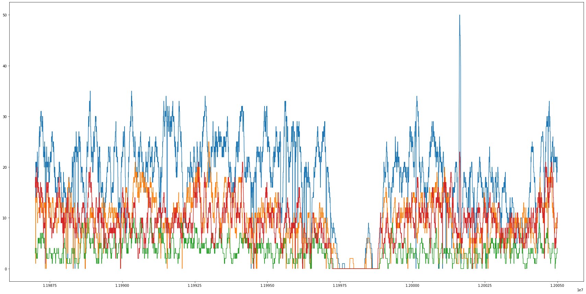


```python
fig, ax = plt.subplots(figsize=(30,15))
#ax.plot(df.loc[:,2:944].mean(),axis=1)
ax.plot(df_AMelMel.loc[:,1],df_AMelMel.loc[:,2:93].mean(axis=1))
ax.plot(df_AMelMel.loc[:,1],df_AMelMel.loc[:,2:93].std(axis=1))


```


    [<matplotlib.lines.Line2D at 0x7f9810ec4890>]


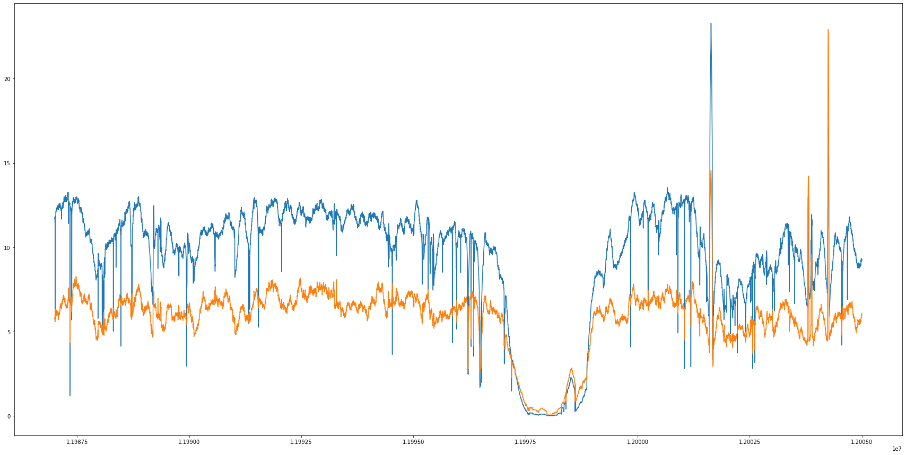


```python
fig, ax = plt.subplots(figsize=(30,15))
#ax.plot(df.loc[:,2:944].mean(),axis=1)
ax.plot(df_AMelMel.loc[:,1],df_AMelMel.loc[:,2:944].mean(axis=1))
ax.plot(df_AMelMel.loc[:,1],df_AMelMel.loc[:,2:944].std(axis=1))
plt.xlim(11987000,12005000)
plt.ylim(0,16)
plt.savefig("/Users/avignal/Documents/Stats/2016_PacificBee/2019AlignAMelMelHav3_1/WholeChromosomesV2c/Inversion_LG3/AMelMel/Depth.pdf", format = 'pdf')

```


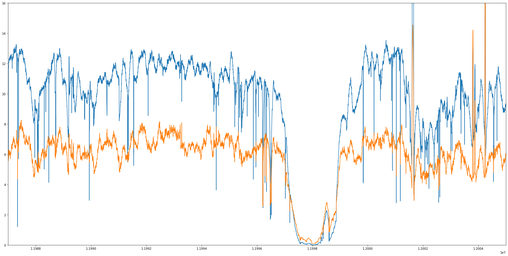


```python

```


```python

```


```python
df_DelIns = pd.read_csv("/Users/avignal/GenotoulWork/DepthChr3Inverstion/allInsDel/InsDelData.txt", sep="\t", header=None)
df_DelIns.columns = ['Chrom','Pos','Svim','Ref','Alt','Type','End','Length']
df_DelIns

```


<div>
<style scoped>
    .dataframe tbody tr th:only-of-type {
        vertical-align: middle;
    }

    .dataframe tbody tr th {
        vertical-align: top;
    }

    .dataframe thead th {
        text-align: right;
    }
</style>
<table border="1" class="dataframe">
  <thead>
    <tr style="text-align: right;">
      <th></th>
      <th>Chrom</th>
      <th>Pos</th>
      <th>Svim</th>
      <th>Ref</th>
      <th>Alt</th>
      <th>Type</th>
      <th>End</th>
      <th>Length</th>
    </tr>
  </thead>
  <tbody>
    <tr>
      <td>0</td>
      <td>NC_037638.1</td>
      <td>19421</td>
      <td>svim_asm.DEL.1</td>
      <td>GATATATATATATATATATATATATATATATATATATATAT</td>
      <td>G</td>
      <td>DEL</td>
      <td>19461.0</td>
      <td>-40.0</td>
    </tr>
    <tr>
      <td>1</td>
      <td>NC_037638.1</td>
      <td>26267</td>
      <td>svim_asm.DEL.2</td>
      <td>ATATATATATATATATATATATATATATATATATATATATATATAT...</td>
      <td>A</td>
      <td>DEL</td>
      <td>26317.0</td>
      <td>-50.0</td>
    </tr>
    <tr>
      <td>2</td>
      <td>NC_037638.1</td>
      <td>69229</td>
      <td>svim_asm.DEL.3</td>
      <td>AATTTATTTAATATAAAGTTTACGGATGGATCATTTTAATACTTTT...</td>
      <td>A</td>
      <td>DEL</td>
      <td>69372.0</td>
      <td>-143.0</td>
    </tr>
    <tr>
      <td>3</td>
      <td>NC_037638.1</td>
      <td>79905</td>
      <td>svim_asm.INS.1</td>
      <td>C</td>
      <td>CCTTTTTTTTTTAAAAATTGATGTTAAATATTAAAAATGTTTAGAA...</td>
      <td>INS</td>
      <td>79905.0</td>
      <td>100.0</td>
    </tr>
    <tr>
      <td>4</td>
      <td>NC_037638.1</td>
      <td>101443</td>
      <td>svim_asm.INS.2</td>
      <td>T</td>
      <td>TATATATATATATATATATATATATATATATATATATATATAATA</td>
      <td>INS</td>
      <td>101443.0</td>
      <td>44.0</td>
    </tr>
    <tr>
      <td>...</td>
      <td>...</td>
      <td>...</td>
      <td>...</td>
      <td>...</td>
      <td>...</td>
      <td>...</td>
      <td>...</td>
      <td>...</td>
    </tr>
    <tr>
      <td>10055</td>
      <td>NW_020555919.1</td>
      <td>6303</td>
      <td>svim_asm.INS.5027</td>
      <td>T</td>
      <td>TAATAATAATAATAATAACAATAATAATAACAATAATAATAACAAC...</td>
      <td>INS</td>
      <td>6303.0</td>
      <td>270.0</td>
    </tr>
    <tr>
      <td>10056</td>
      <td>NW_020555923.1</td>
      <td>1299</td>
      <td>svim_asm.DEL.4959</td>
      <td>ATTTTAAAATATAATATATTCTGAAAAAAATTGCATAAAAAATGAA...</td>
      <td>A</td>
      <td>DEL</td>
      <td>1570.0</td>
      <td>-271.0</td>
    </tr>
    <tr>
      <td>10057</td>
      <td>NW_020555930.1</td>
      <td>3301</td>
      <td>svim_asm.BND.38</td>
      <td>N</td>
      <td>N[NW_020555912.1:1981[</td>
      <td>BND</td>
      <td>NaN</td>
      <td>NaN</td>
    </tr>
    <tr>
      <td>10058</td>
      <td>NW_020555933.1</td>
      <td>3067</td>
      <td>svim_asm.INS.5028</td>
      <td>T</td>
      <td>TTATTATTGTCATTATATATATATATATATATATATATATATATAT...</td>
      <td>INS</td>
      <td>3067.0</td>
      <td>50.0</td>
    </tr>
    <tr>
      <td>10059</td>
      <td>NW_020555933.1</td>
      <td>3067</td>
      <td>svim_asm.INS.5029</td>
      <td>T</td>
      <td>TTATTATTGTCATTATATATATATATATATATATATATATATATAT...</td>
      <td>INS</td>
      <td>3067.0</td>
      <td>58.0</td>
    </tr>
  </tbody>
</table>
<p>10060 rows × 8 columns</p>
</div>


### Longest AMel NUMT absent of HAv3, found by Quentin


```python
df_DelIns[(df_DelIns.Chrom == 'NC_037639.1') & (df_DelIns.Pos > 12047000) & (df_DelIns.Pos < 12048000)]

```


<div>
<style scoped>
    .dataframe tbody tr th:only-of-type {
        vertical-align: middle;
    }

    .dataframe tbody tr th {
        vertical-align: top;
    }

    .dataframe thead th {
        text-align: right;
    }
</style>
<table border="1" class="dataframe">
  <thead>
    <tr style="text-align: right;">
      <th></th>
      <th>Chrom</th>
      <th>Pos</th>
      <th>Svim</th>
      <th>Ref</th>
      <th>Alt</th>
      <th>Type</th>
      <th>End</th>
      <th>Length</th>
    </tr>
  </thead>
  <tbody>
    <tr>
      <td>1514</td>
      <td>NC_037639.1</td>
      <td>12047549</td>
      <td>svim_asm.INS.760</td>
      <td>A</td>
      <td>AAGGTATTCAATAATAAATTTTATTTAAAATATTAAATTTATTATT...</td>
      <td>INS</td>
      <td>12047549.0</td>
      <td>745.0</td>
    </tr>
  </tbody>
</table>
</div>


#### Plot AMelMel


```python
df_AMelMel_NUMT_LG2 = pd.read_csv("/Users/avignal/GenotoulWork/DepthChr3Inverstion/allDepthsAMelMel_NUMT_Chr2.table", sep="\t", header=None)
df_AMelMel_NUMT_LG2

```


<div>
<style scoped>
    .dataframe tbody tr th:only-of-type {
        vertical-align: middle;
    }

    .dataframe tbody tr th {
        vertical-align: top;
    }

    .dataframe thead th {
        text-align: right;
    }
</style>
<table border="1" class="dataframe">
  <thead>
    <tr style="text-align: right;">
      <th></th>
      <th>0</th>
      <th>1</th>
      <th>2</th>
      <th>3</th>
      <th>4</th>
      <th>5</th>
      <th>6</th>
      <th>7</th>
      <th>8</th>
      <th>9</th>
      <th>...</th>
      <th>73</th>
      <th>74</th>
      <th>75</th>
      <th>76</th>
      <th>77</th>
      <th>78</th>
      <th>79</th>
      <th>80</th>
      <th>81</th>
      <th>82</th>
    </tr>
  </thead>
  <tbody>
    <tr>
      <td>0</td>
      <td>CM010320.1</td>
      <td>12211278</td>
      <td>52</td>
      <td>12</td>
      <td>9</td>
      <td>9</td>
      <td>26</td>
      <td>13</td>
      <td>9</td>
      <td>15</td>
      <td>...</td>
      <td>10</td>
      <td>11</td>
      <td>9</td>
      <td>9</td>
      <td>35</td>
      <td>19</td>
      <td>2</td>
      <td>21</td>
      <td>3</td>
      <td>11</td>
    </tr>
    <tr>
      <td>1</td>
      <td>CM010320.1</td>
      <td>12211279</td>
      <td>52</td>
      <td>12</td>
      <td>9</td>
      <td>9</td>
      <td>26</td>
      <td>13</td>
      <td>9</td>
      <td>15</td>
      <td>...</td>
      <td>10</td>
      <td>11</td>
      <td>9</td>
      <td>9</td>
      <td>34</td>
      <td>20</td>
      <td>2</td>
      <td>21</td>
      <td>4</td>
      <td>11</td>
    </tr>
    <tr>
      <td>2</td>
      <td>CM010320.1</td>
      <td>12211280</td>
      <td>51</td>
      <td>12</td>
      <td>9</td>
      <td>9</td>
      <td>26</td>
      <td>13</td>
      <td>10</td>
      <td>15</td>
      <td>...</td>
      <td>10</td>
      <td>11</td>
      <td>9</td>
      <td>9</td>
      <td>35</td>
      <td>20</td>
      <td>2</td>
      <td>21</td>
      <td>4</td>
      <td>11</td>
    </tr>
    <tr>
      <td>3</td>
      <td>CM010320.1</td>
      <td>12211281</td>
      <td>51</td>
      <td>11</td>
      <td>9</td>
      <td>9</td>
      <td>26</td>
      <td>12</td>
      <td>9</td>
      <td>15</td>
      <td>...</td>
      <td>10</td>
      <td>12</td>
      <td>10</td>
      <td>9</td>
      <td>36</td>
      <td>20</td>
      <td>2</td>
      <td>21</td>
      <td>4</td>
      <td>11</td>
    </tr>
    <tr>
      <td>4</td>
      <td>CM010320.1</td>
      <td>12211282</td>
      <td>53</td>
      <td>11</td>
      <td>9</td>
      <td>10</td>
      <td>26</td>
      <td>12</td>
      <td>9</td>
      <td>15</td>
      <td>...</td>
      <td>10</td>
      <td>12</td>
      <td>10</td>
      <td>9</td>
      <td>34</td>
      <td>21</td>
      <td>2</td>
      <td>21</td>
      <td>4</td>
      <td>11</td>
    </tr>
    <tr>
      <td>...</td>
      <td>...</td>
      <td>...</td>
      <td>...</td>
      <td>...</td>
      <td>...</td>
      <td>...</td>
      <td>...</td>
      <td>...</td>
      <td>...</td>
      <td>...</td>
      <td>...</td>
      <td>...</td>
      <td>...</td>
      <td>...</td>
      <td>...</td>
      <td>...</td>
      <td>...</td>
      <td>...</td>
      <td>...</td>
      <td>...</td>
      <td>...</td>
    </tr>
    <tr>
      <td>2737</td>
      <td>CM010320.1</td>
      <td>12214015</td>
      <td>37</td>
      <td>15</td>
      <td>12</td>
      <td>11</td>
      <td>24</td>
      <td>10</td>
      <td>16</td>
      <td>19</td>
      <td>...</td>
      <td>9</td>
      <td>10</td>
      <td>18</td>
      <td>8</td>
      <td>32</td>
      <td>9</td>
      <td>6</td>
      <td>11</td>
      <td>3</td>
      <td>19</td>
    </tr>
    <tr>
      <td>2738</td>
      <td>CM010320.1</td>
      <td>12214016</td>
      <td>37</td>
      <td>16</td>
      <td>12</td>
      <td>11</td>
      <td>25</td>
      <td>10</td>
      <td>16</td>
      <td>19</td>
      <td>...</td>
      <td>9</td>
      <td>11</td>
      <td>18</td>
      <td>9</td>
      <td>31</td>
      <td>9</td>
      <td>6</td>
      <td>11</td>
      <td>3</td>
      <td>20</td>
    </tr>
    <tr>
      <td>2739</td>
      <td>CM010320.1</td>
      <td>12214017</td>
      <td>37</td>
      <td>16</td>
      <td>12</td>
      <td>11</td>
      <td>24</td>
      <td>10</td>
      <td>16</td>
      <td>19</td>
      <td>...</td>
      <td>9</td>
      <td>9</td>
      <td>18</td>
      <td>9</td>
      <td>31</td>
      <td>9</td>
      <td>6</td>
      <td>11</td>
      <td>3</td>
      <td>20</td>
    </tr>
    <tr>
      <td>2740</td>
      <td>CM010320.1</td>
      <td>12214018</td>
      <td>37</td>
      <td>16</td>
      <td>12</td>
      <td>11</td>
      <td>24</td>
      <td>10</td>
      <td>16</td>
      <td>19</td>
      <td>...</td>
      <td>9</td>
      <td>9</td>
      <td>18</td>
      <td>9</td>
      <td>31</td>
      <td>9</td>
      <td>6</td>
      <td>11</td>
      <td>3</td>
      <td>20</td>
    </tr>
    <tr>
      <td>2741</td>
      <td>CM010320.1</td>
      <td>12214019</td>
      <td>37</td>
      <td>16</td>
      <td>12</td>
      <td>11</td>
      <td>23</td>
      <td>10</td>
      <td>16</td>
      <td>19</td>
      <td>...</td>
      <td>9</td>
      <td>9</td>
      <td>18</td>
      <td>8</td>
      <td>30</td>
      <td>9</td>
      <td>6</td>
      <td>10</td>
      <td>3</td>
      <td>20</td>
    </tr>
  </tbody>
</table>
<p>2742 rows × 83 columns</p>
</div>


```python
fig, ax = plt.subplots(figsize=(30,15))
ax.plot(df_AMelMel_NUMT_LG2.loc[:,1],df_AMelMel_NUMT_LG2.loc[:,6])
ax.plot(df_AMelMel_NUMT_LG2.loc[:,1],df_AMelMel_NUMT_LG2.loc[:,7])
ax.plot(df_AMelMel_NUMT_LG2.loc[:,1],df_AMelMel_NUMT_LG2.loc[:,10])
ax.plot(df_AMelMel_NUMT_LG2.loc[:,1],df_AMelMel_NUMT_LG2.loc[:,15])

```


    [<matplotlib.lines.Line2D at 0x7f982f132d50>]


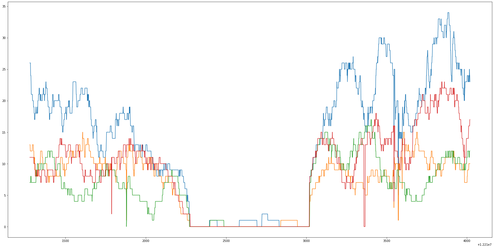


```python
fig, ax = plt.subplots(figsize=(30,15))
ax.plot(df_AMelMel_NUMT_LG2.loc[:,1],df_AMelMel_NUMT_LG2.loc[:,2])
ax.plot(df_AMelMel_NUMT_LG2.loc[:,1],df_AMelMel_NUMT_LG2.loc[:,55])
ax.plot(df_AMelMel_NUMT_LG2.loc[:,1],df_AMelMel_NUMT_LG2.loc[:,60])
ax.plot(df_AMelMel_NUMT_LG2.loc[:,1],df_AMelMel_NUMT_LG2.loc[:,80])

```


    [<matplotlib.lines.Line2D at 0x7f9816804e50>]


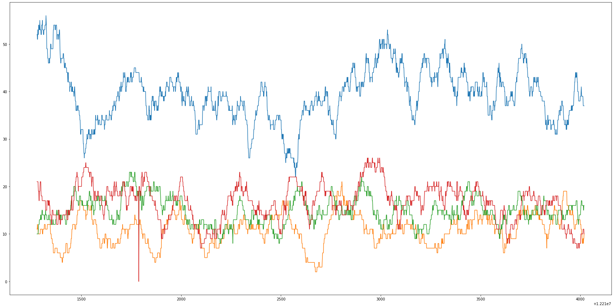


```python
fig, ax = plt.subplots(figsize=(30,15))
ax.plot(df_AMelMel_NUMT_LG2.loc[:,1],df_AMelMel_NUMT_LG2.loc[:,48:82])

```


    [<matplotlib.lines.Line2D at 0x7f981f1267d0>,
     <matplotlib.lines.Line2D at 0x7f982a3529d0>,
     <matplotlib.lines.Line2D at 0x7f982a352b90>,
     <matplotlib.lines.Line2D at 0x7f982a352d50>,
     <matplotlib.lines.Line2D at 0x7f982a352f10>,
     <matplotlib.lines.Line2D at 0x7f982a35c110>,
     <matplotlib.lines.Line2D at 0x7f982a35c350>,
     <matplotlib.lines.Line2D at 0x7f982a35c510>,
     <matplotlib.lines.Line2D at 0x7f982a352ed0>,
     <matplotlib.lines.Line2D at 0x7f982a35c150>,
     <matplotlib.lines.Line2D at 0x7f9820af1090>,
     <matplotlib.lines.Line2D at 0x7f982a35cb50>,
     <matplotlib.lines.Line2D at 0x7f982a35cd10>,
     <matplotlib.lines.Line2D at 0x7f982a35ced0>,
     <matplotlib.lines.Line2D at 0x7f982a35f0d0>,
     <matplotlib.lines.Line2D at 0x7f982a35f290>,
     <matplotlib.lines.Line2D at 0x7f982a35f450>,
     <matplotlib.lines.Line2D at 0x7f982a35f610>,
     <matplotlib.lines.Line2D at 0x7f982a35f7d0>,
     <matplotlib.lines.Line2D at 0x7f982a35f990>,
     <matplotlib.lines.Line2D at 0x7f982a35fb50>,
     <matplotlib.lines.Line2D at 0x7f982a35fd10>,
     <matplotlib.lines.Line2D at 0x7f982a35fed0>,
     <matplotlib.lines.Line2D at 0x7f98206fd0d0>,
     <matplotlib.lines.Line2D at 0x7f98206fd290>,
     <matplotlib.lines.Line2D at 0x7f98206fd450>,
     <matplotlib.lines.Line2D at 0x7f98206fd610>,
     <matplotlib.lines.Line2D at 0x7f98206fd7d0>,
     <matplotlib.lines.Line2D at 0x7f98206fd990>,
     <matplotlib.lines.Line2D at 0x7f98206fdb50>,
     <matplotlib.lines.Line2D at 0x7f98206fdd10>,
     <matplotlib.lines.Line2D at 0x7f98206fded0>,
     <matplotlib.lines.Line2D at 0x7f98207010d0>,
     <matplotlib.lines.Line2D at 0x7f9820701290>,
     <matplotlib.lines.Line2D at 0x7f9820701450>]


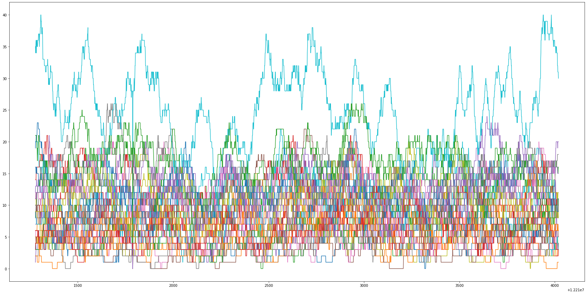


```python
fig, ax = plt.subplots(figsize=(30,15))
#ax.plot(df.loc[:,2:944].mean(),axis=1)
ax.plot(df_AMelMel_NUMT_LG2.loc[:,1],df_AMelMel_NUMT_LG2.loc[:,3:47].mean(axis=1))
ax.plot(df_AMelMel_NUMT_LG2.loc[:,1],df_AMelMel_NUMT_LG2.loc[:,3:47].std(axis=1))

```


    [<matplotlib.lines.Line2D at 0x7f981a945490>]


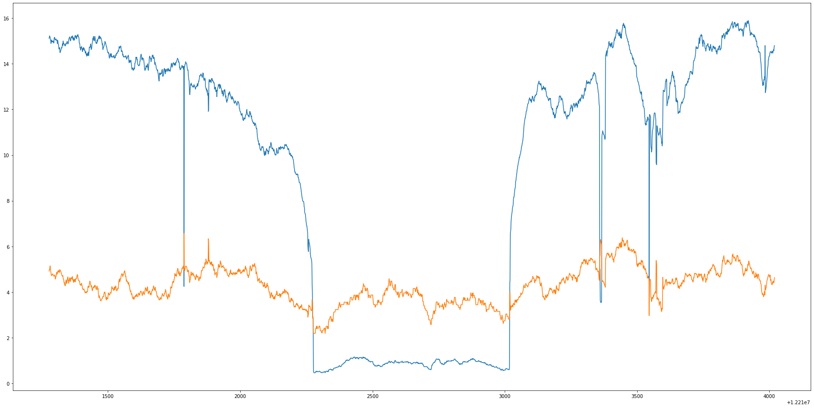


```python
fig, ax = plt.subplots(figsize=(30,15))
#ax.plot(df.loc[:,2:944].mean(),axis=1)
ax.plot(df_AMelMel_NUMT_LG2.loc[:,1],df_AMelMel_NUMT_LG2.loc[:,48:82].mean(axis=1))
ax.plot(df_AMelMel_NUMT_LG2.loc[:,1],df_AMelMel_NUMT_LG2.loc[:,48:82].std(axis=1))

```


    [<matplotlib.lines.Line2D at 0x7f9801282f90>]


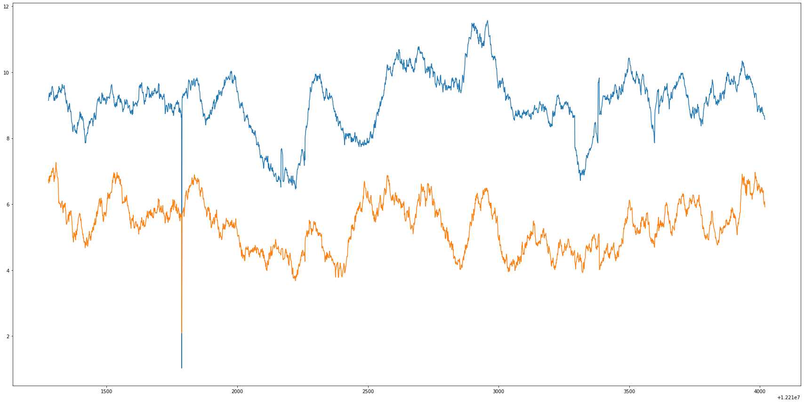


```python
fig, ax = plt.subplots(figsize=(30,15))
#ax.plot(df.loc[:,2:944].mean(),axis=1)
ax.plot(df_AMelMel_NUMT_LG2.loc[:,1],df_AMelMel_NUMT_LG2.loc[:,3:82].mean(axis=1))
ax.plot(df_AMelMel_NUMT_LG2.loc[:,1],df_AMelMel_NUMT_LG2.loc[:,3:82].std(axis=1))

```


    [<matplotlib.lines.Line2D at 0x7f981ab88550>]


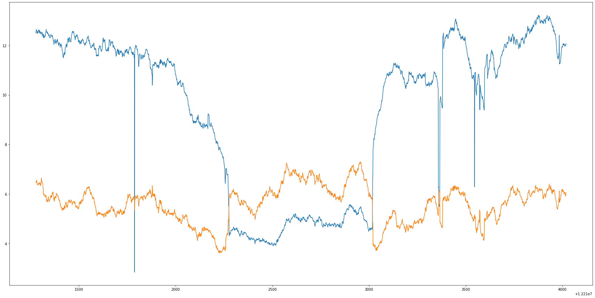


#### Plot HAv3


```python
df_HAv3_NUMT_LG2 = pd.read_csv("/Users/avignal/GenotoulWork/DepthChr3Inverstion/allDepthsHAv3_NUMT_Chr2.table", sep="\t", header=None)
df_HAv3_NUMT_LG2

```


<div>
<style scoped>
    .dataframe tbody tr th:only-of-type {
        vertical-align: middle;
    }

    .dataframe tbody tr th {
        vertical-align: top;
    }

    .dataframe thead th {
        text-align: right;
    }
</style>
<table border="1" class="dataframe">
  <thead>
    <tr style="text-align: right;">
      <th></th>
      <th>0</th>
      <th>1</th>
      <th>2</th>
      <th>3</th>
      <th>4</th>
      <th>5</th>
      <th>6</th>
      <th>7</th>
      <th>8</th>
      <th>9</th>
      <th>...</th>
      <th>73</th>
      <th>74</th>
      <th>75</th>
      <th>76</th>
      <th>77</th>
      <th>78</th>
      <th>79</th>
      <th>80</th>
      <th>81</th>
      <th>82</th>
    </tr>
  </thead>
  <tbody>
    <tr>
      <td>0</td>
      <td>NC_037639.1</td>
      <td>12047000</td>
      <td>42</td>
      <td>9</td>
      <td>13</td>
      <td>14</td>
      <td>11</td>
      <td>10</td>
      <td>10</td>
      <td>17</td>
      <td>...</td>
      <td>6</td>
      <td>15</td>
      <td>19</td>
      <td>8</td>
      <td>25</td>
      <td>13</td>
      <td>6</td>
      <td>18</td>
      <td>4</td>
      <td>8</td>
    </tr>
    <tr>
      <td>1</td>
      <td>NC_037639.1</td>
      <td>12047001</td>
      <td>42</td>
      <td>9</td>
      <td>13</td>
      <td>14</td>
      <td>11</td>
      <td>10</td>
      <td>10</td>
      <td>17</td>
      <td>...</td>
      <td>6</td>
      <td>15</td>
      <td>18</td>
      <td>8</td>
      <td>25</td>
      <td>13</td>
      <td>6</td>
      <td>18</td>
      <td>4</td>
      <td>7</td>
    </tr>
    <tr>
      <td>2</td>
      <td>NC_037639.1</td>
      <td>12047002</td>
      <td>42</td>
      <td>9</td>
      <td>13</td>
      <td>14</td>
      <td>11</td>
      <td>10</td>
      <td>9</td>
      <td>17</td>
      <td>...</td>
      <td>6</td>
      <td>15</td>
      <td>17</td>
      <td>8</td>
      <td>25</td>
      <td>13</td>
      <td>6</td>
      <td>18</td>
      <td>4</td>
      <td>7</td>
    </tr>
    <tr>
      <td>3</td>
      <td>NC_037639.1</td>
      <td>12047003</td>
      <td>42</td>
      <td>9</td>
      <td>13</td>
      <td>14</td>
      <td>11</td>
      <td>10</td>
      <td>9</td>
      <td>17</td>
      <td>...</td>
      <td>6</td>
      <td>15</td>
      <td>18</td>
      <td>8</td>
      <td>25</td>
      <td>13</td>
      <td>6</td>
      <td>18</td>
      <td>4</td>
      <td>7</td>
    </tr>
    <tr>
      <td>4</td>
      <td>NC_037639.1</td>
      <td>12047004</td>
      <td>42</td>
      <td>9</td>
      <td>13</td>
      <td>14</td>
      <td>11</td>
      <td>10</td>
      <td>9</td>
      <td>17</td>
      <td>...</td>
      <td>6</td>
      <td>15</td>
      <td>18</td>
      <td>8</td>
      <td>25</td>
      <td>13</td>
      <td>6</td>
      <td>18</td>
      <td>4</td>
      <td>7</td>
    </tr>
    <tr>
      <td>...</td>
      <td>...</td>
      <td>...</td>
      <td>...</td>
      <td>...</td>
      <td>...</td>
      <td>...</td>
      <td>...</td>
      <td>...</td>
      <td>...</td>
      <td>...</td>
      <td>...</td>
      <td>...</td>
      <td>...</td>
      <td>...</td>
      <td>...</td>
      <td>...</td>
      <td>...</td>
      <td>...</td>
      <td>...</td>
      <td>...</td>
      <td>...</td>
    </tr>
    <tr>
      <td>996</td>
      <td>NC_037639.1</td>
      <td>12047996</td>
      <td>41</td>
      <td>18</td>
      <td>17</td>
      <td>8</td>
      <td>29</td>
      <td>7</td>
      <td>10</td>
      <td>20</td>
      <td>...</td>
      <td>10</td>
      <td>7</td>
      <td>16</td>
      <td>15</td>
      <td>17</td>
      <td>9</td>
      <td>4</td>
      <td>18</td>
      <td>6</td>
      <td>13</td>
    </tr>
    <tr>
      <td>997</td>
      <td>NC_037639.1</td>
      <td>12047997</td>
      <td>41</td>
      <td>17</td>
      <td>17</td>
      <td>8</td>
      <td>29</td>
      <td>7</td>
      <td>10</td>
      <td>20</td>
      <td>...</td>
      <td>10</td>
      <td>7</td>
      <td>15</td>
      <td>15</td>
      <td>17</td>
      <td>8</td>
      <td>4</td>
      <td>18</td>
      <td>6</td>
      <td>13</td>
    </tr>
    <tr>
      <td>998</td>
      <td>NC_037639.1</td>
      <td>12047998</td>
      <td>41</td>
      <td>17</td>
      <td>16</td>
      <td>8</td>
      <td>29</td>
      <td>7</td>
      <td>10</td>
      <td>20</td>
      <td>...</td>
      <td>10</td>
      <td>7</td>
      <td>15</td>
      <td>15</td>
      <td>17</td>
      <td>9</td>
      <td>4</td>
      <td>17</td>
      <td>6</td>
      <td>13</td>
    </tr>
    <tr>
      <td>999</td>
      <td>NC_037639.1</td>
      <td>12047999</td>
      <td>41</td>
      <td>17</td>
      <td>17</td>
      <td>8</td>
      <td>29</td>
      <td>8</td>
      <td>10</td>
      <td>20</td>
      <td>...</td>
      <td>9</td>
      <td>7</td>
      <td>16</td>
      <td>15</td>
      <td>17</td>
      <td>9</td>
      <td>4</td>
      <td>17</td>
      <td>6</td>
      <td>13</td>
    </tr>
    <tr>
      <td>1000</td>
      <td>NC_037639.1</td>
      <td>12048000</td>
      <td>41</td>
      <td>17</td>
      <td>17</td>
      <td>8</td>
      <td>29</td>
      <td>8</td>
      <td>10</td>
      <td>20</td>
      <td>...</td>
      <td>7</td>
      <td>6</td>
      <td>16</td>
      <td>15</td>
      <td>18</td>
      <td>9</td>
      <td>4</td>
      <td>17</td>
      <td>6</td>
      <td>13</td>
    </tr>
  </tbody>
</table>
<p>1001 rows × 83 columns</p>
</div>


```python
fig, ax = plt.subplots(figsize=(30,15))
ax.plot(df_HAv3_NUMT_LG2.loc[:,1],df_HAv3_NUMT_LG2.loc[:,6])
ax.plot(df_HAv3_NUMT_LG2.loc[:,1],df_HAv3_NUMT_LG2.loc[:,7])
ax.plot(df_HAv3_NUMT_LG2.loc[:,1],df_HAv3_NUMT_LG2.loc[:,10])
ax.plot(df_HAv3_NUMT_LG2.loc[:,1],df_HAv3_NUMT_LG2.loc[:,15])

```


    [<matplotlib.lines.Line2D at 0x7f98125856d0>]


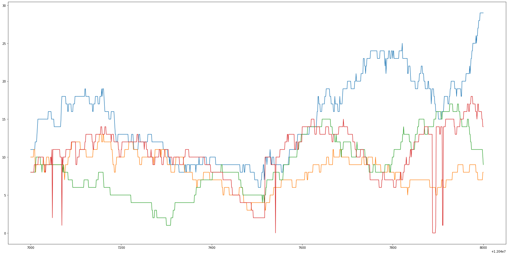


```python
fig, ax = plt.subplots(figsize=(30,15))
ax.plot(df_HAv3_NUMT_LG2.loc[:,1],df_HAv3_NUMT_LG2.loc[:,50])
ax.plot(df_HAv3_NUMT_LG2.loc[:,1],df_HAv3_NUMT_LG2.loc[:,55])
ax.plot(df_HAv3_NUMT_LG2.loc[:,1],df_HAv3_NUMT_LG2.loc[:,60])
ax.plot(df_HAv3_NUMT_LG2.loc[:,1],df_HAv3_NUMT_LG2.loc[:,80])

```


    [<matplotlib.lines.Line2D at 0x7f981709f250>]


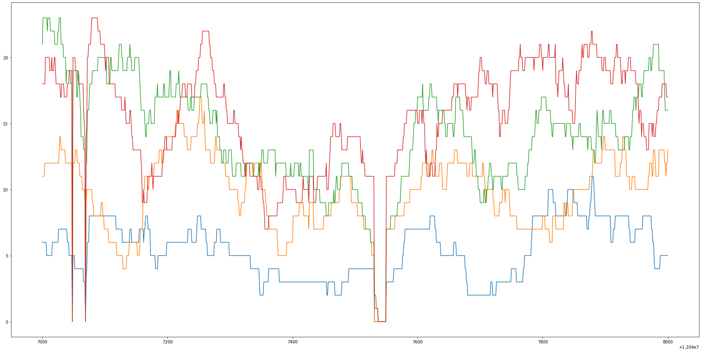


```python
fig, ax = plt.subplots(figsize=(30,15))
ax.plot(df_HAv3_NUMT_LG2.loc[:,1],df_HAv3_NUMT_LG2.loc[:,50])
ax.plot(df_HAv3_NUMT_LG2.loc[:,1],df_HAv3_NUMT_LG2.loc[:,55])
ax.plot(df_HAv3_NUMT_LG2.loc[:,1],df_HAv3_NUMT_LG2.loc[:,60])
ax.plot(df_HAv3_NUMT_LG2.loc[:,1],df_HAv3_NUMT_LG2.loc[:,80])
plt.xlim(12047400,12047620)

```


    (12047400, 12047620)


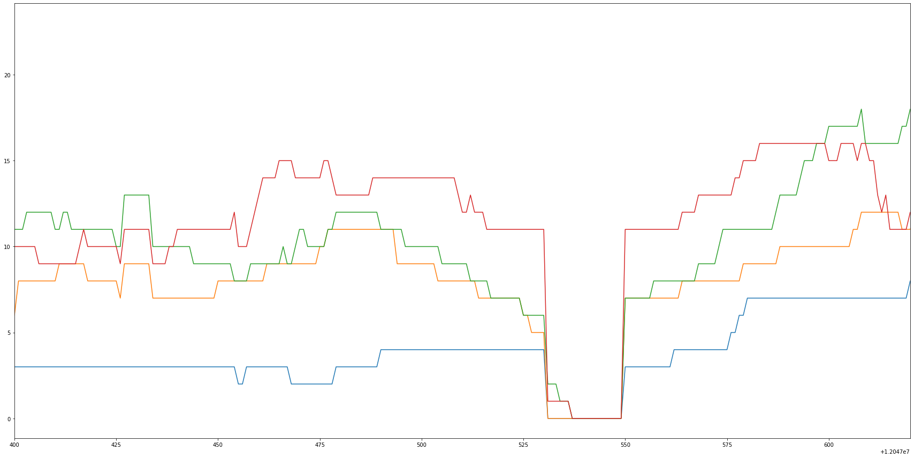


```python
fig, ax = plt.subplots(figsize=(30,15))
#ax.plot(df.loc[:,2:944].mean(),axis=1)
ax.plot(df_HAv3_NUMT_LG2.loc[:,1],df_HAv3_NUMT_LG2.loc[:,2:93].mean(axis=1))
ax.plot(df_HAv3_NUMT_LG2.loc[:,1],df_HAv3_NUMT_LG2.loc[:,2:93].std(axis=1))

```


    [<matplotlib.lines.Line2D at 0x7f981c00ccd0>]


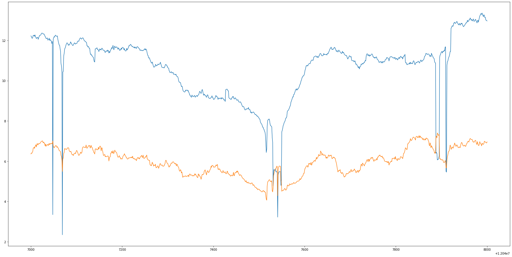


```python
fig, ax = plt.subplots(figsize=(30,15))
ax.plot(df_HAv3_NUMT_LG2.loc[:,1],df_HAv3_NUMT_LG2.loc[:,6])
ax.plot(df_HAv3_NUMT_LG2.loc[:,1],df_HAv3_NUMT_LG2.loc[:,7])
ax.plot(df_HAv3_NUMT_LG2.loc[:,1],df_HAv3_NUMT_LG2.loc[:,10])
ax.plot(df_HAv3_NUMT_LG2.loc[:,1],df_HAv3_NUMT_LG2.loc[:,15])

```

### Longest HAv3 NUMT absent of AMel, found by Quentin


```python
df_DelIns[(df_DelIns.Chrom == 'NC_037647.1') & (df_DelIns.Pos > 670500) & (df_DelIns.Pos < 671491)]

```


<div>
<style scoped>
    .dataframe tbody tr th:only-of-type {
        vertical-align: middle;
    }

    .dataframe tbody tr th {
        vertical-align: top;
    }

    .dataframe thead th {
        text-align: right;
    }
</style>
<table border="1" class="dataframe">
  <thead>
    <tr style="text-align: right;">
      <th></th>
      <th>Chrom</th>
      <th>Pos</th>
      <th>Svim</th>
      <th>Ref</th>
      <th>Alt</th>
      <th>Type</th>
      <th>End</th>
      <th>Length</th>
    </tr>
  </thead>
  <tbody>
    <tr>
      <td>6027</td>
      <td>NC_037647.1</td>
      <td>670675</td>
      <td>svim_asm.DEL.3005</td>
      <td>TTCTTTCAACATGGAATAATTTTTACAAAAAAAAGTTGTTGCTTAT...</td>
      <td>T</td>
      <td>DEL</td>
      <td>671251.0</td>
      <td>-576.0</td>
    </tr>
  </tbody>
</table>
</div>


#### PlotAMelMal


```python
df_AMelMel_NUMT_LG10 = pd.read_csv("/Users/avignal/GenotoulWork/DepthChr3Inverstion/allDepthsAMelMel_NUMT_Chr10.table", sep="\t", header=None)
df_AMelMel_NUMT_LG10

```


<div>
<style scoped>
    .dataframe tbody tr th:only-of-type {
        vertical-align: middle;
    }

    .dataframe tbody tr th {
        vertical-align: top;
    }

    .dataframe thead th {
        text-align: right;
    }
</style>
<table border="1" class="dataframe">
  <thead>
    <tr style="text-align: right;">
      <th></th>
      <th>0</th>
      <th>1</th>
      <th>2</th>
      <th>3</th>
      <th>4</th>
      <th>5</th>
      <th>6</th>
      <th>7</th>
      <th>8</th>
      <th>9</th>
      <th>...</th>
      <th>73</th>
      <th>74</th>
      <th>75</th>
      <th>76</th>
      <th>77</th>
      <th>78</th>
      <th>79</th>
      <th>80</th>
      <th>81</th>
      <th>82</th>
    </tr>
  </thead>
  <tbody>
    <tr>
      <td>0</td>
      <td>CM010328.1</td>
      <td>663884</td>
      <td>35</td>
      <td>11</td>
      <td>18</td>
      <td>17</td>
      <td>19</td>
      <td>9</td>
      <td>11</td>
      <td>19</td>
      <td>...</td>
      <td>12</td>
      <td>16</td>
      <td>20</td>
      <td>8</td>
      <td>25</td>
      <td>10</td>
      <td>16</td>
      <td>14</td>
      <td>9</td>
      <td>13</td>
    </tr>
    <tr>
      <td>1</td>
      <td>CM010328.1</td>
      <td>663885</td>
      <td>33</td>
      <td>10</td>
      <td>18</td>
      <td>17</td>
      <td>19</td>
      <td>9</td>
      <td>11</td>
      <td>19</td>
      <td>...</td>
      <td>11</td>
      <td>16</td>
      <td>20</td>
      <td>8</td>
      <td>25</td>
      <td>9</td>
      <td>16</td>
      <td>15</td>
      <td>9</td>
      <td>13</td>
    </tr>
    <tr>
      <td>2</td>
      <td>CM010328.1</td>
      <td>663886</td>
      <td>33</td>
      <td>10</td>
      <td>18</td>
      <td>18</td>
      <td>20</td>
      <td>9</td>
      <td>11</td>
      <td>19</td>
      <td>...</td>
      <td>11</td>
      <td>16</td>
      <td>20</td>
      <td>7</td>
      <td>25</td>
      <td>9</td>
      <td>16</td>
      <td>15</td>
      <td>9</td>
      <td>14</td>
    </tr>
    <tr>
      <td>3</td>
      <td>CM010328.1</td>
      <td>663887</td>
      <td>33</td>
      <td>10</td>
      <td>18</td>
      <td>18</td>
      <td>20</td>
      <td>9</td>
      <td>11</td>
      <td>19</td>
      <td>...</td>
      <td>10</td>
      <td>16</td>
      <td>20</td>
      <td>7</td>
      <td>25</td>
      <td>9</td>
      <td>16</td>
      <td>14</td>
      <td>9</td>
      <td>14</td>
    </tr>
    <tr>
      <td>4</td>
      <td>CM010328.1</td>
      <td>663888</td>
      <td>33</td>
      <td>9</td>
      <td>18</td>
      <td>18</td>
      <td>20</td>
      <td>9</td>
      <td>11</td>
      <td>20</td>
      <td>...</td>
      <td>10</td>
      <td>16</td>
      <td>20</td>
      <td>7</td>
      <td>25</td>
      <td>9</td>
      <td>17</td>
      <td>14</td>
      <td>9</td>
      <td>14</td>
    </tr>
    <tr>
      <td>...</td>
      <td>...</td>
      <td>...</td>
      <td>...</td>
      <td>...</td>
      <td>...</td>
      <td>...</td>
      <td>...</td>
      <td>...</td>
      <td>...</td>
      <td>...</td>
      <td>...</td>
      <td>...</td>
      <td>...</td>
      <td>...</td>
      <td>...</td>
      <td>...</td>
      <td>...</td>
      <td>...</td>
      <td>...</td>
      <td>...</td>
      <td>...</td>
    </tr>
    <tr>
      <td>2015</td>
      <td>CM010328.1</td>
      <td>665899</td>
      <td>43</td>
      <td>19</td>
      <td>17</td>
      <td>13</td>
      <td>15</td>
      <td>7</td>
      <td>14</td>
      <td>33</td>
      <td>...</td>
      <td>14</td>
      <td>13</td>
      <td>20</td>
      <td>9</td>
      <td>42</td>
      <td>14</td>
      <td>4</td>
      <td>24</td>
      <td>3</td>
      <td>14</td>
    </tr>
    <tr>
      <td>2016</td>
      <td>CM010328.1</td>
      <td>665900</td>
      <td>42</td>
      <td>19</td>
      <td>17</td>
      <td>12</td>
      <td>14</td>
      <td>7</td>
      <td>14</td>
      <td>33</td>
      <td>...</td>
      <td>14</td>
      <td>13</td>
      <td>21</td>
      <td>9</td>
      <td>42</td>
      <td>14</td>
      <td>4</td>
      <td>24</td>
      <td>3</td>
      <td>14</td>
    </tr>
    <tr>
      <td>2017</td>
      <td>CM010328.1</td>
      <td>665901</td>
      <td>43</td>
      <td>19</td>
      <td>17</td>
      <td>12</td>
      <td>13</td>
      <td>7</td>
      <td>14</td>
      <td>33</td>
      <td>...</td>
      <td>14</td>
      <td>13</td>
      <td>20</td>
      <td>9</td>
      <td>42</td>
      <td>14</td>
      <td>4</td>
      <td>23</td>
      <td>3</td>
      <td>14</td>
    </tr>
    <tr>
      <td>2018</td>
      <td>CM010328.1</td>
      <td>665902</td>
      <td>43</td>
      <td>18</td>
      <td>17</td>
      <td>11</td>
      <td>13</td>
      <td>7</td>
      <td>14</td>
      <td>32</td>
      <td>...</td>
      <td>14</td>
      <td>13</td>
      <td>20</td>
      <td>10</td>
      <td>43</td>
      <td>12</td>
      <td>4</td>
      <td>23</td>
      <td>3</td>
      <td>14</td>
    </tr>
    <tr>
      <td>2019</td>
      <td>CM010328.1</td>
      <td>665903</td>
      <td>43</td>
      <td>18</td>
      <td>17</td>
      <td>11</td>
      <td>13</td>
      <td>7</td>
      <td>14</td>
      <td>32</td>
      <td>...</td>
      <td>14</td>
      <td>13</td>
      <td>20</td>
      <td>10</td>
      <td>43</td>
      <td>12</td>
      <td>4</td>
      <td>23</td>
      <td>3</td>
      <td>14</td>
    </tr>
  </tbody>
</table>
<p>2020 rows × 83 columns</p>
</div>


```python
fig, ax = plt.subplots(figsize=(30,15))
#ax.plot(df.loc[:,2:944].mean(),axis=1)
ax.plot(df_AMelMel_NUMT_LG10.loc[:,1],df_AMelMel_NUMT_LG10.loc[:,3:47].mean(axis=1))
ax.plot(df_AMelMel_NUMT_LG10.loc[:,1],df_AMelMel_NUMT_LG10.loc[:,3:47].std(axis=1))

```


    [<matplotlib.lines.Line2D at 0x7f9801bc1f90>]


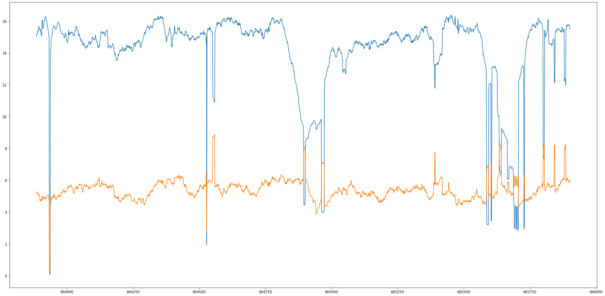


```python
fig, ax = plt.subplots(figsize=(30,15))
#ax.plot(df.loc[:,2:944].mean(),axis=1)
ax.plot(df_AMelMel_NUMT_LG10.loc[:,1],df_AMelMel_NUMT_LG10.loc[:,48:82].mean(axis=1))
ax.plot(df_AMelMel_NUMT_LG10.loc[:,1],df_AMelMel_NUMT_LG10.loc[:,48:82].std(axis=1))

```


    [<matplotlib.lines.Line2D at 0x7f9801be5090>]


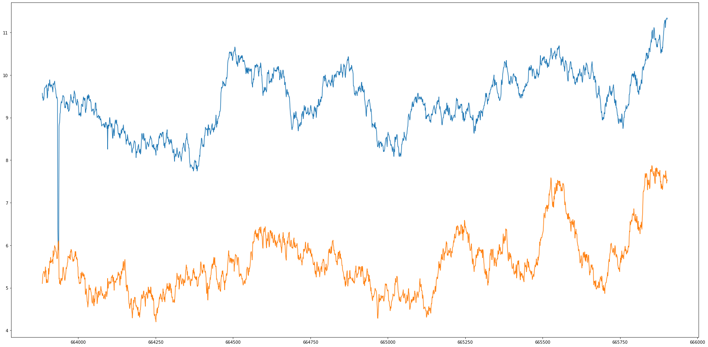


```python
fig, ax = plt.subplots(figsize=(30,15))
#ax.plot(df.loc[:,2:944].mean(),axis=1)
ax.plot(df_AMelMel_NUMT_LG10.loc[:,1],df_AMelMel_NUMT_LG10.loc[:,3:82].mean(axis=1))
ax.plot(df_AMelMel_NUMT_LG10.loc[:,1],df_AMelMel_NUMT_LG10.loc[:,3:82].std(axis=1))

```


    [<matplotlib.lines.Line2D at 0x7f9801c7b890>]


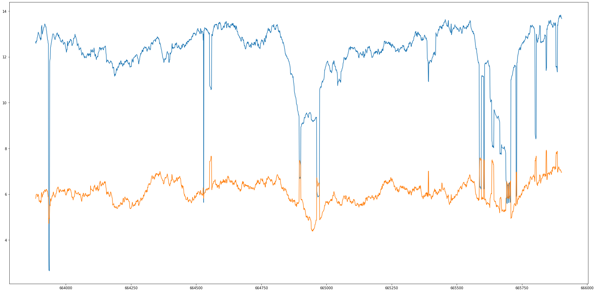


#### Plot HAv3


```python
df_HAv3_NUMT_LG10 = pd.read_csv("/Users/avignal/GenotoulWork/DepthChr3Inverstion/allDepthsHAv3_NUMT_Chr10.table", sep="\t", header=None)
df_HAv3_NUMT_LG10

```


<div>
<style scoped>
    .dataframe tbody tr th:only-of-type {
        vertical-align: middle;
    }

    .dataframe tbody tr th {
        vertical-align: top;
    }

    .dataframe thead th {
        text-align: right;
    }
</style>
<table border="1" class="dataframe">
  <thead>
    <tr style="text-align: right;">
      <th></th>
      <th>0</th>
      <th>1</th>
      <th>2</th>
      <th>3</th>
      <th>4</th>
      <th>5</th>
      <th>6</th>
      <th>7</th>
      <th>8</th>
      <th>9</th>
      <th>...</th>
      <th>73</th>
      <th>74</th>
      <th>75</th>
      <th>76</th>
      <th>77</th>
      <th>78</th>
      <th>79</th>
      <th>80</th>
      <th>81</th>
      <th>82</th>
    </tr>
  </thead>
  <tbody>
    <tr>
      <td>0</td>
      <td>NC_037647.1</td>
      <td>669701</td>
      <td>32</td>
      <td>9</td>
      <td>18</td>
      <td>18</td>
      <td>21</td>
      <td>7</td>
      <td>12</td>
      <td>20</td>
      <td>...</td>
      <td>9</td>
      <td>16</td>
      <td>18</td>
      <td>10</td>
      <td>24</td>
      <td>10</td>
      <td>19</td>
      <td>16</td>
      <td>6</td>
      <td>14</td>
    </tr>
    <tr>
      <td>1</td>
      <td>NC_037647.1</td>
      <td>669702</td>
      <td>32</td>
      <td>9</td>
      <td>19</td>
      <td>18</td>
      <td>21</td>
      <td>7</td>
      <td>12</td>
      <td>20</td>
      <td>...</td>
      <td>9</td>
      <td>16</td>
      <td>18</td>
      <td>10</td>
      <td>24</td>
      <td>10</td>
      <td>19</td>
      <td>17</td>
      <td>6</td>
      <td>14</td>
    </tr>
    <tr>
      <td>2</td>
      <td>NC_037647.1</td>
      <td>669703</td>
      <td>32</td>
      <td>9</td>
      <td>19</td>
      <td>19</td>
      <td>22</td>
      <td>7</td>
      <td>11</td>
      <td>20</td>
      <td>...</td>
      <td>9</td>
      <td>16</td>
      <td>17</td>
      <td>10</td>
      <td>24</td>
      <td>10</td>
      <td>19</td>
      <td>17</td>
      <td>6</td>
      <td>14</td>
    </tr>
    <tr>
      <td>3</td>
      <td>NC_037647.1</td>
      <td>669704</td>
      <td>32</td>
      <td>9</td>
      <td>19</td>
      <td>19</td>
      <td>21</td>
      <td>8</td>
      <td>11</td>
      <td>21</td>
      <td>...</td>
      <td>9</td>
      <td>16</td>
      <td>17</td>
      <td>10</td>
      <td>25</td>
      <td>10</td>
      <td>19</td>
      <td>17</td>
      <td>6</td>
      <td>14</td>
    </tr>
    <tr>
      <td>4</td>
      <td>NC_037647.1</td>
      <td>669705</td>
      <td>32</td>
      <td>9</td>
      <td>18</td>
      <td>19</td>
      <td>21</td>
      <td>8</td>
      <td>11</td>
      <td>21</td>
      <td>...</td>
      <td>9</td>
      <td>16</td>
      <td>17</td>
      <td>10</td>
      <td>25</td>
      <td>10</td>
      <td>19</td>
      <td>17</td>
      <td>6</td>
      <td>14</td>
    </tr>
    <tr>
      <td>...</td>
      <td>...</td>
      <td>...</td>
      <td>...</td>
      <td>...</td>
      <td>...</td>
      <td>...</td>
      <td>...</td>
      <td>...</td>
      <td>...</td>
      <td>...</td>
      <td>...</td>
      <td>...</td>
      <td>...</td>
      <td>...</td>
      <td>...</td>
      <td>...</td>
      <td>...</td>
      <td>...</td>
      <td>...</td>
      <td>...</td>
      <td>...</td>
    </tr>
    <tr>
      <td>2586</td>
      <td>NC_037647.1</td>
      <td>672287</td>
      <td>41</td>
      <td>18</td>
      <td>12</td>
      <td>9</td>
      <td>14</td>
      <td>11</td>
      <td>17</td>
      <td>29</td>
      <td>...</td>
      <td>11</td>
      <td>16</td>
      <td>18</td>
      <td>8</td>
      <td>36</td>
      <td>11</td>
      <td>4</td>
      <td>17</td>
      <td>4</td>
      <td>13</td>
    </tr>
    <tr>
      <td>2587</td>
      <td>NC_037647.1</td>
      <td>672288</td>
      <td>42</td>
      <td>18</td>
      <td>12</td>
      <td>9</td>
      <td>14</td>
      <td>11</td>
      <td>17</td>
      <td>30</td>
      <td>...</td>
      <td>11</td>
      <td>16</td>
      <td>18</td>
      <td>8</td>
      <td>36</td>
      <td>11</td>
      <td>5</td>
      <td>18</td>
      <td>4</td>
      <td>13</td>
    </tr>
    <tr>
      <td>2588</td>
      <td>NC_037647.1</td>
      <td>672289</td>
      <td>41</td>
      <td>18</td>
      <td>12</td>
      <td>9</td>
      <td>15</td>
      <td>11</td>
      <td>17</td>
      <td>30</td>
      <td>...</td>
      <td>11</td>
      <td>16</td>
      <td>18</td>
      <td>8</td>
      <td>36</td>
      <td>12</td>
      <td>5</td>
      <td>18</td>
      <td>4</td>
      <td>13</td>
    </tr>
    <tr>
      <td>2589</td>
      <td>NC_037647.1</td>
      <td>672290</td>
      <td>40</td>
      <td>18</td>
      <td>12</td>
      <td>9</td>
      <td>15</td>
      <td>11</td>
      <td>17</td>
      <td>30</td>
      <td>...</td>
      <td>11</td>
      <td>16</td>
      <td>18</td>
      <td>8</td>
      <td>36</td>
      <td>12</td>
      <td>5</td>
      <td>18</td>
      <td>4</td>
      <td>14</td>
    </tr>
    <tr>
      <td>2590</td>
      <td>NC_037647.1</td>
      <td>672291</td>
      <td>40</td>
      <td>18</td>
      <td>12</td>
      <td>9</td>
      <td>15</td>
      <td>11</td>
      <td>18</td>
      <td>30</td>
      <td>...</td>
      <td>11</td>
      <td>16</td>
      <td>17</td>
      <td>8</td>
      <td>35</td>
      <td>11</td>
      <td>5</td>
      <td>18</td>
      <td>4</td>
      <td>14</td>
    </tr>
  </tbody>
</table>
<p>2591 rows × 83 columns</p>
</div>


```python
fig, ax = plt.subplots(figsize=(30,15))
#ax.plot(df.loc[:,2:944].mean(),axis=1)
ax.plot(df_HAv3_NUMT_LG10.loc[:,1],df_HAv3_NUMT_LG10.loc[:,3:47].mean(axis=1))
ax.plot(df_HAv3_NUMT_LG10.loc[:,1],df_HAv3_NUMT_LG10.loc[:,3:47].std(axis=1))

```


    [<matplotlib.lines.Line2D at 0x7f98033cd8d0>]


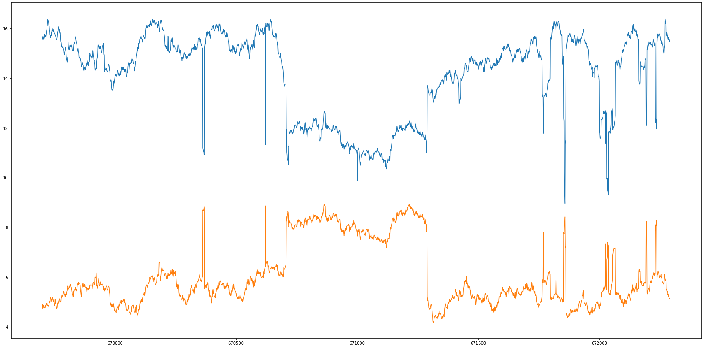


```python
fig, ax = plt.subplots(figsize=(30,15))
#ax.plot(df.loc[:,2:944].mean(),axis=1)
ax.plot(df_HAv3_NUMT_LG10.loc[:,1],df_HAv3_NUMT_LG10.loc[:,3:17].mean(axis=1))
ax.plot(df_HAv3_NUMT_LG10.loc[:,1],df_HAv3_NUMT_LG10.loc[:,3:17].std(axis=1))

```


    [<matplotlib.lines.Line2D at 0x7f98038e0b90>]


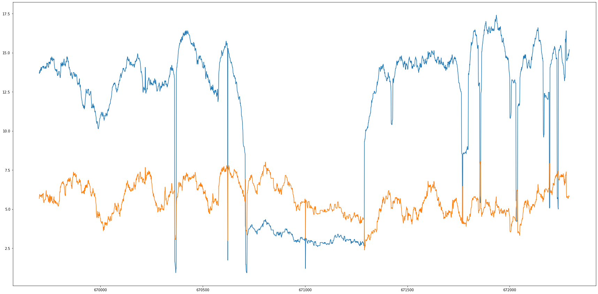


```python
fig, ax = plt.subplots(figsize=(30,15))
#ax.plot(df.loc[:,2:944].mean(),axis=1)
ax.plot(df_HAv3_NUMT_LG10.loc[:,1],df_HAv3_NUMT_LG10.loc[:,18:47].mean(axis=1))
ax.plot(df_HAv3_NUMT_LG10.loc[:,1],df_HAv3_NUMT_LG10.loc[:,18:47].std(axis=1))

```


    [<matplotlib.lines.Line2D at 0x7f981f338ad0>]


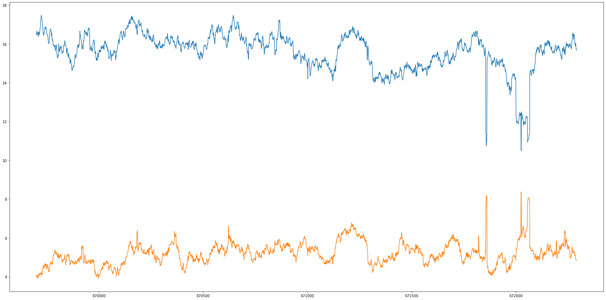


```python
fig, ax = plt.subplots(figsize=(30,15))
#ax.plot(df.loc[:,2:944].mean(),axis=1)
ax.plot(df_HAv3_NUMT_LG10.loc[:,1],df_HAv3_NUMT_LG10.loc[:,48:82].mean(axis=1))
ax.plot(df_HAv3_NUMT_LG10.loc[:,1],df_HAv3_NUMT_LG10.loc[:,48:82].std(axis=1))

```


    [<matplotlib.lines.Line2D at 0x7f9804ced9d0>]


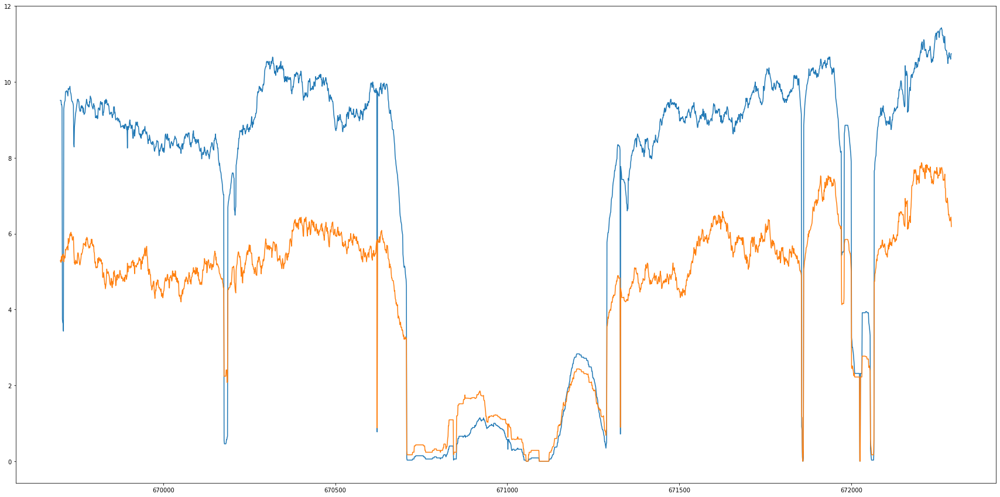


```python
fig, ax = plt.subplots(figsize=(30,15))
#ax.plot(df.loc[:,2:944].mean(),axis=1)
ax.plot(df_HAv3_NUMT_LG10.loc[:,1],df_HAv3_NUMT_LG10.loc[:,3:82].mean(axis=1))
ax.plot(df_HAv3_NUMT_LG10.loc[:,1],df_HAv3_NUMT_LG10.loc[:,3:82].std(axis=1))

```


    [<matplotlib.lines.Line2D at 0x7f98061776d0>]


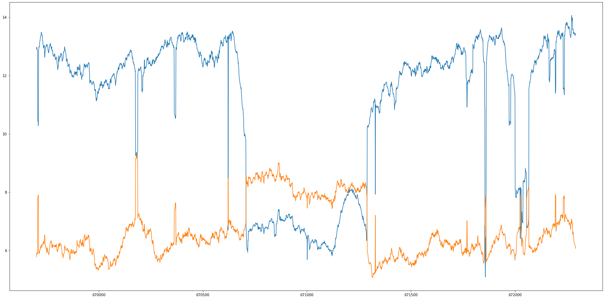


```python
fig, ax = plt.subplots(figsize=(30,15))
ax.plot(df_HAv3_NUMT_LG10.loc[:,1],df_HAv3_NUMT_LG10.loc[:,2])
ax.plot(df_HAv3_NUMT_LG10.loc[:,1],df_HAv3_NUMT_LG10.loc[:,7])
ax.plot(df_HAv3_NUMT_LG10.loc[:,1],df_HAv3_NUMT_LG10.loc[:,10])
ax.plot(df_HAv3_NUMT_LG10.loc[:,1],df_HAv3_NUMT_LG10.loc[:,15])

```


    [<matplotlib.lines.Line2D at 0x7f9804e4d950>]


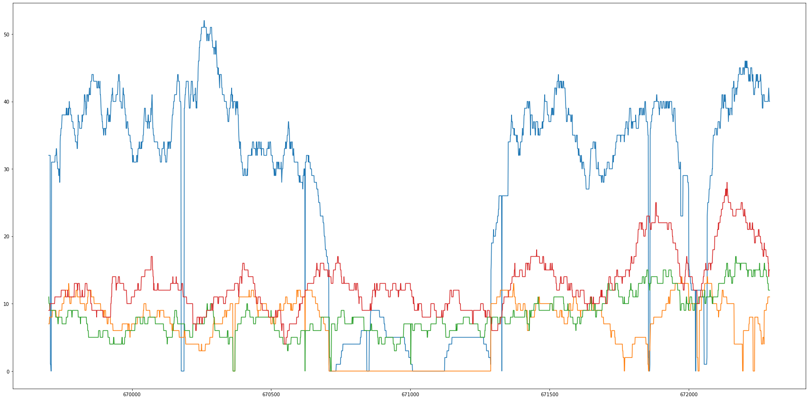


```python

```


```python

```


```python

```


```python

```


```python

```


```python

```


```python
df_DelIns.Length.max()

```


    31640.0


```python
df_DelIns.Length.min()

```


    -39880.0


```python
plt.plot(df_DelIns.Length)
plt.ylim(-1000,1000)

```


    (-1000, 1000)


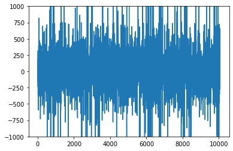


```python
df_DelIns[(df_DelIns.Length < -1000) & (df_DelIns.Length > -10000)]

```


<div>
<style scoped>
    .dataframe tbody tr th:only-of-type {
        vertical-align: middle;
    }

    .dataframe tbody tr th {
        vertical-align: top;
    }

    .dataframe thead th {
        text-align: right;
    }
</style>
<table border="1" class="dataframe">
  <thead>
    <tr style="text-align: right;">
      <th></th>
      <th>Chrom</th>
      <th>Pos</th>
      <th>Svim</th>
      <th>Ref</th>
      <th>Alt</th>
      <th>Type</th>
      <th>End</th>
      <th>Length</th>
    </tr>
  </thead>
  <tbody>
    <tr>
      <td>522</td>
      <td>NC_037638.1</td>
      <td>9355094</td>
      <td>svim_asm.DEL.268</td>
      <td>GTTTCTTTTTCGAAGCAAAGTGACAGGTTTCGTGCGTAAAATCGTC...</td>
      <td>G</td>
      <td>DEL</td>
      <td>9357116.0</td>
      <td>-2022.0</td>
    </tr>
    <tr>
      <td>715</td>
      <td>NC_037638.1</td>
      <td>13892897</td>
      <td>svim_asm.DEL.355</td>
      <td>TATTTAGTTAGGTCTACCCGAAAGTTCTGTCCGAATCTATGACATC...</td>
      <td>T</td>
      <td>DEL</td>
      <td>13894157.0</td>
      <td>-1260.0</td>
    </tr>
    <tr>
      <td>736</td>
      <td>NC_037638.1</td>
      <td>14116790</td>
      <td>svim_asm.DEL.364</td>
      <td>GTAGTATAGTAGTAGTAGTAGTAGTAGTAGTAGTAGTAGTAGTAGT...</td>
      <td>G</td>
      <td>DEL</td>
      <td>14119471.0</td>
      <td>-2681.0</td>
    </tr>
    <tr>
      <td>1126</td>
      <td>NC_037638.1</td>
      <td>26757902</td>
      <td>svim_asm.DEL.555</td>
      <td>CCTTTCCCTTTTCTTTTCTCTTCTAAATGTCGAAGAAGGATCGTTT...</td>
      <td>C</td>
      <td>DEL</td>
      <td>26759004.0</td>
      <td>-1102.0</td>
    </tr>
    <tr>
      <td>1260</td>
      <td>NC_037639.1</td>
      <td>1572067</td>
      <td>svim_asm.DEL.616</td>
      <td>CATTATTATTATTATTATTATTATTATTATTATTATTATTATTATT...</td>
      <td>C</td>
      <td>DEL</td>
      <td>1574271.0</td>
      <td>-2204.0</td>
    </tr>
    <tr>
      <td>1681</td>
      <td>NC_037640.1</td>
      <td>958998</td>
      <td>svim_asm.DEL.841</td>
      <td>CTCACCAGTCAAGGACACTGGAGGGTAGGTTAATGGATGCATCGGT...</td>
      <td>C</td>
      <td>DEL</td>
      <td>960067.0</td>
      <td>-1069.0</td>
    </tr>
    <tr>
      <td>1691</td>
      <td>NC_037640.1</td>
      <td>1119057</td>
      <td>svim_asm.DEL.848</td>
      <td>AATTTATGATTGAAATAAAATTAGCTTATCTATCGCCAACGACCAT...</td>
      <td>A</td>
      <td>DEL</td>
      <td>1120145.0</td>
      <td>-1088.0</td>
    </tr>
    <tr>
      <td>1695</td>
      <td>NC_037640.1</td>
      <td>1160812</td>
      <td>svim_asm.DEL.850</td>
      <td>TGAAAGTCATTTGGTTTATTAAAAATTTTATCAAAAGAATTTATCA...</td>
      <td>T</td>
      <td>DEL</td>
      <td>1165574.0</td>
      <td>-4762.0</td>
    </tr>
    <tr>
      <td>2417</td>
      <td>NC_037641.1</td>
      <td>4043892</td>
      <td>svim_asm.DEL.1202</td>
      <td>GTCATTTGAAATAATCCACCACTTAAACGTTTTAATCATCAGTTTG...</td>
      <td>G</td>
      <td>DEL</td>
      <td>4048231.0</td>
      <td>-4339.0</td>
    </tr>
    <tr>
      <td>2436</td>
      <td>NC_037641.1</td>
      <td>4875114</td>
      <td>svim_asm.DEL.1209</td>
      <td>GAGTATAGTAGTAGTAGTAGTAGTAGTAGTAGTAGTAGTAGTAGTA...</td>
      <td>G</td>
      <td>DEL</td>
      <td>4879142.0</td>
      <td>-4028.0</td>
    </tr>
    <tr>
      <td>2661</td>
      <td>NC_037641.1</td>
      <td>10959780</td>
      <td>svim_asm.DEL.1323</td>
      <td>CACCTTCTCCTTCCTGGCGAGAGAAGAATTAAAAATCGGGATCGGA...</td>
      <td>C</td>
      <td>DEL</td>
      <td>10961362.0</td>
      <td>-1582.0</td>
    </tr>
    <tr>
      <td>2730</td>
      <td>NC_037642.1</td>
      <td>4520</td>
      <td>svim_asm.DEL.1357</td>
      <td>TACGATTTTCAGAATTGCAGTGGATTCTAATAAAATAAGTATTGTC...</td>
      <td>T</td>
      <td>DEL</td>
      <td>7572.0</td>
      <td>-3052.0</td>
    </tr>
    <tr>
      <td>2963</td>
      <td>NC_037642.1</td>
      <td>6000248</td>
      <td>svim_asm.DEL.1491</td>
      <td>ACATTTCCTTTATGGCGTTCGCAAAATTTGAATTTTAATATGCGAT...</td>
      <td>A</td>
      <td>DEL</td>
      <td>6001502.0</td>
      <td>-1254.0</td>
    </tr>
    <tr>
      <td>3345</td>
      <td>NC_037643.1</td>
      <td>858361</td>
      <td>svim_asm.DEL.1682</td>
      <td>GTTATTATATTTTTTATATTTTCAAAAATATTTATAAAAATAATTT...</td>
      <td>G</td>
      <td>DEL</td>
      <td>859694.0</td>
      <td>-1333.0</td>
    </tr>
    <tr>
      <td>3414</td>
      <td>NC_037643.1</td>
      <td>2061243</td>
      <td>svim_asm.DEL.1723</td>
      <td>TAATGTTTAGAAATAAATTGAATTTAATAATTGATAATTTAATAAT...</td>
      <td>T</td>
      <td>DEL</td>
      <td>2062942.0</td>
      <td>-1699.0</td>
    </tr>
    <tr>
      <td>4912</td>
      <td>NC_037645.1</td>
      <td>3334453</td>
      <td>svim_asm.DEL.2438</td>
      <td>ACAAATAGTGGTAGCCTTTCAGAATCGTTAAGCCGGGGTATTGCAA...</td>
      <td>A</td>
      <td>DEL</td>
      <td>3343090.0</td>
      <td>-8637.0</td>
    </tr>
    <tr>
      <td>5901</td>
      <td>NC_037646.1</td>
      <td>10434826</td>
      <td>svim_asm.DEL.2941</td>
      <td>CTCTTTTGTTCAGGATTATTAATATATAATAAAGAGTTTAAGATCG...</td>
      <td>C</td>
      <td>DEL</td>
      <td>10436063.0</td>
      <td>-1237.0</td>
    </tr>
    <tr>
      <td>6078</td>
      <td>NC_037647.1</td>
      <td>2134216</td>
      <td>svim_asm.DEL.3021</td>
      <td>TAAATTAACCCAATTGTCCAATTCATTGACTTACGAAACAAATAAT...</td>
      <td>T</td>
      <td>DEL</td>
      <td>2141169.0</td>
      <td>-6953.0</td>
    </tr>
    <tr>
      <td>6198</td>
      <td>NC_037647.1</td>
      <td>4790319</td>
      <td>svim_asm.DEL.3079</td>
      <td>AAATCTTTTATGAAACTATTTAATTTTTATTTGAAACATTTTTTAA...</td>
      <td>A</td>
      <td>DEL</td>
      <td>4795184.0</td>
      <td>-4865.0</td>
    </tr>
    <tr>
      <td>6716</td>
      <td>NC_037648.1</td>
      <td>4506081</td>
      <td>svim_asm.DEL.3327</td>
      <td>ATTATTATTATTATTATTATTATTATTATTATTATTATTATTATTA...</td>
      <td>A</td>
      <td>DEL</td>
      <td>4509975.0</td>
      <td>-3894.0</td>
    </tr>
    <tr>
      <td>6776</td>
      <td>NC_037648.1</td>
      <td>5160033</td>
      <td>svim_asm.DEL.3355</td>
      <td>CAAAAATTTCAAAGTTTATCTCAGAATAGTATTAAATAGATATAGA...</td>
      <td>C</td>
      <td>DEL</td>
      <td>5162445.0</td>
      <td>-2412.0</td>
    </tr>
    <tr>
      <td>6789</td>
      <td>NC_037648.1</td>
      <td>5284171</td>
      <td>svim_asm.DEL.3363</td>
      <td>AATGATGATGATGATGATGATGATGATGATGATGATGATAATGATG...</td>
      <td>A</td>
      <td>DEL</td>
      <td>5286135.0</td>
      <td>-1964.0</td>
    </tr>
    <tr>
      <td>7920</td>
      <td>NC_037650.1</td>
      <td>670504</td>
      <td>svim_asm.DEL.3902</td>
      <td>TATATGTGTAATGAATTGATCCTCGTGGTTATTTCTTATGTATTTC...</td>
      <td>T</td>
      <td>DEL</td>
      <td>671665.0</td>
      <td>-1161.0</td>
    </tr>
    <tr>
      <td>8032</td>
      <td>NC_037650.1</td>
      <td>1771608</td>
      <td>svim_asm.DEL.3965</td>
      <td>CATTTTCATAATTTTAATTAATTTTTTTGAATACGATATAAACATT...</td>
      <td>C</td>
      <td>DEL</td>
      <td>1775616.0</td>
      <td>-4008.0</td>
    </tr>
    <tr>
      <td>8108</td>
      <td>NC_037650.1</td>
      <td>3300996</td>
      <td>svim_asm.DEL.4007</td>
      <td>GCAAACAATGCACCTCATGCAGCTGCAACCGCCACACTTAAAACCC...</td>
      <td>G</td>
      <td>DEL</td>
      <td>3308110.0</td>
      <td>-7114.0</td>
    </tr>
    <tr>
      <td>8351</td>
      <td>NC_037650.1</td>
      <td>9981299</td>
      <td>svim_asm.DEL.4108</td>
      <td>GAAAGATTCAATATTCAATCTATATTGAAAAAAGTTCTAATCTCAT...</td>
      <td>G</td>
      <td>DEL</td>
      <td>9982473.0</td>
      <td>-1174.0</td>
    </tr>
    <tr>
      <td>8441</td>
      <td>NC_037650.1</td>
      <td>11111196</td>
      <td>svim_asm.DEL.4156</td>
      <td>GCGTGATTTCACCAAGTACATTCTTTCTTTCTTTCTTTCTTTCTTC...</td>
      <td>G</td>
      <td>DEL</td>
      <td>11112302.0</td>
      <td>-1106.0</td>
    </tr>
    <tr>
      <td>8469</td>
      <td>NC_037651.1</td>
      <td>453267</td>
      <td>svim_asm.DEL.4168</td>
      <td>TTTATAATAAGTTACAGTAATAATTTAATAATATATCAATAATACA...</td>
      <td>T</td>
      <td>DEL</td>
      <td>454276.0</td>
      <td>-1009.0</td>
    </tr>
    <tr>
      <td>8474</td>
      <td>NC_037651.1</td>
      <td>479338</td>
      <td>svim_asm.DEL.4171</td>
      <td>TTTACATATTATGTTATGTTATGTTATATATAATTTGATTATTCAT...</td>
      <td>T</td>
      <td>DEL</td>
      <td>481224.0</td>
      <td>-1886.0</td>
    </tr>
    <tr>
      <td>9889</td>
      <td>NW_020555861.1</td>
      <td>88477</td>
      <td>svim_asm.DEL.4892</td>
      <td>GGTAAATCCATATTAAAAATCCTATATTTTGTTTATCTGATAATGC...</td>
      <td>G</td>
      <td>DEL</td>
      <td>93914.0</td>
      <td>-5437.0</td>
    </tr>
    <tr>
      <td>9928</td>
      <td>NW_020555867.1</td>
      <td>42815</td>
      <td>svim_asm.DEL.4904</td>
      <td>AACAATATTTTAAATTTAAAATTAAATATTGCTATCTTATAACAAA...</td>
      <td>A</td>
      <td>DEL</td>
      <td>45077.0</td>
      <td>-2262.0</td>
    </tr>
    <tr>
      <td>9948</td>
      <td>NW_020555870.1</td>
      <td>39040</td>
      <td>svim_asm.DEL.4920</td>
      <td>TGGTATAAACTTTAGACTTCAAAAAATTCTAAAAAAAAGTCTAACG...</td>
      <td>T</td>
      <td>DEL</td>
      <td>41771.0</td>
      <td>-2731.0</td>
    </tr>
    <tr>
      <td>10002</td>
      <td>NW_020555884.1</td>
      <td>7125</td>
      <td>svim_asm.DEL.4943</td>
      <td>GTAAAATGGAATTTTATCCATACGTATTTATAACAGCATATCTCAA...</td>
      <td>G</td>
      <td>DEL</td>
      <td>9619.0</td>
      <td>-2494.0</td>
    </tr>
    <tr>
      <td>10003</td>
      <td>NW_020555884.1</td>
      <td>7125</td>
      <td>svim_asm.DEL.4944</td>
      <td>GTAAAATGGAATTTTATCCATACGTATTTATAACAGCATATCTCAA...</td>
      <td>G</td>
      <td>DEL</td>
      <td>9619.0</td>
      <td>-2494.0</td>
    </tr>
  </tbody>
</table>
</div>


```python
df_DelIns.Type.unique()

```


    array(['DEL', 'INS', 'DUP:TANDEM', 'INV', 'BND'], dtype=object)


```python
df_DelIns[df_DelIns.Type == 'DUP:TANDEM']

```


<div>
<style scoped>
    .dataframe tbody tr th:only-of-type {
        vertical-align: middle;
    }

    .dataframe tbody tr th {
        vertical-align: top;
    }

    .dataframe thead th {
        text-align: right;
    }
</style>
<table border="1" class="dataframe">
  <thead>
    <tr style="text-align: right;">
      <th></th>
      <th>Chrom</th>
      <th>Pos</th>
      <th>Svim</th>
      <th>Ref</th>
      <th>Alt</th>
      <th>Type</th>
      <th>End</th>
      <th>Length</th>
    </tr>
  </thead>
  <tbody>
    <tr>
      <td>467</td>
      <td>NC_037638.1</td>
      <td>7720427</td>
      <td>svim_asm.DUP_TANDEM.1</td>
      <td>N</td>
      <td>&lt;DUP:TANDEM&gt;</td>
      <td>DUP:TANDEM</td>
      <td>7721089.0</td>
      <td>663.0</td>
    </tr>
    <tr>
      <td>724</td>
      <td>NC_037638.1</td>
      <td>13934433</td>
      <td>svim_asm.DUP_TANDEM.2</td>
      <td>N</td>
      <td>&lt;DUP:TANDEM&gt;</td>
      <td>DUP:TANDEM</td>
      <td>13946835.0</td>
      <td>12403.0</td>
    </tr>
    <tr>
      <td>2978</td>
      <td>NC_037642.1</td>
      <td>6368124</td>
      <td>svim_asm.DUP_TANDEM.3</td>
      <td>N</td>
      <td>&lt;DUP:TANDEM&gt;</td>
      <td>DUP:TANDEM</td>
      <td>6369603.0</td>
      <td>1480.0</td>
    </tr>
    <tr>
      <td>3147</td>
      <td>NC_037642.1</td>
      <td>10633794</td>
      <td>svim_asm.DUP_TANDEM.4</td>
      <td>N</td>
      <td>&lt;DUP:TANDEM&gt;</td>
      <td>DUP:TANDEM</td>
      <td>10633983.0</td>
      <td>190.0</td>
    </tr>
    <tr>
      <td>3577</td>
      <td>NC_037643.1</td>
      <td>5865339</td>
      <td>svim_asm.DUP_TANDEM.5</td>
      <td>N</td>
      <td>&lt;DUP:TANDEM&gt;</td>
      <td>DUP:TANDEM</td>
      <td>5867097.0</td>
      <td>1759.0</td>
    </tr>
    <tr>
      <td>3921</td>
      <td>NC_037643.1</td>
      <td>14570172</td>
      <td>svim_asm.DUP_TANDEM.6</td>
      <td>N</td>
      <td>&lt;DUP:TANDEM&gt;</td>
      <td>DUP:TANDEM</td>
      <td>14570328.0</td>
      <td>157.0</td>
    </tr>
    <tr>
      <td>4180</td>
      <td>NC_037644.1</td>
      <td>1588767</td>
      <td>svim_asm.DUP_TANDEM.7</td>
      <td>N</td>
      <td>&lt;DUP:TANDEM&gt;</td>
      <td>DUP:TANDEM</td>
      <td>1588840.0</td>
      <td>74.0</td>
    </tr>
    <tr>
      <td>4557</td>
      <td>NC_037644.1</td>
      <td>9250500</td>
      <td>svim_asm.DUP_TANDEM.8</td>
      <td>N</td>
      <td>&lt;DUP:TANDEM&gt;</td>
      <td>DUP:TANDEM</td>
      <td>9250663.0</td>
      <td>164.0</td>
    </tr>
    <tr>
      <td>5073</td>
      <td>NC_037645.1</td>
      <td>7965513</td>
      <td>svim_asm.DUP_TANDEM.9</td>
      <td>N</td>
      <td>&lt;DUP:TANDEM&gt;</td>
      <td>DUP:TANDEM</td>
      <td>7965690.0</td>
      <td>178.0</td>
    </tr>
    <tr>
      <td>5169</td>
      <td>NC_037645.1</td>
      <td>9330692</td>
      <td>svim_asm.DUP_TANDEM.10</td>
      <td>N</td>
      <td>&lt;DUP:TANDEM&gt;</td>
      <td>DUP:TANDEM</td>
      <td>9330870.0</td>
      <td>179.0</td>
    </tr>
    <tr>
      <td>5922</td>
      <td>NC_037646.1</td>
      <td>11018501</td>
      <td>svim_asm.DUP_TANDEM.11</td>
      <td>N</td>
      <td>&lt;DUP:TANDEM&gt;</td>
      <td>DUP:TANDEM</td>
      <td>11018724.0</td>
      <td>224.0</td>
    </tr>
    <tr>
      <td>6072</td>
      <td>NC_037647.1</td>
      <td>2041589</td>
      <td>svim_asm.DUP_TANDEM.12</td>
      <td>N</td>
      <td>&lt;DUP:TANDEM&gt;</td>
      <td>DUP:TANDEM</td>
      <td>2043596.0</td>
      <td>2008.0</td>
    </tr>
    <tr>
      <td>7714</td>
      <td>NC_037649.1</td>
      <td>6888473</td>
      <td>svim_asm.DUP_TANDEM.13</td>
      <td>N</td>
      <td>&lt;DUP:TANDEM&gt;</td>
      <td>DUP:TANDEM</td>
      <td>6891037.0</td>
      <td>2565.0</td>
    </tr>
    <tr>
      <td>8730</td>
      <td>NC_037651.1</td>
      <td>5522649</td>
      <td>svim_asm.DUP_TANDEM.14</td>
      <td>N</td>
      <td>&lt;DUP:TANDEM&gt;</td>
      <td>DUP:TANDEM</td>
      <td>5534622.0</td>
      <td>11974.0</td>
    </tr>
    <tr>
      <td>9327</td>
      <td>NC_037653.1</td>
      <td>450767</td>
      <td>svim_asm.DUP_TANDEM.15</td>
      <td>N</td>
      <td>&lt;DUP:TANDEM&gt;</td>
      <td>DUP:TANDEM</td>
      <td>452249.0</td>
      <td>1483.0</td>
    </tr>
  </tbody>
</table>
</div>


```python
df_DelIns[df_DelIns.Type == 'INV']

```


<div>
<style scoped>
    .dataframe tbody tr th:only-of-type {
        vertical-align: middle;
    }

    .dataframe tbody tr th {
        vertical-align: top;
    }

    .dataframe thead th {
        text-align: right;
    }
</style>
<table border="1" class="dataframe">
  <thead>
    <tr style="text-align: right;">
      <th></th>
      <th>Chrom</th>
      <th>Pos</th>
      <th>Svim</th>
      <th>Ref</th>
      <th>Alt</th>
      <th>Type</th>
      <th>End</th>
      <th>Length</th>
    </tr>
  </thead>
  <tbody>
    <tr>
      <td>998</td>
      <td>NC_037638.1</td>
      <td>23997122</td>
      <td>svim_asm.INV.1</td>
      <td>AGNNNNNNNNNNNNNNNNNNNNNNNNNAGATAGATAGATGGTCGGA...</td>
      <td>GGTAAAATTTAGTAGAGTGGGTCGATTGACCCCTCCTTCACCACCC...</td>
      <td>INV</td>
      <td>24000541.0</td>
      <td>NaN</td>
    </tr>
    <tr>
      <td>1851</td>
      <td>NC_037640.1</td>
      <td>4094895</td>
      <td>svim_asm.INV.2</td>
      <td>CACCAATTCCTTCAAAATGCATCCTAATACACGAATCTTGAAACGA...</td>
      <td>TCTCTTATTTTTGTTGCGACTTTTTTCTTTTTCGAGTTATTAATAA...</td>
      <td>INV</td>
      <td>4106704.0</td>
      <td>NaN</td>
    </tr>
    <tr>
      <td>2912</td>
      <td>NC_037642.1</td>
      <td>3666926</td>
      <td>svim_asm.INV.3</td>
      <td>GAAAAGCACTGAAAGGAAATTAAAAAATAATTTGTGCCGCAATCAA...</td>
      <td>AAACGAGACAGGCTCGCGAAGAGAGGAAAGAGGGACACGTTGGGGA...</td>
      <td>INV</td>
      <td>3670242.0</td>
      <td>NaN</td>
    </tr>
    <tr>
      <td>3422</td>
      <td>NC_037643.1</td>
      <td>2209846</td>
      <td>svim_asm.INV.4</td>
      <td>GTACGTTACGTAACCGCGCAAATCATTCTCGCTGTGATCCTTCTGT...</td>
      <td>TCAATAGATGTCGATGTTTGCATTTCAATGAATTTTGATACGAAAA...</td>
      <td>INV</td>
      <td>2230008.0</td>
      <td>NaN</td>
    </tr>
    <tr>
      <td>3519</td>
      <td>NC_037643.1</td>
      <td>4227264</td>
      <td>svim_asm.INV.5</td>
      <td>ATGAAACATATTAATTTTCTCCATTTAAAGCAAGACACATAAAATT...</td>
      <td>CCTCCTCCTCCTCCTCTTTTCGTGTTATTTTTTTTTTTCTTTCTTT...</td>
      <td>INV</td>
      <td>4238405.0</td>
      <td>NaN</td>
    </tr>
    <tr>
      <td>4401</td>
      <td>NC_037644.1</td>
      <td>6930586</td>
      <td>svim_asm.INV.6</td>
      <td>ATTTCACCATTATTCACCGAGAGGATGTGAGACTATCGTGCTTTGA...</td>
      <td>GAACTACGTCATCATGTGATGCTCCTCAACTCCAATCAAACGAACA...</td>
      <td>INV</td>
      <td>6931544.0</td>
      <td>NaN</td>
    </tr>
    <tr>
      <td>5055</td>
      <td>NC_037645.1</td>
      <td>7483491</td>
      <td>svim_asm.INV.7</td>
      <td>CCAGGGGAGAGATTTTCGAGCAAAAATATCCTGTATCTTTTCAATC...</td>
      <td>AGTTGCCTTTTCGGGCTGATATGAGTCTCTGAGAATATTGAATACG...</td>
      <td>INV</td>
      <td>7484365.0</td>
      <td>NaN</td>
    </tr>
    <tr>
      <td>5512</td>
      <td>NC_037646.1</td>
      <td>950363</td>
      <td>svim_asm.INV.8</td>
      <td>TAATATAATATGAATATAATATAATATGAATATAATATAATATGAA...</td>
      <td>ATATAATATAATATAATATAATATATATAATAATATATAATATACT...</td>
      <td>INV</td>
      <td>977108.0</td>
      <td>NaN</td>
    </tr>
    <tr>
      <td>6122</td>
      <td>NC_037647.1</td>
      <td>2772093</td>
      <td>svim_asm.INV.9</td>
      <td>NNNNNNNNNNNNNNNNNNNNNNNNNCGAAAGAGAGATTTAATTAAA...</td>
      <td>TCTTTCGGTCACAGGACCACGATGACGGAAAGTACCTCTCGTTTTG...</td>
      <td>INV</td>
      <td>2784039.0</td>
      <td>NaN</td>
    </tr>
    <tr>
      <td>6297</td>
      <td>NC_037647.1</td>
      <td>8552241</td>
      <td>svim_asm.INV.10</td>
      <td>GCGCGAAAAATTGAAATATAAAATAAATTAATTGTTGTTGTTTGTA...</td>
      <td>GCGCGAAAAATTGAAATATTATGTATGTATATTGTTGTTTGGAATC...</td>
      <td>INV</td>
      <td>8585106.0</td>
      <td>NaN</td>
    </tr>
    <tr>
      <td>7372</td>
      <td>NC_037648.1</td>
      <td>15570415</td>
      <td>svim_asm.INV.11</td>
      <td>TCCTTTTCCCTCTTAAACGAATTCTCCGTTTCAGGCTGGAGTTTCA...</td>
      <td>CATTTTTCTACACGTCATTAAATCGATTAGCATTATCGGTTAATTG...</td>
      <td>INV</td>
      <td>15582416.0</td>
      <td>NaN</td>
    </tr>
    <tr>
      <td>7706</td>
      <td>NC_037649.1</td>
      <td>6555825</td>
      <td>svim_asm.INV.12</td>
      <td>AAACTTTTCACCTGCCATCATTTGCATAAAACAAACATCGAAGTTT...</td>
      <td>AAACTTGGAGATCGAAGTGCACATCGGTGGCAGGACTTGTCGCCAT...</td>
      <td>INV</td>
      <td>6560298.0</td>
      <td>NaN</td>
    </tr>
    <tr>
      <td>7879</td>
      <td>NC_037650.1</td>
      <td>50890</td>
      <td>svim_asm.INV.13</td>
      <td>CTTTACATTACAATTGTAATTATAAAATTAATTATATATATTAACA...</td>
      <td>AATTACGTTACCGTATTTTATTATTATTCCGTCTATTAAATATAAT...</td>
      <td>INV</td>
      <td>132134.0</td>
      <td>NaN</td>
    </tr>
    <tr>
      <td>7979</td>
      <td>NC_037650.1</td>
      <td>1317411</td>
      <td>svim_asm.INV.14</td>
      <td>ATTAGAGTCATTATAAAGCGCGACGCTCATTATTTTTAACGCTTAA...</td>
      <td>ATTAAGTCACTCTCTCTTATAAAATTTGAATAATTTTAATATTTAT...</td>
      <td>INV</td>
      <td>1328052.0</td>
      <td>NaN</td>
    </tr>
    <tr>
      <td>8393</td>
      <td>NC_037650.1</td>
      <td>10431514</td>
      <td>svim_asm.INV.15</td>
      <td>AGAGCTTTCGTCTCCGGCTCCCGCGTTCCCGGTGGCGCGTGTGCAC...</td>
      <td>CCCGGCGCTCTGAGCAATCTCCTATCCAAGTGTTGATGGGCGAGGG...</td>
      <td>INV</td>
      <td>10467465.0</td>
      <td>NaN</td>
    </tr>
    <tr>
      <td>8494</td>
      <td>NC_037651.1</td>
      <td>712889</td>
      <td>svim_asm.INV.16</td>
      <td>TTGTGTCTACAGAAAATATCAATGTATTTAATAAATATATAGTATA...</td>
      <td>TAAATGTTTAATGTTATTTTTTTCATTTATTTAAAAAAAATTTTTT...</td>
      <td>INV</td>
      <td>725245.0</td>
      <td>NaN</td>
    </tr>
    <tr>
      <td>9678</td>
      <td>NC_037653.1</td>
      <td>5461845</td>
      <td>svim_asm.INV.17</td>
      <td>TTTTGAGAATGCGTATATTCGAGGAGAAGGGGAGTAAAAGTTTCGA...</td>
      <td>TTCCTCGAACGAGAAATTTTTGCCCAAATTCGACTTTGTATTAGGA...</td>
      <td>INV</td>
      <td>5473081.0</td>
      <td>NaN</td>
    </tr>
    <tr>
      <td>9791</td>
      <td>NW_020555797.1</td>
      <td>36315</td>
      <td>svim_asm.INV.18</td>
      <td>CTATTTGTTTCAATGGCATAAAAAATAAAAAAAGAAACATAAGAAC...</td>
      <td>AATGAAAAGTTAAAGTAAAAGTAAATTCAAAACTTAAAAATTACAA...</td>
      <td>INV</td>
      <td>38193.0</td>
      <td>NaN</td>
    </tr>
    <tr>
      <td>9924</td>
      <td>NW_020555866.1</td>
      <td>63441</td>
      <td>svim_asm.INV.19</td>
      <td>AACTAAATGCTTTGTTATTTCATTTACCAAAGTAAATCTCTGATAA...</td>
      <td>ATTGTCAATTTTACAAAACATAATAAATAAGTTTTAGTTTTGCACA...</td>
      <td>INV</td>
      <td>66175.0</td>
      <td>NaN</td>
    </tr>
  </tbody>
</table>
</div>


```python


```


```python

```
